# M_Schedule DB 스키마 설계

> 대상 프로젝트: Supabase (Postgres + RLS) · `hryikreaxngexhjjxfyl`
> 작성일: 2026-08-17
> 근거 문서: `CLAUDE.md` §1·§2 / `Claude/research-NEXON-API.md` / `Claude/research-KAKAO-BOT.md` / `Claude/research-BOSS-DATA.md`
> 대응 코드: `src/lib/time/week.ts` (주차 키 규칙)

**규모: 테이블 35개 / 뷰 23개 / 마이그레이션 19개.** (실제 DB `hryikreaxngexhjjxfyl` 에 전량 적용 완료)
모든 시각은 `timestamptz`(UTC 저장), 모든 금액은 `bigint`(메소), 주간 버킷은 `week_key text`(예: `2026-W33`),
모든 분배 비율은 `integer` basis point(0~10000). **부동소수점은 어디에도 쓰지 않는다.**

**비로그인 노출면: 객체 12개뿐**(테이블 8 + 뷰 4). 나머지 36개는 전부 차단이며,
공개 테이블은 **컬럼 단위로** 열려 있다(§난제 9).

---

## 설계 결정과 근거

### 난제 1. 인증과 RLS의 접합 → **(c) 서버 전용 쓰기 + RLS 전면 차단**

우리는 Supabase Auth 세션을 쓰지 않고 넥슨 API 키의 SHA-256 해시로 사용자를 식별한다.
따라서 브라우저 세션에는 `auth.uid()`가 **항상 null**이고, "본인 행만 접근" 류의 정책은 애초에 성립하지 않는다.

**선택: (c) 모든 쓰기를 Next.js Route Handler + service role 로 수행하고, RLS 는 anon/authenticated 를 전면 차단한다.**

(a)와 (b)를 버린 이유:

| 안 | 버린 이유 |
|---|---|
| (a) 커스텀 JWT 발급 | 이 프로젝트는 신형 키(`sb_publishable_` / `sb_secret_`)를 쓴다. 신형 키 체계는 **비대칭 JWT 서명 키**로 이동 중이고 개인키는 내보낼 수 없다. 우리가 서명한 JWT 를 Supabase 가 받아주게 하려면 레거시 HS256 JWT 시크릿에 계속 묶여야 하는데, 이는 플랫폼이 걷어내는 방향과 정면으로 충돌한다. |
| (b) 익명 로그인 + 1:1 연결 | 프로젝트 설정에서 익명 로그인을 켜야 하고, **비로그인 열람자마다 `auth.users` 행이 생긴다.** 우리 요구사항은 "비로그인도 그냥 본다"이지 "익명 계정을 만든다"가 아니다. 게다가 클라이언트가 직접 쓰기 가능한 토큰을 쥐게 되어 모든 테이블·컬럼의 정책이 완벽해야만 안전해진다. |

**그리고 (c)에서 RLS 는 장식이 아니라 실질적 방어선이다.** 그 이유를 분명히 해 둔다.

- 브라우저는 `sb_publishable_...`(= `anon` 역할)을 들고 있고 **이 키는 설계상 공개**다. 누구든 PostgREST 에 직접 쿼리를 날릴 수 있다.
- Supabase 는 `public` 스키마의 신규 테이블에 anon/authenticated 권한을 **기본으로 부여**한다. 즉 아무것도 안 하면 전부 열린다.
- 그래서 RLS 를 **모든 28개 테이블에 켜고**, 공개 시간표 SELECT 를 제외한 전부를 명시적으로 거부한다.
  거부는 "정책이 없어서 막힌다"가 아니라 **`using (false) with check (false)` 정책을 직접 써서** 의도를 스키마에 남긴다.
- **이중 방어**: RLS 정책에 더해 `revoke all ... from anon, authenticated` 로 권한 자체를 회수한다.
  RLS 가 실수로 꺼지는 사고가 나도 새지 않는다.

향후 이전 경로도 열어 뒀다. `public.current_app_user_id()` 는 지금은 `current_setting('app.user_id')`를 읽지만,
(a)/(b)로 옮길 때 **이 함수 하나만 고치면** 된다. `app_users.auth_user_id` 컬럼도 미리 비워 뒀다.

> ⚠️ `service_role` 은 `BYPASSRLS` 속성을 가지므로 service_role 용 정책은 실제로 평가되지 않는다.
> 그래도 명시적으로 작성했다 — 의도를 스키마에 기록하고, 향후 bypassrls 가 제거돼도 동작이 유지되게 하기 위해서다.

### 난제 2. 비로그인 열람 → **공개 경로가 기밀 테이블을 아예 참조하지 않게 설계**

정책으로 컬럼을 가리는 대신 **구조적으로 도달 불가능하게** 만들었다.

- 기밀은 전부 별도 테이블로 분리: `user_credentials`(API 키 해시·암호화 원문), `user_nexon_accounts`(account_id),
  `bot_channels`(시크릿 해시), `bot_link_codes`(코드 해시), `invite_links`(토큰 해시),
  `guest_profiles`(승계 토큰 해시), `bot_channel_members`(발신자 식별자), `bot_command_log`.
  → 전부 anon 전면 차단.
- **핵심 트릭**: `party_participants.display_name` 을 스냅샷으로 들고 있다.
  덕분에 공개 시간표가 **`app_users` 를 단 한 번도 조인하지 않는다.** anon 에게 계정 테이블 권한을 한 톨도 줄 필요가 없다.
  (스냅샷의 정합성 부채는 `app_users` 표시명 변경 시 동기화 트리거로 갚는다.)
- 모든 뷰는 `security_invoker = true`. 기본값인 SECURITY DEFINER 뷰를 쓰면 RLS 를 우회해 이 설계가 통째로 무너진다.
- `visibility = 'link'` 파티는 **anon 이 직접 읽지 못한다.** 슬러그가 곧 비밀인데 RLS 는 "요청자가 슬러그를 안다"를 표현할 수 없기 때문이다.
  Route Handler 가 토큰을 검증한 뒤 service role 로 서빙한다. anon 직접 조회는 `visibility = 'public'` 뿐이다.

anon 이 읽을 수 있는 것은 정확히 이것뿐이다 — 보스 마스터 4종, 그리고 **공개 파티**의 파티/참가자/런/참여의사.

> **정정 (2026-08-17, 화면 연결 작업 중 발견).** 위 목록에 원래 "가용시간"이 들어 있었으나
> **실제 스키마와 어긋난다.** 구현된 스키마는 두 겹으로 anon 의 가용시간 열람을 막는다:
> `availability_patterns` / `availability_exceptions` 의 정책이 `anon, authenticated` 에 대해
> `using (false)` 이고, `can_view_availability(p_viewer_user_id, p_person_id)` 는 첫 인자가
> null 이면 **무조건 false** 를 돌려준다(본인 / 수락된 친구 / 같은 파티 구성원만 true).
>
> 두 장치가 독립적으로 같은 답을 내므로 이것은 사고가 아니라 **의도**로 본다. 그리고 그 의도가
> 옳다 — 개인의 주간 생활 시간표는 파티를 공개로 돌렸다는 이유만으로 익명 방문자에게
> 넘길 정보가 아니다. 따라서 **코드가 아니라 이 문서가 틀렸고, 문서를 고쳤다**(§0.5).
>
> 화면에 미치는 영향: 비로그인 `/schedule` 은 공개 파티의 **일정은 보이지만 가용 시간은 비어 있다.**
> 이는 에러가 아니라 정상 상태이므로 빈 상태로 렌더하고 이유를 안내한다.

### 난제 3. 주차 경계 → **KST 고정 UTC+9 성질을 이용한 순수 산술 IMMUTABLE 함수**

`public.week_key(timestamptz) -> text` 를 만들고 `src/lib/time/week.ts` 의 `getWeekKey` 와 값이 일치하도록 했다.

IMMUTABLE 을 지키기 위해 피해야 했던 함정:

| 쓰면 안 되는 것 | 이유 | 대체 |
|---|---|---|
| `extract(epoch from <timestamptz>)` | `date_part(text, timestamptz)` 는 **STABLE** | `extract(epoch from (ts - to_timestamp(0)))` — `date_part(text, interval)` 은 IMMUTABLE |
| `AT TIME ZONE 'Asia/Seoul'` | tzdata 의존 | 오프셋 32400초를 더한 뒤 `date '1970-01-01' + n` 으로 KST 달력 날짜를 만든다 |
| `date::text`, `to_char(...)` | DateStyle / lc_numeric 의존 | `extract` + `lpad` 로 직접 조립 |

알고리즘은 TS 구현과 동일하다. epoch day 0(1970-01-01)이 **목요일**이라는 성질을 이용해 604800초로 절삭하면
곧바로 목요일 00:00 KST 가 나오고, 그 목요일의 `dayOfYear / 7` 을 올림한 값이 ISO 주차와 정확히 일치한다.
(연중 n번째 목요일의 doy 는 항상 `firstThuDoy + 7(n-1)` 이므로 `ceil(doy/7) = n`.)

IMMUTABLE 이라서 실제로 이런 곳에 쓰고 있다:

- **생성 컬럼**: `party_runs.week_key`, `availability_slots.week_key`, `character_scheduler_snapshots.week_key` / `day_key`
- **CHECK 제약**: `boss_clears` 의 `week_key = public.week_key(cleared_at)`
- **인덱스**: 위 생성 컬럼들을 포함한 복합 인덱스 전부

함께 제공하는 함수: `week_start`, `next_week_reset`, `day_start`, `day_key`.

**경계 검증 SQL** (마이그레이션 `20260817090000` 안에 자기검증 DO 블록으로 **내장**되어 있어, 어긋나면 마이그레이션 자체가 실패한다):

```sql
-- 수요일 23:59:59 KST 와 목요일 00:00:00 KST 는 서로 다른 주차여야 한다
select public.week_key(timestamptz '2026-08-19 23:59:59+09') as wed_2359,  -- 2026-W33
       public.week_key(timestamptz '2026-08-20 00:00:00+09') as thu_0000;  -- 2026-W34

-- 같은 순간을 다른 오프셋으로 써도 같은 키 (timestamptz 는 절대 시각)
select public.week_key(timestamptz '2026-08-19 15:00:00+00');              -- 2026-W34

-- 연말 경계: 2026 년은 ISO 53주차까지 있다
select public.week_key(timestamptz '2027-01-01 12:00:00+09'),              -- 2026-W53
       public.week_key(timestamptz '2027-01-07 00:00:00+09');              -- 2027-W01

-- 주 시작 / 다음 초기화
select public.week_start(timestamptz '2026-08-19 23:59:59+09'),            -- 2026-08-13 00:00+09
       public.next_week_reset(timestamptz '2026-08-19 23:59:59+09');       -- 2026-08-20 00:00+09

-- 일간 경계
select public.day_key(timestamptz '2026-08-17 23:59:59+09'),               -- 2026-08-17
       public.day_key(timestamptz '2026-08-18 00:00:00+09');               -- 2026-08-18
```

> 이 SQL 은 실제로 PGlite(PostgreSQL 18.3)에서 실행해 전부 기대값이 나오는 것을 확인했고,
> 추가로 **TypeScript `getWeekKey` 와 9,750개 표본(주 경계 ±1ms 밀집 표본 5,750개 포함)을 교차 비교해 불일치 0건**을 확인했다.

### 난제 4. ocid를 PK로 쓰지 않음 → **UUID PK + 부분 유니크 인덱스**

넥슨 스펙이 "게임 콘텐츠 변경으로 ocid 가 변경될 수 있습니다"라고 명시했다.

- `characters.id uuid` 가 PK, `characters.ocid text` 는 **nullable + 부분 유니크 인덱스**(`where ocid is not null`).
  미해석 상태를 허용하고, 갱신 시 `ocid_refreshed_at` 을 남긴다.
- 키 재발급으로 SHA-256 해시가 바뀌어 계정을 잃는 문제는 `user_credentials` 를 **1:N** 으로 두어(옛 해시는 `invalidated_at`)
  + `user_nexon_accounts.nexon_account_id` 를 보조 식별자로 저장해 복구 경로를 만들었다.

> **대조되는 판단**: 보스 마스터(`bosses`, `boss_difficulties`)는 반대로 **영문 slug 를 text PK 로** 쓴다.
> ocid 는 넥슨이 바꾸는 값이지만 보스 slug 는 **우리가 정하고 "절대 변경 금지"로 못박은 값**이기 때문이다
> (`research-BOSS-DATA.md`). 클리어 원장에 `lotus_hard` 가 그대로 보이는 편이 시드·디버깅·감사에 압도적으로 유리하다.

### 난제 5. 결정석 수익 집계 → **누적 트리거/캐시 없음. 클리어 시점 스냅샷 + 조회 시 집계**

`research-BOSS-DATA.md` 로 규칙이 크게 바뀌었다. 세 가지를 스키마가 강제한다.

**R1. 파티 인원 1/n 분할.** 마스터 가격은 전부 **솔로 기준**이다.
개인수령액 = `floor(기본가 / 입장 시점 파티 인원)`.
→ `boss_clears.party_size` 는 **not null**(기본 1). 저장하지 않으면 수익이 최대 6배 과대 계상된다.
→ 의미는 **"실제로 몇 명이 입장했는가"**이고, 기본값은 앱에 등록된 참가자 수이되 **사용자가 고칠 수 있어야 한다**(§1.3 D3).
→ 분할이 실제로 지켜졌는지 DB 가 직접 검증한다:
   `check (crystal_share_meso = base_price_meso / party_size)` — `bigint / integer` 는 0방향 절삭이고 금액이 음수가 아니므로 floor 와 같다.
→ **파티 상한(`max_party`)은 소프트 상한이다 (§1.3 D5).** DB 는 막지 않는다 — 아래 별도 항목 참조.
→ 다만 `party_size ≥ 1` 은 트리거가 **CHECK 보다 먼저** 막는다. CHECK 제약은 BEFORE 트리거보다 나중에 평가되므로,
   그러지 않으면 `0` 입력 시 `division by zero` 라는 알아보기 힘든 raw 오류가 API 로 새어 나간다.

**R2. 주간 결정은 캐릭터당 주 12개.** 일간·월간 결정은 이 카운터에 포함되지 않는다.
2025-08-21 패치로 13번째 주간 보스는 **입장 자체가 차단**되므로 정상 플레이에서 12개를 넘지 않는다.
→ **집계는 단순 합계**로 한다. 상위 12개 절삭은 뷰에 `row_number()` 한 줄로 남긴 **방어 로직**일 뿐이다
   (수동 입력 실수·과거 데이터 이관으로 12개를 넘겼을 때 값이 터무니없어지는 것만 막는다).
→ **판매 순서 추적은 만들지 않는다.** 사용자가 실제로 판 순서를 우리가 알 방법도 없고 알 필요도 없다.

**R3. 가격 소급 변경 금지.** 클리어 시점의 `base_price_meso` / `party_size` / `crystal_share_meso` / `cycle` 을 행에 복사한다.
집계 뷰는 **가격 마스터를 조인하지 않는다.** 2026-06-18 패치처럼 52개 항목이 한꺼번에 조정돼도 과거 금액은 1메소도 안 움직인다.

**집계 방식 선택: 매번 계산(뷰). 트리거 누적 테이블도, 재계산 캐시 테이블도 만들지 않는다.**
근거 — 캐릭터당 주 12행 + 일간 몇 건이면 한 (캐릭터, 주차) 버킷이 수십 행이다. 커버링 인덱스
`(user_id, week_key, character_id) include (crystal_share_meso, cycle) where effective_cleared` 로 필요한 행만 정확히 읽는다.
반면 누적 테이블은 쓰기 경로에 실패 지점과 드리프트를 추가하고, top-12 방어 로직은 **증분 계산이 불가능**해서 누적값이 틀릴 수 있다.

**집계는 2단계다** (12개 한도가 캐릭터 단위이므로):

1. `v_weekly_crystal_income_by_character` — 캐릭터 × 주차 (한도 적용 지점)
2. `v_weekly_crystal_income` — 사용자 × 주차 (1단계를 다시 합산)

**가격이 `null`(미확인)인 보스를 클리어하면?** → **차단하지도, 0으로 채우지도 않는다.**

| 선택지 | 판정 |
|---|---|
| 차단 | ✗ 사용자는 실제로 그 보스를 깼다. 주 기능을 막는 건 과하다. |
| 0 처리 | ✗ `0` 은 "0메소를 벌었다"는 **사실 주장**이지만 진실은 "모른다"이다. 수익을 조용히 축소한다. |
| **null 유지 + 별도 카운트** | ✓ 채택 |

`base_price_meso`/`crystal_share_meso` 를 null 로 두고 `price_snapshotted_at` 으로 "스냅샷은 찍었음"을 구분한다.
집계 뷰는 합계에서 제외하되 `unknown_price_count` 로 **따로 보고**해 UI 가 "가격 미확인 2건 제외"라고 말할 수 있게 한다.
탈출구로 `manual_base_price_meso`(사용자 직접 입력)를 두었고, 이 값은 마스터보다 우선한다.

> **벨로나 3종(이지·노멀·하드)은 전부 `crystal_price = null` 로 들어온다 (§1.3 D4).**
> 이지·하드는 단일 출처, 노멀은 850M vs 890M 출처 충돌이라 신뢰도가 같다. 셋 다 `released = false` 이기도 하다.

**`cycle` 도 스냅샷한다.** 2026-06-18 패치로 하드 힐라·카오스 핑크빈·노멀 시그너스가 주간→일간으로 원복됐다.
주기가 바뀌면 12개 카운터 대상이 바뀌므로, 과거 기록은 **당시 주기**를 기준으로 남아야 한다.

#### 수익 귀속 주차 — 의도된 근사 (§1.3 D1)

**수익은 "판매 주차"가 아니라 "클리어 주차"에 귀속된다. 이건 게임 규칙이 아니라 우리 앱의 근사다.**

결정석 유효기간은 1주일이므로 수요일에 깬 결정을 **목요일 리셋을 넘겨 팔 수 있고**, 그 경우
*다음* 주의 12개 카운터를 소모한다. 즉 실제 인게임 정산과 우리 집계는 어긋날 수 있다.

그럼에도 클리어 주차 귀속을 택한 이유:

- **실제 판매 시점을 관측할 방법이 없다.** 넥슨 API 는 판매 데이터를 전혀 노출하지 않는다.
- 발주자 요구가 정확히 "완료 처리하면 **그 주의 수익으로** 자동 합산"이다.

→ 스키마는 `week_key(cleared_at)` 기준으로 그대로 집계한다.
→ **한계**: 판매를 미루는 사용자는 우리 숫자와 인게임 메소가 어긋난다. UI 는 이를 정확한 게임 진실이 아니라 **근사치**로 제시해야 한다.

#### 월드당 주 90개 — 집계하고 경고하되 강제하지 않는다 (§1.3 D2)

이건 **실제 병목**이다. 일간 보스 24종 × 7일 = 주 최대 168개라 **캐릭터 하나만으로도 90을 넘긴다.**
무시하면 일간 수익이 과대 계상된다.

- `boss_clears.world_name` 을 **클리어 시점 스냅샷으로 비정규화**했다.
  캐릭터가 삭제(`character_id → null`)돼도 월드 집계가 살아남고, `(world_name, week_key)` 인덱스를 직접 탈 수 있다.
- `v_weekly_crystal_world_usage` 가 개수·주기별 내역·잔여 슬롯·`over_limit` 을 제공한다.
- **차단하지 않고, 표시 수익을 임의로 깎지도 않는다.** "월드당"의 주체(계정 단위인지)가 1차 출처로 확정되지 않았기 때문이다.
  잘못된 가정으로 수익을 조용히 깎는 것보다 수치를 보여주고 사용자가 판단하게 두는 편이 낫다.

#### `max_party` 는 소프트 상한 — DB 로 막지 않는다 (§1.3 D5)

`max_party = 6` 값 대부분은 보스별 1차 출처가 아니라 **세대 규칙에서 유도한 값**이다(개별 확인은 11건뿐,
가디언 엔젤 슬라임은 확인조차 안 됨). 실제 파티가 그 값을 넘는데 등록이 막히면 사용자는 앱을 못 쓴다.

- `boss_difficulties.max_party` 의 CHECK 는 `1~24` 로 넉넉하게 두었다(마스터 값 자체의 정상성만 본다).
- `party_size` / `capacity` / `entry_party_size` 도 `1~24` 범위만 두고 **보스별 상한과 교차 검증하지 않는다.**
- 초기 설계에 있던 **강제 트리거는 제거**했다. 상한 초과는 애플리케이션이 `boss_difficulties.max_party`
  (또는 `v_boss_catalog`)와 비교해 **경고**로 처리한다.
- 익스트림 스우 2인 / 신세대 3인은 개별 확인되어 신뢰도가 높으므로, 경고 문구를 그만큼 강하게 쓸 수 있다.

> ⚠️ **1/n 의 `n` 이 무엇인지 아직 확정되지 않았다.** 파티 소속 인원인지 대기맵 실입장 인원인지 1차 출처가 없고,
> "입장 후 이탈해도 1/6"이라는 주장도 근거 없는 추론이었다. **오차가 최대 50%** 다.
> 스키마는 `party_size` 하나만 저장하므로 영향은 없지만, 출시 전 인게임 확인이 필요하다.

### 난제 6. 넥슨 `complete_flag` vs 수동 체크 → **관측 시각 기준 승자 판정 + 충돌 보존**

**규칙: 관측 시각이 더 최신인 쪽이 이긴다. 동률이면 사람(수동)이 이긴다. 진 쪽 값은 지우지 않는다.**

비교 기준을 **"호출 시각"이 아니라 "응답이 말하는 기준 시각"**(`api_observed_at`)으로 잡은 것이 핵심이다.
넥슨 데이터는 평균 15분 지연되므로 호출 시각으로 비교하면 항상 API 가 최신인 척하게 된다.

컬럼 표현:

| 컬럼 | 역할 |
|---|---|
| `manual_cleared` / `manual_set_at` | 사용자가 손으로 체크·해제한 값과 그 시각 |
| `api_cleared` / `api_observed_at` | 넥슨 `complete_flag` 와 그 **데이터 기준 시각** |
| `effective_cleared` | 트리거가 계산한 승자. 수익 집계는 오직 이 값을 본다 |
| `has_conflict` | 두 출처가 다름. **덮어쓰지 않고 UI 배지로 노출** |

한쪽만 있으면 그쪽을 쓴다. 클리어가 취소되면 금액 스냅샷을 비워, 다시 깼을 때 **그 시점 시세로 다시** 찍히게 한다.

넥슨의 `weekly_boss_clear_limit_count`(= 12로 확정 예상)는 `character_scheduler_snapshots` 에 그대로 보관해
상한 검증의 신뢰 가능한 근거로 쓴다. 다만 **12를 코드에 박지 않고** `public.weekly_crystal_sell_limit()` 함수 한 곳에 둔다.

### 난제 7. 임시 참가자 승계 → **널러블 FK 단일 테이블 + `claim_guest_profile()`**

**선택: `party_participants` 한 테이블에 `user_id`(정규 사용자)와 `guest_id`(임시 참가자)를 널러블 FK 로 두고
`check (num_nonnulls(user_id, guest_id) = 1)` 로 정확히 하나만 채워지게 한다.**

정규화(참가자 유형별 테이블 분리)를 버린 이유:

- 겹쳐보기 시간표는 **한 파티의 모든 참가자를 한 번에** 훑어야 한다. 테이블을 나누면 모든 조회가 UNION 이 되고
  인덱스·RLS 정책·FK 가 전부 두 벌이 된다.
- `availability_slots` / `run_signups` 가 참가자를 가리키는 FK 도 두 벌이 되어야 한다. 유형이 바뀌면 FK 대상이 바뀐다.
- 반대로 단일 테이블이면 **승계가 `update ... set user_id = ?, guest_id = null` 한 줄**이고,
  하위 테이블은 `participant_id` 가 그대로라 **손댈 필요조차 없다.** 이게 결정적이다.

승계 경로:

```
초대 링크(invite_links, 토큰 해시만 저장)
  → 이름 입력 → guest_profiles + party_participants(guest_id)
  → 이 시점부터 이미 파티 자리를 차지하고 공개 시간표에 나타난다
  → 나중에 넥슨 키로 정식 가입
  → claim_guest_profile(guest_id, user_id)
  → 가용시간·참여의사·런 작성 이력이 전부 계정에 따라온다
```

`claim_guest_profile()` 은 SECURITY DEFINER 함수이며 두 경우를 나눠 처리한다:

- **전환(moved)**: 그 파티에 본인 행이 없으면 게스트 행을 그대로 `user_id` 로 바꾼다. 표시명은 계정 표시명으로 승격된다.
- **병합(merged)**: 이미 본인 행이 있으면 게스트 행의 가용시간·참여의사를 본인 행으로 옮기고(충돌 시 본인 것 우선)
  게스트 행을 삭제한다. `party_participants (party_id, user_id)` 유니크 위반을 피하는 유일한 방법이다.

승계 후 `claim_token_hash` 를 null 로 폐기하고, `guest_claims` 에 감사 로그를 남긴다.
이미 다른 계정에 승계된 게스트를 다시 승계하려 하면 예외를 던진다.

> ⚠️ **보안상 가장 위험한 지점.** PostgreSQL 은 함수 EXECUTE 를 기본으로 PUBLIC 에 부여하므로,
> 회수하지 않으면 anon 이 PostgREST RPC 로 **남의 게스트 레코드를 자기 계정에 승계**할 수 있다.
> 마이그레이션 08 에서 `revoke all ... from public, anon, authenticated` 후 service_role 에만 grant 한다.
> **10 에서 이 함수를 재정의하므로 거기서 권한을 다시 잠근다** — `create or replace function` 은
> 기본 PUBLIC 실행권을 다시 붙이기 때문에, 재정의 후 revoke 를 빠뜨리면 구멍이 그대로 열린다.

### 난제 8. 수익 분배(share) — 게임의 1/n 위에 얹는 우리의 재분배 모델

발주자 추가 요구: *"파티 인원수 제한은 넣는 대신에 분배 조절을 넣어줘. 100% 기준으로 33 : 67 이런식으로?"*
*"결정석도 있고 그 외에 드랍도 있음. 그런 것도 분배할 수 있게"*

#### 8-1. 게임 규칙(pot)과 우리 재분배 모델(share)의 구분 — 이게 이 기능의 전부다

두 층을 절대 섞지 않는다.

| 층 | 주체 | 값 | 우리가 바꿀 수 있나 |
|---|---|---|---|
| **pot** (총 파이) | **게임** | `party_size × floor(base_price / party_size)` | ❌ 불가. 게임이 각자에게 `floor(base/n)` 을 지급하고, 그 합이 pot 이다 |
| **share** (분배) | **사람** | 참가자별 `share_bp` (basis point) | ✅ 전적으로 우리 데이터. 버스·캐리 등 게임 밖 메소 거래다 |

- 넥슨 API 는 pot 만 계산 가능하게 해 주고 **재분배는 전혀 관측할 수 없다.** 100% 자체 입력이다.
- `boss_clears.pot_meso` 는 게임 규칙 스냅샷, `boss_clears.share_bp` / `crystal_share_meso` 는 우리 모델의 결과다.
- **기본값이 균등이면 게임과 1메소도 다르지 않은 값이 나온다.** 조절해야만 게임과 달라진다.

⚠️ 기존에 있던 `check (crystal_share_meso = base_price_meso / party_size)` 제약은 **폐기했다.**
균등 분배는 이제 불변식이 아니라 *기본값*이다. 대신 `crystal_share_meso between 0 and pot_meso` 로 완화하고,
"참가자 수령액 합계 = pot" 검증은 `v_run_crystal_settlement` 뷰가 담당한다.
(우리 DB 에 행이 없는 게스트도 pot 을 나눠 갖기 때문에, 단일 행 CHECK 로는 합계 불변식을 표현할 수 없다.)

#### 8-2. share 를 어디에 두었나 — `run_signups.share_bp`

**파티(`party_participants`)가 아니라 런(`run_signups`)에 둔다.**

결정석 pot 은 *"그 보스에 실제로 같이 들어간 사람들"* 이 나눈다. 파티 멤버 전체가 아니다.
6인 파티에서 4명만 간 런이면 **그 4명 사이에서** 합이 10000 이어야 한다.
파티에 두면 참석자 부분집합에 대해 합이 10000 이 되지 않아 애초에 성립하지 않는다.

- 값은 **basis point 정수(0~10000)**. `10000 = 100%`, `3300 = 33%`. **부동소수점·실수 퍼센트를 쓰지 않는다.**
- 불참자(`status <> 'going'`)는 `check (status = 'going' or share_bp = 0)` 으로 분배 대상에서 배제된다.
- **게스트도 share 를 가진다.** `run_signups.participant_id → party_participants` 이고 그 테이블이
  정규 사용자와 게스트를 함께 담으므로 별도 처리가 필요 없다(난제 7의 단일 테이블 설계가 여기서 배당금을 준다).

#### 8-3. 합계 10000 강제 방식 — **지연(DEFERRED) 제약 트리거**

```
create constraint trigger run_signups_share_total
  after insert or update or delete on run_signups
  deferrable initially deferred
  for each row execute function assert_run_share_total();
```

- **왜 CHECK 가 아닌가**: 합계는 **여러 행에 걸친 불변식**이라 단일 행 CHECK 로 표현할 수 없다.
- **왜 즉시(IMMEDIATE)가 아니라 지연인가**: 참가자를 한 명 추가하거나 33:67 로 바꾸는 순간
  합계는 **반드시 일시적으로 깨진다.** 즉시 검사하면 문장 순서를 곡예하지 않는 한 어떤 정상적인 편집도
  통과할 수 없다. → **커밋 시점에 한 번만** 본다. 트랜잭션 안에서 어떻게 고치든 자유롭되 끝났을 때 맞아야 한다.
- 허용 합계는 **10000(분배 확정) 또는 0(참가자 없음)** 두 가지다.
- 드랍 전용 비율(`run_drop_shares`)도 같은 이유로 같은 방식을 쓴다.
- 사용자 지정의 유일한 진입점은 `set_run_shares(run_id, participant_ids[], share_bps[])` 이며,
  합계를 먼저 검사하고 `party_runs.share_mode` 를 `manual` 로 전환한다.

#### 8-4. 참가자 변동 시 재계산 정책

`party_runs.share_mode` 로 갈린다. **"사람이 손댄 적이 있으면 존중, 없으면 자동"** 이 원칙이다.

| 모드 | 참가자 **추가** | 참가자 **삭제/불참** |
|---|---|---|
| `auto_equal` (기본) | 전원 **균등 재계산** | 전원 **균등 재계산** |
| `manual` (한 번이라도 조절하면 전환) | 새 참가자 **0%**, 기존 비율 그대로 (합계 10000 유지) | 떠난 사람 몫을 남은 사람에게 **기존 비율대로 비례 재분배** |

- `manual` 에서 추가 시 0% 를 주는 이유: 남의 몫을 시스템이 임의로 빼앗지 않는다. 새로 온 사람 몫은 사람이 정한다.
- `manual` 에서 삭제 시 재분배하는 이유: 그러지 않으면 합계가 10000 미만이 되어 **pot 일부가 증발**한다.
- 합계가 이미 정확히 10000 이면 `manual` 모드에서는 **아무것도 건드리지 않는다.**
- 균등 계산: `floor(10000/n)` 씩 주고 나머지 `10000 mod n` 을 **결정론적 순서(`created_at, id`)로 앞에서부터 1씩**.
  3명 → `3334/3333/3333`, 7명 → `1429×6 + 1426`… 형태로 **항상 정확히 10000**.
- 구현: `rebalance_run_shares(run_id)` + `run_signups` AFTER 트리거(재진입은 `pg_trigger_depth()` 로 차단).

#### 8-5. 반올림 잉여 배분 — 최대잉여법, DB 함수 단일 구현

`floor(pot × share_bp / 10000)` 를 각자 계산해 더하면 **총액보다 작아진다.** 메소가 샌다.

**규칙 (최대잉여법, largest remainder)**
1. 각자 `floor(total × weight / Σweight)` 를 먼저 받는다.
2. 남은 메소(`total - Σfloor`)를 **나머지가 큰 순서**로 1메소씩 나눠 준다.
3. 동률이면 `weight` 큰 순 → `key(uuid)` 오름차순. **완전 결정론적** — 같은 입력이면 항상 같은 결과.

→ 합계가 총액과 **정확히 일치**한다. 실측: 33:67 로 51,499,998 메소를 나눠도 합이 정확히 51,499,998.

**어디에 두었나: `public.distribute_meso(total, keys[], weights[])` — DB 함수.** 애플리케이션이 아니다.

- 웹 UI, 카톡 봇(`!결정석`), **주간 집계 뷰**가 모두 같은 값을 내야 한다.
  TS 에 두면 **뷰가 그 로직을 호출할 수 없어** 집계와 화면이 반드시 갈라진다. 이게 결정적 이유다.
- 순수 정수 산술이라 `IMMUTABLE` 로 선언할 수 있고 뷰에서 자유롭게 쓸 수 있다.
- 봇 응답 예산이 3초인데, 서버가 재계산하지 않고 뷰를 그대로 읽으면 끝난다.
- bp 재정규화(`manual` 모드 이탈자 처리)도 **같은 함수**를 `total = 10000` 으로 호출해 쓴다. 규칙이 한 곳뿐이다.

> **분모가 10000 이 아니라 `Σweight` 인 이유 (중요한 정밀도 함정).**
> 균등 분배를 bp 로 표현하면 오차가 생긴다. `1/6 = 0.16666…` 인데 bp 로는 `1667`/`1666` 으로 근사되어
> 6인 파티에서 1인당 수천 메소가 어긋난다(실측: 8,585,049 vs 정답 8,583,333).
> → **균등 모드는 가중치를 전부 `1` 로 넘긴다**(분모 = n). pot 이 `party_size` 로 정확히 나누어떨어지므로
> 게임 결과와 **1메소도 다르지 않다.**
> → 사용자 지정 모드는 가중치로 `share_bp` 를 넘긴다(분모 = 10000). 33:67 이 정확히 표현된다.
> 하나의 알고리즘으로 두 경우를 모두 정확히 처리한다.

#### 8-6. 기타 드랍 수익

결정석 외에 보스 드랍템을 팔아 나누는 수익을 `run_drops` 에 기록한다. 한 런에 여러 건이 달린다.

분배 방식 3종:

| `share_mode` | 의미 | 가중치 출처 |
|---|---|---|
| `party_default` | 그 런의 기본 분배 비율을 따름 | `v_run_share_weights` (런의 share_bp 또는 균등) |
| `custom` | 이 드랍 건에만 적용되는 별도 비율 | `run_drop_shares` (합계 10000 강제) |
| `solo` | 특정 1인이 전부 가져감 (먹은 사람이 갖는 경우) | `solo_participant_id` 단독 |

- **`sale_amount_meso` 는 nullable = 아직 안 팔았다.** `0` 이 아니다.
  벨로나 미확인 가격(§1.3 D4)과 같은 기조 — 모르는 값을 0 으로 채우면 "0메소를 벌었다"는 거짓 주장이 된다.
  → 정산 뷰에 **아예 나타나지 않고**, 미판매 건수는 따로 셀 수 있다.
- 주차 귀속은 **그 런의 주차를 따라간다**(트리거 동기화). 나중에 팔더라도 *그 보스에서 나온 수익*으로 묶어 본다 — §1.3 D1 과 같은 기조다.

#### 8-7. 참가자 번호 `seat_no` — 사람이 입으로 부르는 안정적 식별자

카톡 평문에서 긴 닉네임 대신 번호로 사람을 가리키기 위한 것이다. `!분배 1번 33` 처럼.
**모집 순번이나 대기열이 아니라 자리 지정용 식별자다.**

- `run_signups.seat_no smallint`, 런 안에서 1부터. `unique (run_id, seat_no)` + `check (>= 1)`.
- 게스트도 번호를 가지며, **정식 계정 승계 시 행이 그대로 유지되므로 번호가 자동으로 따라간다.**
  (병합 케이스에서는 본인 번호를 유지하고 게스트 번호가 빈 번호가 된다 — 한 사람은 자리 하나이므로 맞다.)

> ★ **번호는 절대 재배열하지 않는다.**
> 3번이 나갔다고 4번이 3번이 되면, 그 순간 방에서 진행 중이던 대화가 전부 어긋난다
> ("3번한테 33 줘"라고 말한 사람과 들은 사람이 서로 다른 사람을 가리키게 된다).
> → 빠진 번호는 **빈 채로 둔다.** 빈 번호를 재사용하지도 않는다(신규는 항상 `max+1`).
> → 따라서 번호는 연속이 아닐 수 있다. **그게 정상이다.**
> 실측: 1,2,3,4 에서 3번 탈퇴 → `1,2,4` 유지 → 신규 참가 → `1,2,4,5`.

**번호 부여를 트리거에 둔 이유 (앱이 아니라)**
참가자를 만드는 경로가 최소 셋이다 — 웹 UI, 카톡 봇 `!등록`, 초대 링크 참가.
앱에 두면 세 경로가 전부 같은 규칙을 구현해야 하고 한 곳만 빠뜨려도 번호가 겹치거나 빈다.
DB 에 두면 구현이 하나뿐이고 어떤 경로로 들어와도 강제된다.

**경쟁 조건 대응**
`max(seat_no)+1` 은 동시 INSERT 에 취약하다(둘 다 3을 읽고 둘 다 4를 쓴다).
→ 같은 런에 대해 **트랜잭션 범위 advisory lock**(`pg_advisory_xact_lock`)으로 번호 부여를 직렬화한다.
`party_runs` 행을 잠그지 않으므로 일정 수정과 경합하지 않고, 커밋/롤백 시 자동 해제된다.
→ 그래도 `unique (run_id, seat_no)` 를 backstop 으로 남겨, 락을 우회하는 경로에서도 중복이 저장되지 않는다.

번호는 균등 분배의 **결정론적 순서**로도 쓰인다(나머지를 번호 순으로 1씩 배분).

#### 8-8b. 주간 수익 집계 확장

**주간 수익 = 결정석 분배 몫 + 드랍 분배 몫.** 두 계통을 끝까지 분리해 집계한다.

- **주간 12개 상한은 결정석 개수에만 적용된다.** 드랍과는 무관하다 — 섞으면 드랍이 결정석 슬롯을 잡아먹는 것처럼 계산된다.
- `v_weekly_income` 이 `crystal_income_meso` / `drop_income_meso` / `total_income_meso` 를 나눠 낸다.
  화면과 봇이 "결정석 얼마 / 드랍 얼마 / 합계 얼마"를 그대로 출력할 수 있다.

### 난제 9. 공개 컬럼 권한 — **RLS 는 행만 거르고 컬럼은 못 거른다**

#### 실제로 터진 결함

08 마이그레이션이 `grant select on table public.run_signups to anon` 로 **테이블 전체**를 허용했다.
그 뒤 10 마이그레이션이 `run_signups` 에 `share_bp` 를 추가하자, 공개 파티의 **분배 비율이 비로그인에게 그대로 노출**됐다.
`has_column_privilege('anon','public.run_signups','share_bp','select')` → `true` 로 확인됐다.

원인은 개인의 실수가 아니라 **구조**다. RLS 정책은 "어떤 행"만 결정하고 "어떤 컬럼"은 결정하지 못한다.
테이블 단위 GRANT 는 **나중에 추가되는 컬럼을 자동으로 포함**하므로, 시간이 지나면 반드시 샌다.

#### 선택: 컬럼 단위 GRANT (뷰 분리가 아니라)

결정적 이유는 **기본값이 안전하기 때문**이다.

| | 새 컬럼이 추가되면 |
|---|---|
| `grant select on table` | **자동으로 열린다** ← 이번 사고의 원인 |
| `grant select (a,b,c)` | **자동으로 닫혀 있다.** 명시적으로 허용해야만 열린다 |

부수 효과로 anon 의 `select *` 는 이제 실패한다. **의도된 것이다** — 비로그인 열람의 정식 경로는
공개 뷰(`v_public_party_runs` 등)이고, 테이블 직접 접근은 그 뷰가 필요로 하는 컬럼만 열어 둔다.

공개 시간표 5개 테이블에서 **제외한 컬럼**:

| 테이블 | 제외 | 이유 |
|---|---|---|
| `run_signups` | `share_bp`, `note`, `character_id` | 분배 비율 = **돈 약정** / 개인 메모 / 캐릭터 UUID |
| `parties` | `owner_user_id` | 계정 UUID. 공개 파티 사이 인물 연결고리가 된다 |
| `party_participants` | `user_id`, `guest_id`, `character_id`, `invited_by_user_id` | 계정·게스트 UUID 와 초대 관계 |
| `party_runs` | `created_by_participant_id`, `share_mode` | 작성자 식별 / 분배 방식도 돈 약정의 일부 |

`seat_no` 는 **공개 유지**한다. 사람을 부르는 관리 번호일 뿐 금전 정보가 아니고,
공개 시간표에서 "1번 우레푸"로 표시하는 데 쓴다(CLAUDE.md §1.4).

#### `note` 판단 — 개인 메모는 비공개, 운영자 공지는 공개

| 컬럼 | 결정 | 근거 |
|---|---|---|
| `run_signups.note` | **비공개** | 개인이 자기 참여에 붙인 자유 텍스트다. 공개 시간표를 그리는 데 전혀 필요 없고("누가 간다"만 있으면 된다), 무엇이 들어갈지 통제할 수 없다 |
| `party_runs.note` | **공개 유지** | 주최자가 그 일정에 붙인 공지이며, 공개 파티에서는 모집 공고의 일부다. 이미 공개 중인 `parties.description` 과 같은 성격 |

원칙: **개인이 자기에 대해 쓴 메모는 비공개, 운영자가 파티에 붙인 설명은 공개.**
→ UI 는 공개 파티의 note 편집 시 "비로그인 사용자에게도 보입니다"를 고지해야 한다.

#### 재발 방지 가드 — `assert_no_public_sensitive_columns()`

민감 패턴 컬럼(`%share%` `%meso%` `%_bp` `%secret%` `%hash%` `%token%` `%api_key%`)이
anon/authenticated 에 SELECT 가능하면 **마이그레이션을 실패시킨다.** `week_key` 경계 자기검증과 같은 방식이다.

의도적 공개는 **화이트리스트에 명시**해야 통과한다 — "조용히 새는 것"이 아니라 "명시적으로 허용한 것"이 되게 만든다.

현재 화이트리스트 (전부 근거 있음):

| 항목 | 근거 |
|---|---|
| `parties.share_slug`, `v_public_party_board.share_slug`, `v_public_party_runs.share_slug` | 공개 파티의 짧은 URL. RLS 가 `visibility='public'` 행만 노출하므로 **슬러그가 비밀인 `link` 파티는 이 경로로 나오지 않는다** |
| `boss_crystal_prices.price_meso`, `v_boss_catalog.crystal_price_meso` | 결정석 시세는 게임 공개 정보이자 만인이 아는 상수표다. 개인 수익이 아니다 |

가드는 **11·12 마이그레이션 끝에서 호출**되며, 앞으로 추가되는 마이그레이션도 끝에서 호출해야 한다.
실제로 `share_bp` 를 일부러 열어 가드가 실패하는지, 되돌리면 통과하는지 검증했다.

### 난제 10. 반복 가능시간 — 핵심 화면(§1.4)의 데이터 모델

발주자: *"사람들은 규칙적으로 출퇴근하니 평균 가능한 시간 / 특이사항으로 등록해두고, 파티원을 선택하면
왼쪽에 각자의 가능 시간이 뜨고 오른쪽에서 일정을 등록"*

#### 10-1. 2층 구조 + `availability_slots` 폐기

- `availability_patterns` — **요일별 반복 구간.** 한 번 넣으면 계속 유효하다.
- `availability_exceptions` — **특정 KST 날짜 하루만** 덮어쓰기(야근·여행).

**`availability_slots` 는 폐기했다.** 이유:

1. 30분 격자 이산 슬롯은 "매주 다시 찍는" 모델이고, §1.4 가 명시적으로 거부한 UX 다
   ("Never make users re-enter a normal week").
2. 패턴+예외가 같은 정보를 더 적은 입력으로, 더 정밀하게(분 단위) 표현한다.
3. 무엇보다 **한 사람의 가용시간에 진실이 둘이면 안 된다.** 어정쩡하게 공존시키면
   나중에 어느 쪽이 맞는지 아무도 모르게 된다.

파티별 가용시간이 사라지는 것 아닌가? → §1.4 가 원하는 것은 **사람 단위 생활 패턴**이고,
파티별 의사는 `run_signups`(참여 의사)가 이미 담당한다. 역할이 겹치지 않는다.

**소유 주체는 캐릭터가 아니라 사람**이다. 다만 `party_participants` 와 **같은 널러블 FK 방식**으로
`user_id` / `guest_id` 중 하나를 갖는다 — 초대 링크로 들어온 게스트도 가용시간을 넣을 수 있어야
왼쪽 패널이 반쪽이 되지 않는다. 승계 시 계정으로 이관된다.

#### 10-2. 자정 넘김(22:00~02:00) 표현

**구간을 쪼개지 않고 `end_minute` 가 1440 을 넘도록 허용한다.** 22:00~02:00 = `1320~1560`.

두 행으로 쪼개면 사용자의 의도("밤 10시부터 새벽 2시까지")가 데이터에서 사라지고, 화면에 되돌려
보여줄 때 다시 합쳐야 한다. **한 행이 곧 한 의도다.**
해석기가 `kst_moment(날짜, 1560)` 을 계산하면 자동으로 다음 날 02:00 이 된다.
해석기는 조회 범위보다 **하루 앞에서 시작**해 전날에서 넘어오는 구간을 놓치지 않는다.

시각은 KST 벽시계 **분**(0~1439 시작 / 1~2880 종료)으로 저장한다. 요일은 ISO(1=월…7=일)라
`extract(isodow from date)` 와 값이 그대로 맞는다.

#### 10-3. 예외는 **뺄셈 전용** — 실효 = 패턴 − 예외

발주자: *"특이사항은 그냥 단순하게 기본적으로 잡힌 시간대를 제외하고 '아 이때 안 돼요' 표시하는 거임. 이유는 없어도 됨"*

초기 설계에 있던 **대체(replacement) 변형(`custom_hours`)을 걷어냈다.** 남은 규칙은 하나뿐이다.

| 항목 | 결정 |
|---|---|
| 연산 | **뺄셈만.** `실효 = 패턴 − 예외` |
| 하루 통째 제외 | `(0, 1440)` 전 구간 제외로 표현. **별도 종류(kind)를 두지 않는다** — 같은 뜻인데 저장 형태가 둘이면 안 되기 때문 |
| 특정 구간 제외 | 그 구간만 빼면 되고, 결과가 두 조각으로 쪼개져도 정상 |
| 사유·메모 | **선택 사항.** `note` 는 nullable 이고 **UI 가 절대 필수로 요구하지 않는다** |
| 패턴에 없는 시간 **추가** | **의도적으로 지원하지 않는다.** 필요하면 패턴 자체를 넓히면 된다 (나중에 "왜 없지?" 하고 다시 논의하지 말 것) |

★ **예외는 벽시계 시각 기준으로 잘라낸다** — 패턴 "행" 단위가 아니다.
"목요일 제외"는 **KST 목요일에 속하는 어떤 순간도 가능하지 않음**을 뜻하므로,
수요일 패턴 `22:00~02:00` 에서 넘어온 **목 00:00~02:00 도 잘린다.**

> 판단 근거: 스케줄링에서 **거짓 "불가"는 슬롯 하나를 놓치는 비용**이지만,
> **거짓 "가능"은 못 오는 사람을 잡아버리는 비용**이다. 항상 전자가 낫다.

구현은 **multirange 뺄셈**(PG14+)이다 — `range_agg(패턴구간) - range_agg(예외구간)`.
구간을 손으로 쪼개는 코드를 쓰면 자정 넘김에서 반드시 실수가 난다.
multirange 는 **절대 시각 위에서** 계산하므로 겹침 병합·부분 제외·완전 제외가 한 연산으로 처리되고
**자정 넘김에 특별 취급이 필요 없다.**

실측 검증 (전부 통과):

| 케이스 | 결과 |
|---|---|
| 하루 통째 제외 | 그날 가능시간 0 |
| 구간 가운데 제외 | 앞뒤 **두 조각**으로 쪼개짐 (21~22시 / 23~24시) |
| **자정 넘김 구간 일부 제외** | 화22~수00 / 수01~수02 두 조각 |
| **목요일 제외 → 수요일에서 넘어온 목 00~02시** | **사라짐** (수 22~24시는 살아남음) |
| **대칭: 수요일 제외** | 수 22~24시만 사라지고 목 00~02시는 남음 |
| 예외 없는 날 | 패턴 그대로 |

> `resolve_availability` 의 반환 컬럼에서 `source` / `note` 를 없앴다. 뺄셈만 하므로 출처는 항상 패턴이고,
> 예외 사유가 필요한 UI 는 `availability_exceptions` 를 직접 읽으면 된다.

#### 10-4. 해석기와 겹침 질의 — DB 단일 구현

`resolve_availability(person_ids[], from, to)` / `availability_overlap(person_ids[], from, to, k[, exclude_run_id])`.

> ⚠️ **2026-08-18 (마이그레이션 23) — 겹침의 정의가 넓어졌다.**
> `availability_overlap` 은 이제 **패턴 − 예외 − 이미 등록된 런의 점유**를 센다.
> 발주 요구: *"일정을 등록하면 그 일정도 가능 시간에 반영이 되어야지 당연히 보스를
> 두개 동시에 할수있는건아니잖음"*. 점유 판정은 새 함수 `person_run_commitments()`
> 하나가 소유한다 — **`going` 신청만** 세고, **취소된 런**과 **시각 미정 런**은 세지
> 않으며, `p_exclude_run_id` 로 **수정 중인 런 하나를 뺄 수 있다**(없으면 그 런이
> 자기 자리를 막아 시각을 옮길 수 없다).
> **`resolve_availability` 는 바뀌지 않았다** — 여전히 패턴 − 예외다. 개인 레인은 그
> 전체를 그리고 점유 구간은 화면이 「이미 일정 있음」으로 **겹쳐 그린다**. 가능 시간이
> 조용히 줄기만 하면 사용자에게는 "왜 안 되지?" 만 남기 때문이다(§1.4).


**DB 에 둔 이유는 `distribute_meso` 와 같다** — 웹과 카톡 봇이 반드시 같은 답을 내야 한다.
앱에 두면 화면·봇·집계가 갈라진다.

겹침 질의는 **sweep line**: 모든 구간 경계로 시간축을 자르고 구간별 인원을 센 뒤,
조건(k명 이상)을 만족하는 인접 구간을 하나의 창으로 병합한다.

- `k = 인원수` → "전원 가능한 창". `k < 인원수` → "6인 파티가 다 안 모여도 4명이면 가는" 경우.
- `available_count` 는 병합된 창 **전체에서 보장되는 최소 인원**이다.
  `person_ids` 는 창 전체를 커버하는 사람들(정확한 교집합)이다.
- 한 사람이 겹치는 구간을 여러 개 등록해도 `count(distinct person_id)` 라 **인원이 부풀지 않는다**(검증).

#### 10-5. 열람 범위 — "전부 공유"의 실제 경계

가용시간은 생활 패턴이다. **몇 시에 집에 있는지가 드러나므로 아무나 보면 안 된다.**

공개 범위 = **본인 / 수락된 친구 / 같은 파티 구성원**. 그 밖에는 비공개.

인증 모델 (c) 에서는 `auth.uid()` 가 없어 이 규칙을 RLS 로 표현할 수 없다. 그래서
`can_view_availability(viewer_user_id, person_id)` 함수 하나로 못박고 Route Handler 가 호출한다.
TS 에 흩어 놓으면 화면·봇이 서로 다른 범위를 쓰게 된다. 테이블 자체는 anon/authenticated 전면 차단이다.

### 난제 11. 다중 넥슨 계정 — 본캐 닉네임이 정체성

발주자: *"여러 개의 다른 계정의 캐릭터도 등록할 수 있어야 함. API 추가등록 기능"*
*"본캐 닉네임 기준 API 로그인을 기준으로 하고 연결되는 추가 API 키를 넣을 수 있게.
연결된 api 키로 입력해서 로그인한다고 해도 가능하도록"*

근본 제약(§1.1): **넥슨 API 키는 그 키를 발급한 계정의 캐릭터만 읽는다.**
부계정 캐릭터를 보려면 그 계정의 키를 추가로 등록하는 수밖에 없다.

#### 11-1. `characters` 출처 — **키가 아니라 계정을 가리킨다**

`characters.nexon_account_ref → user_nexon_accounts(id)`.

키를 가리키지 않은 이유: 키를 재발급하면 SHA-256 해시가 바뀌어 credential 행이 새로 생긴다.
credential 을 가리키면 **재발급할 때마다 모든 캐릭터의 출처가 끊긴다.**
반면 넥슨 계정은 키를 바꿔도 그대로이고, 캐릭터가 실제로 속한 것도 계정이지 키가 아니다.

호출에는 키가 필요하므로 **계정 → 현재 유효 키** 경로를 `v_character_sync_source` 가 제공한다.
스케줄러 API 프록시는 이 뷰에서 `credential_id` 를 얻어 호출한다.

#### 11-2. 키 ↔ 계정 링크는 **M:N**

`credential_nexon_accounts(credential_id, nexon_account_ref)`.

`/character/list` 의 `account_list` 는 **배열**이라 키 하나가 복수 계정을 돌려줄 수 있다(조건 미확인).
반대로 재발급하면 한 계정에 여러 credential 이 붙는다. **양방향 다중이라 링크 테이블이 정답이다.**
검증(`/character/list` 호출) 시점에 채운다.

#### 11-3. 키 무효화 시 캐릭터 — **지우지 않는다**

`characters.sync_state` = `syncable` | `no_valid_key`.

**캐릭터를 삭제하지 않는다.** 과거 클리어 기록·파티 참가 이력이 그 캐릭터에 걸려 있기 때문이다.
동기화만 멈추고 읽기는 계속된다(실측: 키 무효화 후에도 과거 클리어 금액이 그대로 조회됨).
`v_character_sync_source.credential_id` 가 `null` 이면 호출 불가 상태다.

상태는 `character_is_syncable()` 한 함수로만 판정하고, `user_credentials` / `credential_nexon_accounts`
변경 시 트리거가 영향받은 캐릭터를 다시 계산한다(단일 writer, 재진입은 `pg_trigger_depth()` 로 차단).

#### 11-4. 로그인 해석 — **어느 키로도 같은 사람**

이것이 이번 요구의 핵심이다.

- `user_credentials.api_key_hash` 가 **전역 유니크**이므로 해시 하나는 반드시 사용자 한 명으로만 해석된다.
- 따라서 **주 키든 연결 키든 결과가 같은 `user_id` 이고, 표시 정체성도 같은 본캐 닉네임**이다.
  새 기기에서, 세션 없이, 한참 뒤에 부계정 키만 들고 와도 동일 계정으로 들어온다(실측 검증).
- **"로그인하려면 주 키여야 한다" 같은 제약은 두지 않는다.** 발주자가 명시적으로 반대한 부분이다.
- `resolve_login_by_key_hash(hash)` 가 이 규칙의 단일 구현이다.

두 경로를 혼동하지 말 것:

| 경로 | 세션 필요? |
|---|---|
| **키로 로그인** | ❌ 불필요. 이미 붙은 키면 어느 것이든 된다 |
| **키를 새로 붙이기** | ✅ 필요. 그래야 "이 키를 이 사람에게 붙인다"가 성립한다 |

`attach_nexon_credential()` 은 **이미 다른 `app_users` 에 묶인 키를 거부**한다.
조용히 소유자를 바꾸면 **계정 탈취**가 된다. 계정 병합은 별도의 명시적 절차이며 **현재 미구현**이다.

#### 11-5. 본캐와 주 키 — 트리거로 연동

- 본캐: `characters.is_main` + 기존 부분 유니크 `characters_one_main_per_user` (사용자당 1개).
- 주 키: `user_credentials.is_primary` + 부분 유니크 `user_credentials_one_primary_per_user` (사용자당 1개).
- 주 키는 **정체성의 출처일 뿐 로그인 자격과 무관**하다.

**트리거로 한 이유** (앱이 아니라): 본캐가 정해지는 경로가 여러 개다 — 최초 가입 시 자동 지정,
웹에서 변경, 부계정 키 추가 후 변경. 세 경로가 전부 (a) `app_users` 스냅샷 갱신 (b) 주 키 이동을
정확히 해야 하는데, 한 곳만 빠뜨리면 **화면에 뜨는 본캐 닉네임과 실제 본캐가 갈라진다.**
정체성이 갈라지는 건 조용한 치명상이라 DB 에서 한 번만 구현한다. `seat_no` 와 같은 판단이다.

실측: 본캐를 부계정 캐릭터로 바꾸면 `app_users` 스냅샷과 `is_primary` 가 함께 따라오고,
그 뒤 **어느 키로 로그인해도 새 본캐 닉네임**이 나온다.

### 난제 12. 알림 라우팅 — 사람이 아니라 **방**을 따라간다

발주자: *"보스 파티의 생성자도 필요할 거 같음. 그 사람이 존재하는 카톡방…
그 카톡방에다가 `19시 1파티 보스 (파티원1, 2 3 4)` 이런 식으로 알림 가게"*

#### 12-1. 목적지는 **파티에 바인딩된 방**

발주자는 "생성자가 존재하는 카톡방"이라고 했지만 **사람 기준 라우팅은 안 된다.**
한 사람이 여러 방에 있으면 **전 방에 도배**된다. 생성자는 "누가 만들었나"를 기록할 뿐이고,
알림의 목적지는 그 파티가 태어난(또는 사용자가 고른) 방 하나다.

`parties.bot_channel_id` (nullable FK → `bot_channels`):

| 파티 출처 | 바인딩 |
|---|---|
| 방에서 `!보스등록` | **그 방**에 자동 바인딩 |
| 웹에서 생성 | 사용자가 연결된 방 중 하나를 고르거나 **아무 방도 아님** |
| null | 웹 전용. **푸시 없음** — 정상 상태다 |

**한 파티가 여러 방에 보내야 하는가? → 기본 1:1 로 확정.**
같은 공지가 두 방에 뜨면 참가 응답이 갈라지고, "어느 방에서 온 `!등록`인가"를 추적해야 하는
문제가 새로 생긴다. 다만 **확장 비용을 0으로 만들어 뒀다**: 호출부는 `bot_channel_id` 를 직접
읽지 않고 **`party_notify_channel_ids(party_id)` 함수**(0..N 행)로만 목적지를 얻는다.
나중에 다중 방이 필요하면 링크 테이블을 만들고 이 함수만 교체하면 되며, 적재 로직은 한 줄도 안 바뀐다.

#### 12-2. 생성자 — 이미 있는 것으로 충분하다

| 컬럼 | 의미 |
|---|---|
| `parties.owner_user_id` | **파티 생성자.** 알림 책임자이자 파티 설정의 주인 |
| `party_runs.created_by_participant_id` | 그 **일정 항목**을 만든 사람(참가자 단위, 게스트 가능) |

역할이 다르며 둘 다 필요하다. 파티는 우레푸가 만들었어도 이번 주 하드 스우 런은 라이언이 잡을 수 있다.
**새로 만들 것이 없다.**

**게스트는 파티를 만들 수 없다** — `owner_user_id` 가 `not null references app_users` 라 이미 강제된다.
방에서 `!연결` 없이 `!보스등록` 을 치면 알림 대상(어느 계정에게?)과 분배 주체(누가 owner?)가
불명확해지므로, 봇은 연결을 요구해야 한다(research-KAKAO-BOT §2.4 의 🔒 안내).

#### 12-3. 파티 번호 — 방 × 주차

`party_room_numbers(channel_id, week_key, party_id, party_no)`.

**별도 테이블인 이유**: `parties` 는 여러 주에 걸쳐 지속되므로 컬럼 하나로는 "이번 주 1파티"를
표현할 수 없다. 방마다 매주 1번부터 다시 시작해 번호가 무한정 커지지 않고,
활동을 멈춘 파티가 번호를 영구 점유하지도 않는다.

★ `seat_no` 와 같은 규칙: **한 주 안에서 재배열하지 않는다.** 2파티가 취소돼도 3파티가
2파티가 되지 않는다 — 방에서 진행 중이던 대화가 어긋나기 때문이다. 빈 번호는 그 주 내내 비워 둔다.

**주 사이 안정성**: 지난주에 쓰던 번호가 이번 주에 비어 있으면 **그 번호를 다시 준다.**
"1파티는 계속 1파티"라는 방 사람들의 기대가 유지된다(실측 검증). 비어 있지 않으면 `max+1`.
경쟁 조건은 `seat_no` 와 같이 (방, 주차) advisory lock + unique 백스톱으로 막는다.

#### 12-4. 알림 문구 — DB 단일 구현

`format_run_notice(run_id, kind, now, max_names)`.
`distribute_meso` / `resolve_availability` 와 같은 이유다 — **웹 미리보기와 봇 실제 발송이 갈라지면 안 된다.**

발주자 예시 형태를 그대로 낸다 (실측 일치):

```
19시 1파티 하드 스우 (우레푸, 라이언, 어피치, 프로도)
8/20(목) 19시30분 2파티 하드 스우 (우레푸, 라이언, 어피치, 프로도 …외 3명)
```

카카오톡 평문 제약(research-KAKAO-BOT §1.4) 준수:

| 규칙 | 처리 |
|---|---|
| 마크다운·HTML 금지 | 사용 안 함 (검증: `*_#`\|` 문자 0개) |
| **가변폭 폰트 → 공백 정렬 금지** | 단순 연결만. 연속 공백 0개 (검증) |
| 350자 예산 | 초과 시 `...` 로 절단 |
| 이모지 절제 | `created`=📌 / `remind`=⏰ 각 1개 |

- 참가자는 **4명까지 나열 + `…외 N명`**.
- 이름은 `party_participants.display_name` **스냅샷만** 쓴다. 계정 UUID·닉네임 조인을 하지 않아 개인정보가 샐 구조가 아니다.
- 시각은 KST. 기준일과 같은 날이면 `19시`, 다르면 `8/20(목) 19시`. 분이 0이 아니면 `19시30분`.
- 방에 바인딩되지 않은 파티는 번호를 생략한다. `scheduled_at` 이 null 이면 `시간미정`.

#### 12-5. 아웃박스 적재 — DB 는 규칙, 서버는 타이밍

| 알림 | 적재 주체 | 이유 |
|---|---|---|
| `run_created` | **서버** (명령 처리 끝) | `bot_outbox` 는 **문자열을 얼려** 담는다. 트리거는 참가자가 다 들어오기 전에 발화해 `(모집중)` 만 담긴 알림이 나간다. `!보스등록` 은 파티·런·참가자를 함께 만들므로 **처리가 끝난 뒤** 적재해야 발주자가 원한 `(우레푸, 라이언, …)` 형태가 나온다 |
| `run_remind` (T-30) | **서버 스케줄러** | "30분 전"은 **시간 기반**이라 트리거로 표현할 수 없다. 아무 행이 안 바뀌어도 시간이 흐르면 발화해야 한다 |

→ **DB 가 규칙(dedupe 규약·TTL·문구)을 소유하고 서버는 타이밍만 소유한다.**
규칙이 DB 에 있으므로 웹·봇·스케줄러가 같은 문구와 같은 중복 방지를 공유한다.
서버는 `enqueue_run_notice(run_id, kind)` 를 부르기만 하면 되고, 스케줄러는
`v_pending_run_reminders` 에서 `remind_at <= now() < scheduled_at` 인 행을 읽어 같은 함수를 부른다.

**`dedupe_key` 규약** — `{목적}:{엔티티ID}:{시점}`

```
run_created:<run_id>
run_remind:<run_id>:T-30
weekly_summary:<week_key>     ← 주차 표기는 반드시 week_key (KST 목 00:00 경계)
```

⚠️ ISO 주차를 쓰면 **수·목 알림이 두 주에 걸쳐 중복 생성**된다. `week_key` 만 쓴다.

**`expires_at`** — 지난 알림은 가치가 음수다.

| 종류 | TTL |
|---|---|
| `run_remind` | **보스 시각 + 15분** (보스 시간이 지나 도착하면 의미 없음) |
| `run_created` | 2시간 |

#### 12-6. `!보스등록 <보스>` 경로 점검 결과

| 필요한 것 | 상태 |
|---|---|
| 발신자 → `bot_channel_members` → `app_users` | ✅ 마이그레이션 06 (이미 있음) |
| 보스 별칭 해석 → `boss_aliases` | ✅ 구조 있음 / ⚠️ **시드 없음** |
| 파티 생성자 → `parties.owner_user_id` | ✅ 게스트 불가 강제됨 |
| 방 바인딩 → `parties.bot_channel_id` | ✅ 이 마이그레이션 |
| 파티 번호 → `party_room_numbers` | ✅ 이 마이그레이션 |
| 문구·적재 → `format_run_notice` / `enqueue_run_notice` | ✅ 이 마이그레이션 |

**시간 미지정**: `party_runs.scheduled_at` 이 nullable 이라 시각 없이도 런을 만들 수 있다.
문구는 `시간미정 1파티 …` 이 되고, `v_pending_run_reminders` 는 `scheduled_at is not null` 조건
때문에 **리마인더를 만들지 않는다**(보낼 시각이 없으므로).
봇은 되묻기를 우선하되, 사용자가 생략을 고집하면 시각 없는 런으로 만든 뒤 나중에 채우면 된다.
→ **스키마 변경 없이 성립한다.**

#### 12-7. 가드 확장 — 방 참조도 잡는다

`bot_channel_id` 는 기존 패턴(share/meso/_bp/secret/hash/token/api_key) 중 어디에도 걸리지 않았다.
**어느 방에 속하는지는 사적 정보**이므로 가드에 **`%channel%` / `%room%` 패턴을 추가**했다.
실측: `parties.bot_channel_id` 를 일부러 열자 가드가 마이그레이션을 실패시켰고, 되돌리니 통과했다.

### 난제 13. 관리 번호 3종 — 축이 서로 다르다

화면 작업에서 두 결함이 나왔다: 일정 번호가 없고, 참가자 번호가 **런 단위**라 사람 호칭으로 못 쓴다
("3번"이 런마다 달라지면 사람은 이해하지 못한다).

#### 13-1. 통합 검토 → `seat_no` 폐기, 파티 단위 하나로

먼저 "두 번호를 하나로 합칠 수 있는가"를 검토했고 **합칠 수 있었다.**

- 런 참가자는 언제나 파티 참가자의 **부분집합**이다. 런 단위로 1..n 을 다시 매기면 같은 사람이 런마다
  다른 번호를 갖게 되는데, 그게 정확히 이 결함이다.
- `!분배 1번 33` 의 "1번"은 **사람**을 가리킨다. 분배 자체는 런 단위가 맞지만(실제 들어간 사람이 나눔),
  **호칭은 파티 단위여야 한다.**
- 균등 분배의 결정론적 순서, 알림 문구의 이름 나열 순서도 파티 단위 번호로 충분하다.

→ **`run_signups.seat_no` 를 제거하고 `party_participants.member_no` 하나만 남겼다.**
컬럼·트리거·유니크 제약이 하나씩 줄었다.

#### 13-2. 남은 세 번호

| 번호 | 무엇을 가리키나 | 스코프 | 어디에 |
|---|---|---|---|
| `party_no` | 방 안의 **파티** ("1파티") | 방 × 주차 | `party_room_numbers` |
| `run_no` | 파티 안의 **일정** ("#2 하드 스우") | 파티 | `party_runs` |
| `member_no` | 파티 안의 **사람** ("1번 우레푸") | 파티 | `party_participants` |

축이 전부 달라 역할이 겹치지 않는다. 셋 다 §1.4 공통 규칙을 따른다 —
**재배열 금지 / 빈 번호 재사용 금지 / 신규는 max+1 / advisory lock + unique 백스톱.**

#### 13-3. `run_no` 에 주차를 넣지 않은 이유

1. 번호는 관리 식별자다. 주차를 넣으면 **일정을 다음 주로 미룰 때 번호가 바뀌거나 새 주차에서 충돌**한다.
   일정 하나를 미뤘다고 번호가 달라지면 안 된다. (실측: 다음 주로 미뤄도 `run_no` 는 그대로 1)
2. §1.4 의 오른쪽 패널은 "이 파티에 등록된 일정 목록"이고, 번호는 그 목록의 영구 ID 다.
3. `party_no` 가 이미 (방, 주차) 축을 담당한다. 같은 축을 두 번 쓰면 "이번 주 2번"이
   파티인지 일정인지 모호해진다.

#### 13-4. 공개 여부

`member_no` / `run_no` 는 seat_no 와 같은 성격의 **관리 번호**다. 금전 정보가 아니고 공개 시간표에서
"1번 우레푸", "#2 하드 스우"로 표시하는 데 쓰므로 **컬럼 단위 GRANT 에 포함**했다.
반면 `party_no` 는 방 개념이라 `party_room_numbers` 자체가 anon 전면 차단이다.

---

### 난제 14. advisor 지적 해소 — `search_path` 고정과 FK 인덱스 선별

`20260817093000_harden_search_path_and_fk_indexes.sql` 의 근거를 남긴다.
14개 마이그레이션을 실제 DB(`hryikreaxngexhjjxfyl`)에 적용한 뒤 Supabase advisor 가 지적한
**함수 `search_path` 가변 42건**과 **인덱스 없는 외래키 19건**을 다룬다.

#### 14-1. `search_path` — 위험의 정체는 권한 상승이 아니다

먼저 사실 관계부터. 지적된 42건은 **전부 `SECURITY INVOKER`** 다. 이 DB 의 `SECURITY DEFINER`
함수는 `claim_guest_profile`(우리 것)과 `rls_auto_enable`(Supabase 플랫폼의 이벤트 트리거) 둘뿐이고
**둘 다 이미 고정되어 있었다.** 그러므로 "정의자 권한을 탈취한다"는 고전적 시나리오는 성립하지 않는다.

그럼에도 고정한 이유는 다르다. §2 대로 이 프로젝트의 **모든 쓰기는 `service_role`** 로 들어온다.
`service_role` 은 RLS 를 우회하는 최고 권한 역할이다. 그 세션의 `search_path` 가 가변이면 함수 본문의
미수식 이름(`boss_clears`, `week_key(...)`)이 경로 앞쪽 스키마에 심어진 동명 객체로 해석될 수 있다.
즉 **권한 상승이 아니라 최고 권한 세션에서의 객체 하이재킹**이 실제 위험이고, 고정이 옳은 대응이다.

값은 **`public, pg_temp`** 로 정했다.

- `pg_catalog` 는 **일부러 적지 않았다.** 경로에 명시하지 않으면 Postgres 가 암묵적으로 맨 앞에서 먼저
  찾는다. 굳이 적으면 오히려 우리 `public` 객체보다 뒤로 밀릴 수 있어 손해다.
- **`pg_temp` 를 맨 끝에 두는 것이 이 설정의 핵심이다.** 적지 않는 것과 마지막에 적는 것은 전혀 다르다.
  아예 적지 않으면 Postgres 는 임시 스키마를 경로의 **맨 앞**에서 찾으므로, 임시 객체를 만들 수 있는
  호출자가 `pg_temp.boss_clears` 를 심어 우리 테이블을 가릴 수 있다. 마지막에 명시하면 `public` 이
  항상 먼저 이겨 그 경로가 막힌다.

**적용 전 안전성 실측 (이게 이 작업의 진짜 위험 지점이었다).**
이 DB 의 세션 기본 경로는 `"$user", public, extensions` 이고 **pgcrypto / uuid-ossp 가 `extensions`
스키마에 있다.** 경로에서 `extensions` 를 빼는 순간 미수식 `digest()`·`gen_random_bytes()`·
`crypt()`·`uuid_generate_v4()` 호출은 전부 깨진다. 그래서 두 가지 방법으로 전수 확인했다.

| 확인 방법 | 대상 | 결과 |
|---|---|---|
| `pg_depend` 의존성 조회 | SQL 언어 함수(생성 시 파싱되어 의존성이 기록됨) | `public`·`pg_catalog` 밖 참조 **0건** |
| 본문 정규식 스캔 | plpgsql 함수(본문이 파싱되지 않아 텍스트 확인 필요) | `extensions` 스키마 함수 이름과 겹치는 호출 **0건** |

`public` 밖을 참조하는 유일한 곳은 `assert_no_public_sensitive_columns()` 의
`information_schema.columns` 인데 **이미 스키마가 수식되어 있어** 영향이 없다.

**구현은 함수 나열이 아니라 `pg_proc` 순회 DO 블록이다.** 앞으로 추가되는 함수도 같은 방식으로 잡히게
하려는 것이다. 제외 조건 셋을 반드시 함께 둔다 — ① 소유자가 우리가 아닌 함수, ② 확장이 설치한 함수
(`pg_depend.deptype='e'`), ③ 이벤트 트리거 함수(= Supabase 가 심은 `rls_auto_enable`).
오버로드는 `pg_get_function_identity_arguments()` 로 시그니처를 만들어 정확히 구분한다.
`proname` 만으로는 인자만 다른 동명 함수를 구분할 수 없다.

#### 14-2. FK 인덱스 — 19건 중 16건만 만든다

전부 만들지 않았다. 각 FK 를 세 기준으로 판단했다.

- **(a) 참조 동작 비용** — `cascade`/`set null`/`restrict` 가 걸린 FK 는 부모 행이 지워질 때마다
  자식에서 참조 행을 찾는다. 인덱스가 없으면 그 탐색이 **자식 테이블 전체 순차 스캔**이다.
  부모 삭제가 일상적인 조작이고 자식이 계속 커진다면 필요하다.
- **(b) 조회 경로** — 그 컬럼이 실제 화면·봇 질의의 필터인가.
- **(c) 비용** — 자식이 **영구히 작고** 부모 삭제도 사실상 없다면 쓰기 비용과 저장공간만 는다.

**nullable FK 는 전부 부분 인덱스(`where col is not null`)로 만들었다.** 완전 btree 는 NULL 행까지
저장하는데 그 항목은 참조 검사(항상 부모의 non-null 값을 찾는다)에 절대 쓰이지 않는 순수한 낭비다.
플래너가 `col = $1` → `col is not null` 함의를 증명하므로 부분 인덱스가 그대로 쓰인다.
**실측으로 확인했다** — RI 와 같은 모양의 `... where character_id = $1 for key share` 질의가
`party_participants_character_idx`(부분 인덱스) 를 타는 것을 실행계획으로 확인했다.
Supabase 린터도 부분 인덱스를 커버로 인정한다(기존 `characters_account_idx` 등이 부분 인덱스인데
지적 목록에 없었다).

**생성 16건**

| FK | 동작 | 인덱스 | 근거 |
|---|---|---|---|
| `boss_clears_boss_difficulty_id_fkey` | restrict | `boss_clears_difficulty_week_idx (boss_difficulty_id, week_key)` | restrict 도 참조 행 확인이 필요 → 최대 테이블 전수 스캔. (b) 도 해당("이번 주 이 보스 클리어자") |
| `boss_clears_crystal_price_id_fkey` | set null | `boss_clears_crystal_price_idx` 부분 | 시세 행 삭제가 최대 테이블을 훑는다. D4 미상 행은 null 이라 인덱스가 작다 |
| `bot_command_log_user_id_fkey` | set null | `bot_command_log_user_idx (user_id, created_at desc)` 부분 | 무한 증가 로그. 계정 삭제 시 최악. 어뷰징 조사 경로도 겸함 |
| `chore_completions_character_id_fkey` | set null | `chore_completions_character_idx` 부분 | §2.1.1 캐릭터 추적 해제는 **일상 조작** |
| `chore_completions_definition_fk` | cascade | `chore_completions_definition_idx (chore_definition_id, scope)` | 사용자 커스텀 숙제 삭제가 일상 조작 |
| `friendships_blocked_by_user_id_fkey` | cascade | `friendships_blocked_by_idx` 부분 | 거의 항상 null → 사실상 빈 인덱스라 공짜. 차단 목록 조회도 겸함 |
| `guest_profiles_created_via_invite_id_fkey` | set null | `guest_profiles_invite_idx` 부분 | 파티 삭제 → invite_links cascade → 각각이 set null 스캔 유발 |
| `invite_links_created_by_user_id_fkey` | set null | `invite_links_creator_idx` 부분 | 계정 삭제 스캔 + "내가 만든 초대" 관리 화면 |
| `invite_redemptions_participant_id_fkey` | set null | `invite_redemptions_participant_idx` 부분 | 6인 파티 삭제 = 참가자 삭제 6번 = 스캔 6번 |
| `invite_redemptions_user_id_fkey` | set null | `invite_redemptions_user_idx` 부분 | 적재는 느려도 삭제 없이 무한히 쌓인다 → "영구히 작다"가 아니다 |
| `party_participants_character_id_fkey` | set null | `party_participants_character_idx` 부분 | 캐릭터 추적 해제마다 스캔 |
| `party_participants_invited_by_user_id_fkey` | set null | `party_participants_invited_by_idx` 부분 | (b) 는 없고 **(a) 만으로** 생성. 삽입 시 1회 기록 후 불변이라 유지비가 삽입당 항목 하나 |
| `party_runs_created_by_participant_id_fkey` | set null | `party_runs_creator_idx` 부분 | 참가자 이탈(§1.4)마다 스캔 |
| `run_drops_recorded_by_participant_id_fkey` | set null | `run_drops_recorded_by_idx` 부분 | 위와 동일. 드랍 기록은 런마다 쌓인다 |
| `run_drops_solo_participant_id_fkey` | set null | `run_drops_solo_participant_idx` 부분 | 독식 드랍에만 채워져 대부분 null → 아주 작다 |
| `run_signups_character_id_fkey` | set null | `run_signups_character_idx` 부분 | 캐릭터 추적 해제마다 스캔 |

**미생성 3건 — advisor 목록에 계속 남는다. 놓친 것이 아니라 판단한 결과다.**

| FK | 동작 | 미생성 근거 |
|---|---|---|
| `boss_aliases_entry_belongs_to_boss` | cascade | `boss_aliases` 는 보스 마스터에 딸린 별칭표라 행 수가 보스 수에 묶여 **수백 행에서 영구히 멈춘다**. 부모 `boss_difficulties` 삭제는 패치 정비 때뿐이고 그 위 `bosses` 는 애초에 `restrict` 로 잠겨 있다. 실제 조회 경로인 별칭 해석(`!등록 카룡`)은 이미 `boss_aliases_normalized_uniq`/`_normalized_group_uniq` 가 받는다 |
| `bot_link_codes_channel_id_fkey` | cascade | `bot_link_codes` 는 `!연결 <코드>` 용 6자리 코드다. 한 사용자가 평생 몇 번 발급받는 게 전부라 행 수가 (사용자 수 × 소수) 로 묶인다. 부모 `bot_channels` 삭제(방 제거)도 드물다. (a)·(b) 없이 (c) 만 남는 전형적 경우 |
| `bot_link_codes_consumed_by_channel_id_fkey` | set null | 위와 같고, 코드가 소비되기 전까지 계속 null 이라 인덱스가 거의 빈다. 그 빈 인덱스를 유지하려고 코드 발급마다 쓰기를 더할 이유가 없다 |

**뒤집을 조건**: 위 판단은 전부 "이 테이블은 영구히 작다"는 전제 위에 있다.
`bot_link_codes` 를 주기적 발급 방식으로 바꾸거나 `boss_aliases` 를 사용자 편집 대상으로 열면
전제가 깨지므로 그때 만들면 된다.

### 난제 15. 넥슨 실측 반영 — 매핑 계층과 보스 마스터 시드

근거: `Claude/NEXON-API-OBSERVED.md` (실제 키로 18회 호출한 **실측**. 추정 아님)

#### 15-1. 변환은 함수 한 곳에만

| API 실제 값 | 우리 enum | 변환 |
|---|---|---|
| `bossDaily` / `bossWeekly` / `bossMonthly` | `daily` / `weekly` / `monthly` | `nexon_cycle_to_boss_cycle()` |
| `easy` `normal` `chaos` `hard` `extreme` | **값이 동일** | `nexon_difficulty_to_tier()` |
| 문자열 `"true"` / `"false"` | boolean | `nexon_flag_to_boolean()` |

`cycle` 변환이 여러 곳에 흩어지면 한 곳만 빠뜨려도 **주간 보스가 일간으로 들어가 12개 카운터 대상이 통째로 어긋난다.**

★ **모르는 값은 null 을 돌려준다. 예외를 던지지도, 기본값으로 떨어지지도 않는다.**
넥슨이 새 주기를 추가했을 때 동기화 전체가 죽으면 안 되고, 조용히 `daily` 가 되어도 안 된다.
대신 `nexon_resolve_boss_difficulty()` 가 그 사실을 **반드시 기록**한다.
(실측: `bossYearly` → null, `daily`(우리 값을 그대로 넣어도) → null)

#### 15-2. 미매핑 기록 — 의도적 제외와 미지의 신규 보스를 구분한다

API 는 `시즌 보스 메이린`(챌린저스 월드 전용 이벤트 보스)을 돌려주는데 우리는 의도적으로 제외했다.
동기화가 이걸 만나 죽어서도 안 되고, 매번 "신규 보스" 경고를 띄워서도 안 된다 — 진짜 신규 보스 경고가 묻힌다.

`nexon_unmapped_contents.resolution`:

| 값 | 뜻 |
|---|---|
| `unknown` | **사람이 봐야 한다.** 신규 보스 가능성 |
| `intentionally_excluded` | 우리가 일부러 뺐다 (메이린) |
| `pending_release` | 마스터에 있으나 미출시 |

`v_nexon_unmapped_open` 은 `unknown` 만 보여준다. **비어 있는 것이 정상**이고 행이 생기면 신규 보스가 나왔다는 뜻이다.

> ⚠️ **실제 DB 에서 잡은 결함(마이그레이션 18).**
> 처음엔 메이린을 `(이름, null, null)` 로 제외 등록했는데, 실제 API 는 난이도·주기를 채워 보낸다.
> 유니크 키가 `(content_name, difficulty, cycle)` 이라 **새 행이 `unknown` 으로 생겨** 의도적 제외 보스가
> 경고 목록에 떴다. 요구사항이 금지한 바로 그 상황이다.
> → **분류는 보스(이름) 단위**로 전파하도록 고쳤다. 관측 행은 난이도까지 남기되(진단에 필요)
> `resolution` 은 같은 이름의 기존 판단을 물려받는다. 사람이 분류할 땐 `nexon_classify_content()` 가
> 그 이름의 모든 행에 한 번에 적용한다.

#### 15-3. 보스명 실측 여부

`bosses.nexon_name_verified` — **조인 실패가 조용히 일어나면 안 된다.**
실측 32종 중 31종이 보스로 조인되고 1종(메이린)은 의도적 제외다. 벨로나만 미출시라 실측되지 않아
`nexon_name_verified = false` 이며, 이름이 추정값이라 조인이 실패할 수 있음을 표시한다.
`v_boss_nexon_mapping_health` 로 상태를 본다.

#### 15-4. 시드하면서 내린 판단 3가지

1. **`radiant_omen` → `radiant_malefic_star`.** `review-BOSS-DATA.md` 가 "실제 영문명은 Radiant Malefic Star 이고
   id 가 DB 영구 키라고 스스로 못 박은 이상 지금 고치는 것이 옳다"고 지적했다. **시드 시점이 마지막 기회**였다.
2. **모호한 별칭 2개를 넣지 않았다.**
   `노벨` → 노멀 벨룸 / 노멀 벨로나, `노반` → 노멀 반반 / 노멀 반 레온 양쪽에 걸린다.
   봇이 조용히 엉뚱한 보스에 등록하는 것보다 두 글자 더 치게 하는 편이 낫다(`노벨룸`/`노벨로나`, `노반반`/`노반레`).
   유니크 제약이 이 모호성을 잡아낸 것이며, 제약을 우회하지 않고 데이터를 고쳤다.
3. **벨로나 3종 가격 `null` + `released=false`** (§1.3 D4). null 은 0 이 아니라 미확인이다.

#### 15-5. 동기화 대상 선택

실측: 이 계정 캐릭터 **59명**. 전체 동기화 59콜, 개발 키 1,000콜/일 → 하루 약 17회가 한계다.
`characters.is_tracked` 로 **사용자가 고른 캐릭터만** 동기화한다(CLAUDE.md §2.1.1).
`v_nexon_sync_plan` 이 자격증명별로 `tracked_character_count` vs `calls_remaining` 을 비교해
`full_sync_fits` 를 내주므로, 배치는 이 값만 보고 돌릴지 말지 정하면 된다.
실측상 **응답 헤더에 잔여 할당량이 없어** 우리가 직접 세는 것 말고는 방법이 없다.

### 난제 16. 캐릭터별 "매주 가는 보스" — 상시 계획과 주차 기록의 분리

발주자: *"일정 등록할 때 캐릭터 이름을 넣어야 하고. **각 캐릭터마다 가는 주간 보스를 저장**해야 함"*

앞부분은 **이미 있었다** — `run_signups.character_id`. 일정 등록 시 캐릭터 지정은 스키마 변경 없이
화면만 붙이면 된다. 뒷부분이 비어 있었고, 그것이 `character_boss_plans` (마이그레이션 19)다.

#### 16-1. 왜 새 테이블인가 — 기존 셋 중 어느 것도 이 역할이 아니다

| 기존 객체 | 담는 것 | 왜 부족한가 |
|---|---|---|
| `boss_clears` | "이번 주에 **깼다**" | 주차별 사후 기록이다. "평소 이걸 간다"는 사전 의사를 담을 자리가 없다 |
| `character_scheduler_snapshots` | 넥슨 응답 **원문 미러** | 읽기 전용 성격이라 사용자가 편집할 수 없다. 게다가 API 를 안 쓰는 사용자에겐 아무것도 없다 |
| `run_signups` | "이 **런**에 간다" | 특정 일정에 대한 의사다. 일정이 없으면 존재할 수 없다 |

★ **주차 컬럼을 두지 않은 것이 이 테이블의 핵심 설계다.**
§1.4 의 "사람들은 규칙적으로 산다, 매주 다시 입력시키지 마라"와 같은 기조다.
계획은 **상시**로 한 번 세우고, 주차는 `boss_clears` 와 조인할 때 `week_key(now())` 로 **바깥에서** 붙인다.

#### 16-2. 충돌 규칙 — **수동이 무조건 이긴다** (난제 6 과 일부러 다르다)

난제 6(`complete_flag`)은 "더 최신 관측이 이긴다"였다. 여기서는 최신성 비교를 **하지 않는다.**

| | `complete_flag` (난제 6) | `registration_flag` (난제 16) |
|---|---|---|
| 데이터의 성질 | **이미 일어난 사건의 관측** | **앞으로의 의사 표명** |
| 두 출처의 관계 | 같은 객관적 사실을 서술 → 최신 관측이 더 옳다 | API 쪽은 **사용자가 관리하지 않을 수도 있는 별도 체크리스트** |
| 규칙 | 관측 시각이 최신인 쪽 승 (동률이면 사람) | **manual 이 있으면 무조건 manual** |

최신성 규칙을 여기 그대로 적용하면 이런 일이 벌어진다 — 사용자가 우리 앱에서 방금 "하드 스우 감"을
넣어도, 다음 동기화가 **방치된 인게임 체크리스트(false)** 를 관측하는 순간 그 계획이 조용히 사라진다.
대다수 사용자는 인게임 스케줄러 체크리스트를 관리하지 않으므로 이건 예외가 아니라 **기본 경로**다.

컬럼 표현 (난제 6 과 형태는 닮았지만 판정 규칙이 다르다):

| 컬럼 | 역할 |
|---|---|
| `manual_active` / `manual_set_at` | 사용자가 직접 켜고 끈 값. **null = 미판단** |
| `api_registered` / `api_observed_at` | 넥슨 `registration_flag`. `api_observed_at` 은 **응답 기준 시각**(호출 시각 아님 — 데이터가 ~15분 지연되므로) |
| `is_active` | 트리거 계산값 = `coalesce(manual_active, api_registered)`. **이 한 줄이 곧 충돌 규칙이다** |
| `has_conflict` | 두 값이 다름. 진 쪽을 **지우지 않고** UI 배지로 노출 |

- 사용자가 "API 값을 채택"을 누르면 그것은 `set_character_boss_plan()` 으로 들어오는 **새 수동 값**이다.
  자동 반영 경로는 없다. 사람이 명시적으로 누른 것만 반영된다.
- **UPSERT 구문 사고를 구조로 막는다.** 규칙이 트리거에 있어도 동기화 코드가
  `on conflict do update set manual_active = ...` 를 실수로 포함하면 끝이다.
  그래서 쓰기 경로를 함수 둘로 고정했다 — `set_character_boss_plan()` 은 `manual_*` 만,
  `sync_character_boss_plan()` 은 `api_*` 만 건드린다. 서로의 컬럼을 문법적으로 만질 수 없다.
- `sync_character_boss_plan()` 은 `p_registration_flag` 를 **text 로 받는다.** 실측상 넥슨은
  `"true"`/`"false"` **문자열**을 주므로(§1.0), 변환을 `nexon_flag_to_boolean()` 안쪽에 두어
  TS 계층이 파싱을 틀릴 수 없게 했다. 해석 불가 문자열은 조용히 null 로 흘리지 않고 예외를 던진다.
- `api_observed_at` 이 **역행하는 관측**(재시도·지연 응답)은 `on conflict ... where` 로 무시한다.

#### 16-3. 12개 상한 — **집계·경고만. DB 는 막지 않는다**

`max_party`(§1.3 D5) 와 **같은 기조**다. 하드 제약을 두지 않은 이유:

1. **계획은 탐색적이다.** "이 캐릭터가 갈 12개를 무엇으로 고를까"를 정하려면 후보 15개를 올려놓고
   3개를 끄는 과정을 반드시 지난다. 13번째 INSERT 에서 막으면 도구가 가장 필요한 순간에 멈춘다.
2. **끄기(`is_active=false`)가 이미 그 용도다.** 15개를 목록에 두고 12개만 켜는 것이 정상 사용법이고,
   하드 제약은 이 사용법과 정면으로 충돌한다.
3. **12는 판매 상한이지 계획 상한이 아니다.** 결정석은 획득 후 1주일 유효라 지난주 클리어분을
   이번 주에 팔 수 있다(§1.3 D1). 실제 슬롯 소모는 계획 테이블만 봐서는 **알 수 없다.**
4. 여러 행에 걸친 개수 불변식은 CHECK 로 표현할 수 없어 트리거가 필요한데, 차단 트리거는
   같은 캐릭터에 대한 동시 INSERT 를 직렬화시키고 사용자에겐 알아보기 힘든 raw 오류로 새어 나간다.

→ 뷰가 `weekly_limit` / `weekly_over_limit` / `weekly_slots_remaining` 을 낸다.
   상한값은 코드에 박지 않고 기존 `public.weekly_crystal_sell_limit()` 한 곳을 쓴다.
   **실측 24개 등록 시 차단 없이 `weekly_over_limit = true`, `weekly_slots_remaining = 0`.**

#### 16-4. 일간·월간 보스 — **목록에 넣을 수 있게 하되 12 카운터에는 절대 넣지 않는다**

| 선택지 | 판정 |
|---|---|
| `check (cycle = 'weekly')` 로 주간만 허용 | ✗ **`cycle` 은 패치로 바뀌는 값이다.** 2026-06-18 패치가 하드 힐라·카오스 핑크빈·노멀 시그너스를 주간→일간으로 되돌렸다. 제약을 걸어 두면 게임이 바뀌는 그 순간 기존 행이 위법해지고 UPDATE 가 전부 막힌다. 마스터 데이터의 **가변 속성**에 하드 제약을 거는 것은 구조적으로 잘못된 결합이다 |
| 저장은 허용, **뷰가 cycle 로 분리** | ✓ 채택 |

- 고정된 일간 세트(하드 힐라 등)를 매일 도는 사용자가 실제로 있고, "이 캐릭터가 도는 보스 목록"은
  그것을 적어 둘 자연스러운 자리다.
- 뷰가 `planned_weekly` / `planned_daily` / `planned_monthly` 를 **분리해서** 내고,
  `over_limit` 판정은 오직 `planned_weekly` 만 본다 (§1: 일간 결정석은 12에 포함되지 않는다).
- `counts_toward_weekly_limit` 컬럼이 행 단위로도 이 구분을 노출하므로 UI 가 그대로 쓸 수 있다.

> ⚠️ **알려진 근사**: `boss_clears` 의 유니크 키가 `(user, character, boss_difficulty, week_key)` 라
> 일간 보스는 한 주에 최대 1행이다. 따라서 일간 계획의 `is_cleared` 는 **"이번 주에 한 번이라도 깼다"**
> 이며 "7일 중 며칠 깼다"가 아니다. 일자별 진척이 필요해지면 `boss_clears` 의 키를 확장해야 한다.

#### 16-5. 집계는 2단 — 캐릭터에서 먼저 끝낸다

`v_weekly_crystal_income_by_character → v_weekly_crystal_income` 과 **같은 구조**이며 이유도 같다:
**12개 상한이 캐릭터 단위**이므로 캐릭터에서 판정이 끝나야 한다.

1. `v_character_boss_plan_status` — 계획 한 줄 = 뷰 한 행 + 이번 주 클리어 여부
2. `v_character_weekly_boss_progress` — 캐릭터 × 이번 주 (**상한 판정 지점**)
3. `v_user_weekly_boss_progress` — 사용자 × 이번 주 (1~2를 재합산)

- **"남은 것 목록"은 `where is_active and not is_cleared` 한 줄이다.**
  애플리케이션이 `boss_clears` 와 다시 조인할 일이 없어야 한다 — 웹과 카톡 봇이 같은 답을 내야 하므로
  `distribute_meso` / `resolve_availability` 와 같은 판단이다(§8-5, §10-4).
- 사용자 단위 뷰에는 **12를 들이대지 않는다.** 상한이 캐릭터당이라 총합에 12를 비교하면 무의미하다.
  대신 `over_limit_character_count` 로 "몇 캐릭터가 넘겼는지"를 센다.

#### 16-6. 열람 범위 — **본인만.** 가용시간보다도 좁다

`can_view_character_plans(viewer_user_id, character_id)` 하나에 못박았다(난제 10-5 와 같은 방식).

- 범위는 **본인뿐**이다. 친구에게도, **같은 파티 구성원에게도 열지 않는다.**
  남의 보스 계획을 열람할 제품상 이유가 없다. 필요해지면 그때 이 함수 하나만 넓힌다.
- 첫 인자가 null(비로그인)이면 **무조건 false** — 난제 2 의 정정에서 확인한 방어를 그대로 답습했다.
- 테이블·뷰 3종 모두 anon/authenticated 전면 차단 + `REVOKE ALL` 이중 방어.

#### 16-7. `user_id` 비정규화 — 앱이 아니라 **트리거만** 쓴다

`character_boss_plans` 는 `character_id` 와 `user_id` 를 함께 든다(`boss_clears` 와 같은 형태).
사용자 단위 합계 뷰가 `characters` 를 매번 조인하지 않아도 되기 때문이다.

드리프트 위험은 **"애플리케이션이 이 컬럼에 절대 쓰지 않는다"** 로 원천 차단한다 —
BEFORE 트리거가 `characters.user_id` 에서 매번 유도하며, 존재하지 않는 캐릭터면 예외를 던진다.
`NOT NULL` 은 BEFORE 트리거 **이후에** 평가되므로 INSERT 문에서 컬럼을 생략해도 된다.

---

## ERD

```mermaid
erDiagram
    app_users ||--o{ user_credentials : "주 키 + 연결 키 (다중 넥슨 계정)"
    app_users ||--o{ user_nexon_accounts : "넥슨 계정 (본계정/부계정)"
    app_users ||--o{ characters : "소유 캐릭터"
    app_users ||--o{ availability_patterns : "요일별 반복 가능시간"
    app_users ||--o{ availability_exceptions : "날짜별 예외"
    guest_profiles ||--o{ availability_patterns : "게스트도 가능시간"
    guest_profiles ||--o{ availability_exceptions : "게스트도 예외"
    user_credentials ||--o{ credential_nexon_accounts : "키가 읽는 계정 (M:N)"
    user_nexon_accounts ||--o{ credential_nexon_accounts : "계정을 읽는 키"
    user_nexon_accounts ||--o{ characters : "캐릭터 출처 계정"
    app_users ||--o{ parties : "소유"
    app_users ||--o{ party_participants : "참가"
    app_users ||--o{ boss_clears : "클리어 원장"
    app_users ||--o{ character_boss_plans : "계획 소유자 (트리거 유도)"
    characters ||--o{ character_boss_plans : "매주 가는 보스 (상시 계획)"
    boss_difficulties ||--o{ character_boss_plans : "난이도까지 특정"
    app_users ||--o{ chore_completions : "숙제"
    app_users ||--o{ friendships : "친구"
    app_users ||--o{ bot_channel_members : "봇 계정 연결"
    app_users ||--o{ guest_profiles : "승계한 게스트"

    user_credentials ||--o{ nexon_api_quota_usage : "일별 호출량"
    characters ||--o{ character_scheduler_snapshots : "넥슨 응답 미러"
    characters ||--o{ boss_clears : "캐릭터별 12개 한도"

    bosses ||--o{ boss_difficulties : "난이도별 엔트리"
    bosses ||--o{ boss_aliases : "별칭"
    boss_difficulties ||--o{ boss_aliases : "난이도 특정 별칭"
    boss_difficulties ||--o{ boss_crystal_prices : "효력기간형 기본가"
    boss_difficulties ||--o{ party_runs : "무슨 보스"
    boss_difficulties ||--o{ boss_clears : "무슨 보스"
    boss_crystal_prices ||--o{ boss_clears : "가격 스냅샷 출처"

    parties ||--o{ party_participants : "구성원"
    parties ||--o{ party_runs : "보스 런"
    parties ||--o{ invite_links : "초대 링크"
    bot_channels ||--o{ parties : "알림 목적지 (nullable 1:1)"
    bot_channels ||--o{ party_room_numbers : "방 안 파티 번호"
    parties ||--o{ party_room_numbers : "방x주차 번호"

    party_participants ||--o{ run_signups : "참여 의사"
    party_participants ||--o{ party_runs : "작성자"

    party_runs ||--o{ run_signups : "참가/미정/거절 + 분배 비율"
    party_runs ||--o{ boss_clears : "이 런에서 깸"
    party_runs ||--o{ run_drops : "기타 드랍 수익"
    run_drops  ||--o{ run_drop_shares : "이 건 전용 비율"
    party_participants ||--o{ run_drop_shares : "수령자"
    party_participants ||--o{ run_drops : "solo 독식자 / 기록자"

    guest_profiles ||--o{ party_participants : "임시 참가자"
    guest_profiles ||--o{ guest_claims : "승계 감사"
    invite_links ||--o{ invite_redemptions : "사용 이력"
    invite_links ||--o{ guest_profiles : "이 링크로 생성됨"

    chore_definitions ||--o{ chore_completions : "숙제 정의"

    bot_channels ||--o{ bot_channel_members : "발신자 매핑"
    bot_channels ||--o{ bot_outbox : "선제 알림 큐"
    bot_channels ||--o{ bot_command_log : "명령 감사"
    bot_channels ||--o{ bot_link_codes : "페어링 코드"

    app_users {
        uuid id PK
        text display_name "공개 X"
        uuid auth_user_id "향후 확장 자리"
    }
    user_credentials {
        text api_key_hash UK "SHA-256, 원문 저장 금지"
        bytea encrypted_api_key "동의자만"
    }
    characters {
        uuid id PK
        text ocid "변경 가능, 부분 UK"
        uuid nexon_account_ref "출처 계정 (키 아님)"
        enum sync_state "syncable / no_valid_key"
        bool is_main "사용자당 1개"
    }
    user_credentials {
        text api_key_hash UK "전역 유니크 → 어느 키로도 같은 사람"
        bool is_primary "본캐 계정 키, 사용자당 1개"
    }
    availability_patterns {
        smallint weekday "ISO 1=월..7=일"
        int start_minute "KST 벽시계 분"
        int end_minute "1440 초과 = 자정 넘김"
    }
    availability_exceptions {
        date exception_date "KST 달력 날짜"
        enum kind "unavailable / custom_hours"
        text note "특이사항"
    }
    boss_difficulties {
        text id PK "영문 slug"
        enum cycle "daily/weekly/monthly"
        int max_party "6 / 3 / 2"
        bool released
    }
    party_participants {
        uuid user_id FK "정규 사용자"
        uuid guest_id FK "임시 참가자"
        text display_name "공개 스냅샷"
        smallint member_no "파티 안 사람 번호"
    }
    boss_clears {
        text week_key "클리어 주차 (목 00:00 KST)"
        int party_size "pot 계산용 입장 인원"
        bigint base_price_meso "null = 미확인"
        bigint pot_meso "게임이 파티에 준 총액"
        int share_bp "내 분배 비율 (우리 모델)"
        bigint crystal_share_meso "최대잉여법 적용 실수령액"
        enum cycle "클리어 시점 스냅샷"
        text world_name "90개 한도 집계용 스냅샷"
        bool effective_cleared
        bool has_conflict
    }
    run_signups {
        enum status "going/maybe/declined"
        int share_bp "분배 비율, 런 합계 = 10000"
    }
    party_room_numbers {
        text week_key "방 x 주차 스코프"
        smallint party_no "1파티, 2파티"
    }
    party_runs {
        enum share_mode "auto_equal / manual"
        int entry_party_size "실제 입장 인원"
        smallint run_no "파티 안 일정 번호"
        uuid bot_channel_id "알림 방 (parties 경유)"
    }
    run_drops {
        text item_name
        bigint sale_amount_meso "null = 미판매"
        enum share_mode "party_default/custom/solo"
        text week_key "런의 주차를 따라감"
    }
    run_drop_shares {
        int share_bp "드랍 1건 전용, 합계 = 10000"
    }
    availability_slots {
        timestamptz slot_start "30분 격자"
        text week_key "생성 컬럼"
    }
```



---

## 테이블별 상세

표기: **PK** 기본키 / **UK** 유니크 / **FK** 외래키 / 🔒 anon 전면 차단 / 🌐 조건부 공개 읽기

### 1) 신원 · 자격증명 — `20260817090100_core_identity.sql`

#### 🔒 `app_users` — 앱 사용자

| 컬럼 | 타입 | 제약 | 설명 |
|---|---|---|---|
| `id` | uuid | **PK**, default `gen_random_uuid()` | |
| `display_name` | text | not null, 1~40자 | 표시명. 변경 시 참가자 스냅샷 동기화 트리거 발동 |
| `main_character_name` / `main_world_name` | text | | 표시용 스냅샷 |
| `avatar_url` | text | | |
| `status` | account_status | not null, default `active` | active/suspended/deleted |
| `auth_user_id` | uuid | **UK** | 향후 Supabase Auth 연동 자리. 현행 모델에서는 항상 null. `auth.users` FK 는 이식성을 위해 **의도적으로 걸지 않음** |
| `created_at`/`updated_at`/`last_login_at`/`deleted_at` | timestamptz | | |

인덱스: `app_users_active_idx (created_at desc) where deleted_at is null`
트리거: `set_updated_at`, `sync_participant_display_name`(AFTER UPDATE OF display_name)

#### 🔒 `user_credentials` — 넥슨 API 키 자격증명

키 재발급 시 해시가 바뀌어도 계정을 잃지 않도록 **1:N** 이다. 옛 해시는 `invalidated_at` 으로 비활성화한다.

| 컬럼 | 타입 | 제약 | 설명 |
|---|---|---|---|
| `id` | uuid | **PK** | |
| `user_id` | uuid | **FK** → app_users, cascade | |
| `api_key_hash` | text | not null, **UK**, `~ '^[0-9a-f]{64}$'` | SHA-256 hex. **원문 키는 어떤 경우에도 저장 금지** |
| `encrypted_api_key` | bytea | | 서버 대리호출 동의자만. 앱 레벨 AEAD 결과 |
| `encryption_key_id` | text | | 키 회전용 |
| `allow_server_side_use` | boolean | not null, default false | |
| `is_primary` | boolean | not null, default false | **주 키**(본캐 계정). 사용자당 1개. 로그인 자격과는 무관 |
| `consent_at` | timestamptz | | |
| `last_validated_at` / `invalidated_at` | timestamptz | | |

제약: `allow_server_side_use = true` 이면 `encrypted_api_key`·`encryption_key_id`·`consent_at` 이 모두 있어야 한다.
인덱스: `user_credentials_user_idx (user_id) where invalidated_at is null`

#### 🔒 `user_nexon_accounts` — 넥슨 계정 보조 식별자

`nexon_account_id text not null UK` + `user_id FK`. 키 재발급으로 해시가 바뀌었을 때의 **계정 복구 경로**.

#### 🔒 `characters` — 사용자 소유 캐릭터

| 컬럼 | 타입 | 제약 | 설명 |
|---|---|---|---|
| `id` | uuid | **PK** | ocid 가 아니라 자체 UUID (난제 4) |
| `user_id` | uuid | **FK** → app_users | |
| `ocid` | text | nullable, 부분 **UK** (`where ocid is not null`) | 넥슨이 바꿀 수 있는 값 |
| `ocid_refreshed_at` | timestamptz | | |
| `character_name` | text | not null, 1~30자 | |
| `world_name` / `character_class` / `guild_name` / `image_url` | text | | |
| `character_level` | integer | 1~500 | |
| `is_main` | boolean | not null, default false | 사용자당 1개(부분 유니크). 바뀌면 트리거가 스냅샷+주 키를 함께 옮긴다 |
| `nexon_account_ref` | uuid | **FK** → user_nexon_accounts | **출처 계정.** 키가 아니라 계정을 가리킨다(§난제 11-1) |
| `sync_state` | character_sync_state | not null | `no_valid_key` = 동기화 불가. **읽기는 계속 된다** |
| `last_synced_at` | timestamptz | | |

제약: `unique (user_id, character_name, world_name)`
인덱스: `characters_ocid_uniq (ocid) where ocid is not null`, `characters_one_main_per_user (user_id) where is_main`, `characters_user_idx`

#### 🔒 `nexon_api_quota_usage` — 넥슨 호출량 일별 집계

`credential_id FK` × `day_key text`(KST) **UK**, `call_count` / `error_count` / `throttled_count`.
개발 단계 키 1,000건/일 예산 통제용. 넥슨 허용량 리셋 기준이 KST 이므로 `day_key()` 를 그대로 쓴다.

### 2) 보스 마스터 — `20260817090200_boss_master.sql` (**시드 없음**)

#### 🌐 `bosses` — 보스 본체

| 컬럼 | 타입 | 제약 | 설명 |
|---|---|---|---|
| `id` | text | **PK**, `~ '^[a-z0-9][a-z0-9_]{0,49}$'` | 우리가 정한 slug (`lotus`). **변경 금지** |
| `korean_name` | text | not null, **UK** | `스우` |
| `generation` | boss_generation | not null, default `classic` | classic 6인 / modern 3인 / event(수익 격리) |
| `nexon_content_name` | text | **UK** | 넥슨 `content_name` 원문. 실호출 수집 필요 |
| `sort_order` | integer | not null | |

#### 🌐 `boss_difficulties` — 보스 × 난이도 (실제 도전 단위)

`research-BOSS-DATA.md` 표의 한 행 = 여기 한 행.

| 컬럼 | 타입 | 제약 | 설명 |
|---|---|---|---|
| `id` | text | **PK** | `lotus_hard`. **DB 영구 키 — 변경 불가.** 시드 전에 slug 확정 필요 |
| `boss_id` | text | **FK** → bosses, restrict | |
| `korean_name` | text | not null | `하드 스우`. UI·봇 응답에 그대로 사용 |
| `difficulty` | boss_difficulty_tier | not null | easy/normal/chaos/hard/extreme |
| `cycle` | boss_cycle | not null | daily/weekly/monthly. **불변 아님** (2026-06-18 실제 변경) |
| `max_party` | integer | not null, default 6, 1~24 | **소프트 상한**(§1.3 D5). DB 는 초과를 막지 않고 앱이 경고한다. 익스트림 스우 = 2 |
| `entry_level` | integer | 1~500 | |
| `released` | boolean | not null, default false | 미출시/폐지는 **행 삭제 대신 false** (과거 기록 보존) |
| `nexon_difficulty` | text | | 넥슨 원문(자유 문자열). 매핑 실패 감지 |

제약: `unique (boss_id, difficulty)`, `unique (id, boss_id)`(별칭 복합 FK 용)
인덱스: `boss_difficulties_boss_idx`, `boss_difficulties_cycle_idx (cycle, sort_order) where released`

#### 🌐 `boss_aliases` — 별칭 → 보스(+선택 난이도)

`boss_id FK` + `boss_difficulty_id text` nullable + `alias` + `normalized_alias`.
`boss_difficulty_id` 가 null 이면 난이도 미지정 별칭(`스우`)이고 봇이 되묻는다. 채워지면 즉시 특정(`하스우`).
복합 FK `(boss_difficulty_id, boss_id) → boss_difficulties(id, boss_id)` 로 "그 보스의 엔트리"임을 강제한다.
유니크: 난이도 특정 별칭은 전역 유일, 미지정 별칭은 보스별 유일 (같은 문자열이 두 대상을 가리키면 조용히 엉뚱한 보스에 등록되므로).

#### 🌐 `boss_crystal_prices` — 결정석 기본가 (효력기간형)

| 컬럼 | 타입 | 제약 | 설명 |
|---|---|---|---|
| `boss_difficulty_id` | text | **FK** | |
| `price_meso` | bigint | **nullable**, ≥ 0 | **솔로 기준** 기본가. `null` 은 0 이 아니라 **미확인** |
| `effective_from` | timestamptz | not null | |
| `patch_label` | text | | `1.2.202 (2026-06-18)` |

제약: `unique (boss_difficulty_id, effective_from)`
함수: `current_crystal_price(text, timestamptz)` — 그 시점 유효 가격 1건

### 3) 스케줄링 — `20260817090300_scheduling.sql`

#### 🌐 `parties` — 파티

| 컬럼 | 타입 | 제약 | 설명 |
|---|---|---|---|
| `id` | uuid | **PK** | |
| `owner_user_id` | uuid | **FK** → app_users | |
| `name` | text | not null, 1~60자 | |
| `visibility` | party_visibility | not null, default `private` | private / link / public |
| `share_slug` | text | **UK**, `~ '^[a-z0-9]{4,32}$'` | `/r/a7k2` |
| `world_name` | text | | |
| `default_capacity` | integer | not null, default 6, 1~24 | 보스별 상한은 소프트이므로 넉넉한 정상성 범위만 |
| `bot_channel_id` | uuid | **FK** → bot_channels, nullable | **알림이 갈 카톡방.** null = 웹 전용(푸시 없음). **anon 비공개** — 어느 방인지는 사적 정보 |
| `archived_at` | timestamptz | | |

제약: private 가 아니면 `share_slug` 필수
인덱스: `parties_public_idx (updated_at desc) where visibility='public' and archived_at is null`, `parties_owner_idx`

#### 🌐 `party_participants` — 참가자 (정규 + 게스트 공존)

| 컬럼 | 타입 | 제약 | 설명 |
|---|---|---|---|
| `id` | uuid | **PK** | |
| `party_id` | uuid | **FK** → parties, cascade | |
| `user_id` | uuid | **FK** → app_users, nullable | |
| `guest_id` | uuid | **FK** → guest_profiles, nullable | FK 는 마이그레이션 05 에서 추가(순환 회피) |
| `display_name` | text | not null, 1~40자 | **공개 시간표 렌더링용 스냅샷** |
| `role` | party_member_role | owner/organizer/member | |
| `character_id` | uuid | **FK** → characters, set null | |
| `member_no` | smallint | not null, **unique (party_id, member_no)**, ≥1 | **파티 안에서 사람을 부르는 번호.** 봇 `!분배 1번 33` 의 대상. 재배열/재사용 금지 |
| `joined_at` / `left_at` | timestamptz | | |

제약: `check (num_nonnulls(user_id, guest_id) = 1)`, `unique (id, party_id)`(하위 복합 FK 용)
인덱스: 부분 유니크 `(party_id, user_id)` / `(party_id, guest_id)`, `party_participants_party_idx (party_id) where left_at is null` 외

#### 🌐 `party_runs` — 보스 런 (일정 항목)

| 컬럼 | 타입 | 제약 | 설명 |
|---|---|---|---|
| `id` | uuid | **PK** | |
| `party_id` | uuid | **FK** | |
| `boss_difficulty_id` | text | **FK** → boss_difficulties, restrict | |
| `scheduled_at` | timestamptz | nullable | null = **시각 미정**(겹쳐보기로 조율 중) |
| `duration_minutes` | integer | 5~600, default 30 | |
| `status` | run_status | proposed/confirmed/done/cancelled | |
| `capacity` | integer | 1~24, default 6 | 모집 정원. `max_party` 초과는 **앱이 경고**(DB 는 안 막음, §1.3 D5) |
| `entry_party_size` | integer | 1~24 | **입장 시점 실제 인원.** 기본값은 등록 참가자 수, 사용자 수정 가능. 클리어가 이 값을 스냅샷 |
| `run_no` | smallint | not null, **unique (party_id, run_no)**, ≥1 | **파티 안 일정 번호.** 주차를 넣지 않아 일정을 미뤄도 번호가 안 변한다 |
| `week_key` | text | **생성 컬럼** `week_key(coalesce(scheduled_at, created_at))` | |

제약: `confirmed` 면 `scheduled_at` 필수
인덱스: `party_runs_party_week_idx (party_id, week_key, scheduled_at)`, `party_runs_upcoming_idx`, `party_runs_boss_idx`

#### 🌐 `run_signups` — 참여 의사 + **분배 비율**

`run_id FK` + `participant_id FK` + `status signup_status`(going/maybe/declined) + `character_id`.
`unique (run_id, participant_id)` / 인덱스 `(run_id, status)`, `(participant_id)`.

| 컬럼 | 타입 | 제약 | 설명 |
|---|---|---|---|
| `share_bp` | integer | not null, default 0, 0~10000 | **수익 분배 비율(basis point).** 한 런의 `going` 참가자 합계 = 정확히 10000 |
| ~~`seat_no`~~ | — | **폐기(마이그레이션 14)** | 파티 단위 `party_participants.member_no` 로 통합되었다(§난제 13) |

제약:
- `check (status = 'going' or share_bp = 0)` — 불참자는 분배 대상이 아니다
- **지연 제약 트리거** `run_signups_share_total` — 커밋 시 런별 합계가 `10000` 또는 `0` 인지 검증
- 트리거 `run_signups_sync_shares` — 참가자 변동 시 §8-4 정책대로 재계산
- (`seat_no` 관련 트리거·제약은 마이그레이션 14 에서 제거됨)

> 공개 파티에서는 anon 도 `share_bp` 를 읽을 수 있다. 비율은 금액이 아니고,
> 공개 모집글의 "버스 33:67" 같은 정보와 같은 성격이라 의도적으로 노출한다.
> **금액(`run_drops`, 정산 뷰)은 전부 비공개다.**

#### 🔒 `run_drops` — 기타 드랍 수익

| 컬럼 | 타입 | 제약 | 설명 |
|---|---|---|---|
| `id` | uuid | **PK** | |
| `run_id` | uuid | **FK** → party_runs, cascade | 한 런에 여러 건 |
| `item_name` | text | not null, 1~100자 | 자유 텍스트 (칠흑의 보스 반지 등) |
| `sale_amount_meso` | bigint | nullable, ≥ 0 | **null = 아직 안 팔았다.** 0 이 아니다 |
| `sold_at` | timestamptz | | 금액 입력 시 트리거가 자동 기록 |
| `share_mode` | drop_share_mode | not null, default `party_default` | party_default / custom / solo |
| `solo_participant_id` | uuid | **FK** → party_participants | `solo` 일 때 필수 |
| `recorded_by_participant_id` | uuid | **FK** → party_participants | |
| `week_key` | text | not null | **그 런의 주차를 따라간다**(트리거 동기화) |

제약: `share_mode='solo'` 면 `solo_participant_id` 필수 / `(sale_amount_meso is null) = (sold_at is null)`
인덱스: `run_drops_run_idx`, `run_drops_week_idx`, `run_drops_unsold_idx (run_id) where sale_amount_meso is null`

#### 🔒 `run_drop_shares` — 드랍 1건 전용 비율

`drop_id FK` + `participant_id FK` + `share_bp integer (0~10000)`, `unique (drop_id, participant_id)`.
**지연 제약 트리거** `run_drop_shares_total` 이 드랍별 합계 `10000`/`0` 을 커밋 시 검증한다.

#### ~~`availability_slots`~~ — **폐기됨 (마이그레이션 11)**

패턴/예외 모델로 대체되었다. 근거는 §난제 10-1. 아래 원 설명은 이력으로만 남긴다.

<details><summary>폐기된 설계 (펼치기)</summary>

#### `availability_slots` — 가용 시간 격자

| 컬럼 | 타입 | 제약 | 설명 |
|---|---|---|---|
| `id` | uuid | **PK** | |
| `party_id` | uuid | not null | party_participants 에서 **비정규화** |
| `participant_id` | uuid | not null | |
| `slot_start` | timestamptz | not null, 30분 격자 정렬 | `check (mod(extract(epoch from (slot_start - to_timestamp(0))), 1800) = 0)` |
| `week_key` | text | **생성 컬럼** `week_key(slot_start)` | |

제약: `unique (participant_id, slot_start)`, 복합 FK `(participant_id, party_id) → party_participants(id, party_id)`
인덱스: `availability_slots_overlay_idx (party_id, week_key, slot_start)`, `(participant_id, slot_start)`

> **범위형(tstzrange + GiST)이 아니라 이산 30분 슬롯을 쓴 이유**: 겹쳐보기는 결국 "각 칸에 몇 명"을 세는 일이다.
> 이산 슬롯이면 `group by slot_start` 한 번으로 끝나고 평범한 B-tree 로 충분하다. 범위형은 겹침 계산에 구간 분할이 필요해 훨씬 비싸다.
> `party_id` 비정규화는 **복합 FK 로 정합성을 강제**하면서 겹쳐보기 집계가 조인 없이 끝나게 한다.

</details>

#### 🔒 `availability_patterns` — 요일별 반복 가능시간 (마이그레이션 11)

| 컬럼 | 타입 | 제약 | 설명 |
|---|---|---|---|
| `id` | uuid | **PK** | |
| `user_id` / `guest_id` | uuid | **FK**, `num_nonnulls = 1` | 소유 주체는 **사람**(계정 또는 게스트). 캐릭터가 아니다 |
| `weekday` | smallint | not null, 1~7 | ISO 요일 1=월…7=일. `extract(isodow)` 와 값 일치 |
| `start_minute` | integer | not null, 0~1439 | KST 벽시계 분 |
| `end_minute` | integer | not null, 1~2880 | **1440 초과 = 자정 넘김.** 22:00~02:00 = 1320~1560 |
| `note` | text | | |

제약: `end_minute > start_minute`, `end_minute - start_minute <= 1440`(한 구간 24시간 이하)
한 요일에 **구간 여러 개 허용**(점심 잠깐 + 저녁). 겹치는 구간을 넣어도 집계가 `count(distinct)` 라 인원이 부풀지 않는다.
인덱스: `(user_id, weekday) where user_id is not null`, `(guest_id, weekday) where guest_id is not null`

#### 🔒 `availability_exceptions` — 특정 날짜 덮어쓰기 (마이그레이션 11)

| 컬럼 | 타입 | 제약 | 설명 |
|---|---|---|---|
| `user_id` / `guest_id` | uuid | `num_nonnulls = 1` | |
| `exception_date` | date | not null | **KST 달력 날짜.** 순간이 아니라 업무 날짜라 `date` 가 정확하다. `kst_date(timestamptz)` 와 같은 값 |
| `kind` | availability_exception_kind | not null | `unavailable`(그날 불가) / `custom_hours`(그날은 이 시간만) |
| `start_minute` / `end_minute` | integer | | `custom_hours` 일 때만 |
| `note` | text | | **특이사항 자유 텍스트**("야근", "출장") |

제약: `unavailable` 이면 시간이 null, `custom_hours` 면 시간이 not null + 범위 유효
부분 유니크: 하루에 `unavailable` 행은 하나 (`nulls not distinct`)

#### 🔒 `credential_nexon_accounts` — 키 ↔ 넥슨 계정 링크 (마이그레이션 12)

`credential_id FK` × `nexon_account_ref FK`, `unique (credential_id, nexon_account_ref)`.
`/character/list` 의 `account_list[]` 가 배열이고 재발급 시 계정당 키가 늘어나므로 **M:N** 이다.

### 4) 결정석 · 숙제 — `20260817090400_crystal_and_chores.sql`

#### 🔒 `boss_clears` — 주차별 클리어 원장 (수익의 유일한 근거)

한 행 = (사용자, 캐릭터, 보스 엔트리, 주차) 하나.

| 컬럼 | 타입 | 제약 | 설명 |
|---|---|---|---|
| `id` | uuid | **PK** | |
| `user_id` | uuid | **FK** → app_users | |
| `character_id` | uuid | **FK** → characters, nullable, set null | 12개 한도의 단위 |
| `boss_difficulty_id` | text | **FK**, restrict | |
| `run_id` | uuid | **FK** → party_runs, set null | 봇 `!클리어` 가 런과 연결 |
| `week_key` | text | not null, `~ '^\d{4}-W\d{2}$'` | 트리거 관리 |
| `manual_cleared` / `manual_set_at` | boolean / timestamptz | | 수동 체크 |
| `api_cleared` / `api_observed_at` | boolean / timestamptz | | 넥슨 flag + **데이터 기준 시각** |
| `effective_cleared` | boolean | not null, default false | 트리거 계산. **집계는 이 값만 본다** |
| `has_conflict` | boolean | not null, default false | 두 출처 불일치 (지우지 않고 보존) |
| `cleared_at` | timestamptz | | |
| `party_size` | integer | not null, default 1, 1~24 | **pot 계산용 실제 입장 인원**, 사용자 수정 가능(§1.3 D3) |
| `party_size_confirmed` | boolean | not null, default false | **인원을 사람이 확인했는가**(마이그레이션 20). false = 아무도 확인한 적 없음 |
| `pot_meso` | bigint | | **게임 규칙**: `party_size × floor(base/party_size)`. 파티 전체가 받은 총액 |
| `share_bp` | integer | 0~10000 | **우리 모델**: 이 사용자가 pot 에서 가져간 비율 |
| `cycle` | boss_cycle | | **클리어 시점 주기 스냅샷** |
| `world_name` | text | | **클리어 시점 월드 스냅샷.** 월드당 주 90개 집계용(§1.3 D2) |
| `base_price_meso` | bigint | nullable, ≥0 | 솔로 기준 기본가 스냅샷. null = 미확인 |
| `crystal_share_meso` | bigint | nullable, ≥0 | pot 에 share 를 적용한 **실수령액**(최대잉여법). 집계는 이 값만 더한다 |
| `manual_base_price_meso` | bigint | nullable, ≥0 | 사용자 입력. 마스터보다 우선 |
| `crystal_price_id` | uuid | **FK** → boss_crystal_prices | 감사 추적 |
| `price_snapshotted_at` | timestamptz | | 스냅샷 완료 표식(가격이 정당히 null 일 수 있어 필요) |
| `source` | clear_source | manual/nexon_api/bot | |

제약:
- `unique nulls not distinct (user_id, character_id, boss_difficulty_id, week_key)` — 같은 주 중복 방지 (PG15+)
- `check (cleared_at is null or week_key = public.week_key(cleared_at))` — 버킷 정합성
- `check (effective_cleared = false or (cleared_at, price_snapshotted_at, cycle 이 모두 not null))`
- `check ((base_price_meso is null) = (crystal_share_meso is null))`, `check ((base_price_meso is null) = (pot_meso is null))`
- `check (crystal_share_meso between 0 and pot_meso)` — **1/n 강제 제약은 폐기**했다(§8-1).
  균등은 이제 불변식이 아니라 기본값이므로, 합계 = pot 검증은 `v_run_crystal_settlement` 가 담당한다
- `check (share_bp between 0 and 10000)`

트리거 `boss_clears_apply_state` (BEFORE INSERT/UPDATE) — 한 패스에서 전부 처리:
① 보스 엔트리의 `cycle` 조회 + `party_size ≥ 1` 방어 + 월드 스냅샷 + **`party_size_confirmed` 유도(INSERT 한정)** →
② 승자 판정 → ③ 충돌 플래그 → ④ `cleared_at` / 금액 스냅샷(이미 찍었으면 **재계산 안 함**) → ⑤ 주차 버킷

##### 재스냅샷 규칙 — 관측값은 보존, 파생값만 재계산 (마이그레이션 20)

`price_snapshotted_at` 을 `null` 로 넘기면 ④가 다시 돈다. 인원 수정이 쓰는 경로가 바로 이것이다.
문제는 그 블록이 **`cycle` 까지 마스터 현재값으로 재스탬프**했다는 점이다.

> 보스 주기는 패치로 바뀐다(2026-06-18 하드 힐라 · 카오스 핑크빈 · 노멀 시그너스 주간 → 일간 원복).
> 그래서 과거 기록의 인원을 고치면 **당시 주간이던 클리어가 일간으로 바뀌고** 주당 12개 카운터
> 집계가 통째로 틀어졌다. §1 "클리어 시점 값을 스냅샷한다" 위반.

★ 근본 원인은 **시세와 주기의 비대칭**이다.

| | 이력 보관 | 시각 기준 조회 | 재조회 결과 |
|---|---|---|---|
| 시세 | `boss_crystal_prices(boss_difficulty_id, effective_from)` | `current_crystal_price(boss, cleared_at)` | 같은 행 — **구조적으로 이미 안전**했다 |
| 주기 | 없음. `boss_difficulties.cycle` 단일 현재값 | 불가능 | **과거 덮어쓰기** |

이제 `old.price_snapshotted_at is not null and old.effective_cleared and 보스 엔트리 동일` 인
UPDATE(= 재스냅샷)에서 `cycle` · `crystal_price_id` · `base_price_meso` 를 **보존**하고
`pot_meso` / `share_bp` / `crystal_share_meso` 만 새 `party_size` 로 다시 만든다.
시세 보존은 `current_crystal_price()` 가 어차피 같은 값을 준다는 데 기대지 않고 **명시적으로** 한다 —
시세 이력에 소급 정정 행이 들어와도 과거 기록이 흔들리지 않게.
INSERT 와 "미클리어 → 클리어" 전이는 **종전대로** 새로 스탬프한다(지킬 스냅샷이 없다).

> `old` 접근은 반드시 `tg_op = 'UPDATE'` 블록 **안에서만** 한다. INSERT 에서 `old` 는 배정되지
> 않아 참조 자체가 에러이고, plpgsql 조건식은 SQL 식으로 평가되어 `and` 단축 평가가 보장되지 않는다.

##### `party_size_confirmed` — "인원 미확인"을 추론에서 사실로 (마이그레이션 20)

넥슨 API 에는 파티 정보가 **아예 없다**(§1.1). 그래서 관측만으로 만들어진 행의 `party_size = 1` 은
사실 주장이 아니라 그냥 DB 기본값이다. 예전에는 이걸 화면이
`source='nexon_api' and run_id is null and party_size = 1` 로 **추론**했는데,
그러면 **진짜로 솔로였던 API 클리어는 영원히 "확인 필요"로 남는다**(오탐). 저장할 자리가 없어서였다.

- INSERT 유도 규칙(트리거): `명시값 or source <> 'nexon_api' or run_id is not null`.
  → 넥슨 동기화 행은 **미확인**, 사람/봇이 만든 행과 런 연결 행은 **확인됨**.
- UPDATE 에서는 트리거가 건드리지 않는다. 사용자가 방금 한 확인이 조용히 취소되면 안 된다.
- `set_clear_party_size()` 만 이 비트를 올린다. **값이 이미 같아도 올린다** — "1명 맞다"는
  확인 행위 자체가 결과이고, 그래야 위 오탐이 해소된다.
- 기본값이 `false` 인 이유: 거짓 "확인됨"은 6인 보스를 조용히 6배로 잡고, 거짓 "미확인"은 확인
  요청이 한 번 더 뜰 뿐이다. 손해가 압도적으로 비대칭이라 **모르면 미확인**이 맞다
  (§1.4 "거짓 available 보다 거짓 unavailable" 과 같은 기조).
- 기존 12행 백필은 INSERT 유도 규칙과 **같은 식**을 적용했다. 시드가 전부 `source='manual'` 이라
  **12행 모두 확인됨**이 되고, 이는 종전 화면 판정과 정확히 일치한다 — 기존 행의 의미는 안 바뀐다.

> 생성 컬럼을 쓰지 않은 이유: 생성 컬럼은 BEFORE 트리거보다 **나중에** 계산되므로 같은 패스에서 그 값을 보고 금액을 스냅샷할 수 없다.
> 같은 이유로 `party_size ≥ 1` 도 CHECK 가 아니라 트리거에서 먼저 막는다 — CHECK 는 트리거 이후에 평가되어
> `division by zero` 가 먼저 터진다.

인덱스:
- `boss_clears_income_idx (user_id, week_key, character_id) include (crystal_share_meso, cycle) where effective_cleared` ← 수익 집계 커버링
- `boss_clears_character_week_idx (character_id, week_key) where effective_cleared and character_id is not null`
- `boss_clears_world_week_idx (world_name, week_key) where effective_cleared and world_name is not null` ← 월드 90개 집계
- `boss_clears_pending_idx (user_id, week_key) where effective_cleared = false` ← 봇 `!결정석`
- `boss_clears_conflict_idx`, `boss_clears_run_idx`

> `party_size_confirmed` 전용 인덱스는 두지 **않았다**. "확인 필요" 목록은 이미 그 주차의 클리어를
> 통째로 읽어오는 화면이 계산하므로 `boss_clears_income_idx` 로 충분하다. 별도 화면이 생기면 그때
> `where not party_size_confirmed` 부분 인덱스를 추가한다.

#### 함수 `set_clear_party_size(p_clear_id uuid, p_party_size integer) → void` (마이그레이션 20)

인원 수정의 **정식 입구**(§1.3 D3 "사용자가 고칠 수 있어야 한다").

1. 범위 검증 `1 ≤ n ≤ 24`. `max_party` 는 **막지 않는다**(§1.3 D5 — 대부분 세대 규칙에서 유도된
   값이라 실제 파티를 거부하면 사용자가 앱을 못 쓴다). 초과는 화면이 경고로 처리한다.
2. 대상 행을 `for update` 로 잠근다.
3. `party_size` + `party_size_confirmed = true` + `price_snapshotted_at = null` 로 UPDATE →
   트리거가 금액만 다시 만든다(`cycle` · 시세는 위 재스냅샷 규칙이 보존).
4. **런에 걸린 기록이면 런 전체를 함께 고친다** — `party_runs.entry_party_size` 갱신 →
   그 런의 모든 클리어 재스냅샷 → `recompute_run_crystal_shares(run_id)`.
   "몇 명이 입장했는가"는 개인이 아니라 그 입장 자체의 사실이라, 내 행만 고치면 같은 런의 참가자가
   서로 다른 pot 을 갖게 되고 `v_run_crystal_settlement`(합계 = pot 검증)이 깨진다.

- pot 공식을 **한 줄도 갖지 않는다.** 계산은 전부 트리거에 맡겨 DB 안에서도 공식이 두 벌이 되지 않게 했다.
- `price_snapshotted_at` 은 **재계산 시각으로 갱신**된다. 이 컬럼은 "금액이 확정되었다"는 완료 표식이지
  "어느 시세를 썼는가"의 출처가 아니다. 출처는 `crystal_price_id` / `base_price_meso` 가 따로 들고
  그쪽은 보존되므로, 타임스탬프를 옮겨도 감사 정보가 사라지지 않는다.
- ⚠️ **소유권 검사를 하지 않는다.** service_role 전용이고 호출자(Route Handler)가 세션 `user_id` 로
  대상 기록을 먼저 확인한다 — `recompute_run_crystal_shares()` 와 같은 규약이다.

#### 🔒 `character_scheduler_snapshots` — 넥슨 스케줄러 응답 미러

`character_id FK` + `snapshot_at timestamptz`(넥슨 `date` 원값, 오프셋 포함 절대 시각) **UK** +
`weekly_boss_clear_count` / `weekly_boss_clear_limit_count`(= 12 예상) + `payload jsonb` + `is_empty` +
`week_key`/`day_key` **생성 컬럼**.

> `is_empty = true` 는 그날 미접속을 뜻하며 **오류가 아니라 빈 상태**다.
> ⚠️ 약관 제5조 ⑤ + "크롤링 데이터 30일 이내 갱신 의무" 때문에 30일 초과분은 배치로 파기해야 한다 (`..._fetched_idx` 가 그 인덱스).

#### 🔒 `chore_definitions` / `chore_completions` — 주간 숙제 (우선순위 최하)

`chore_definitions`: `scope`(daily/weekly) + `slug` UK + `name` + `nexon_content_name` + `owner_user_id`(사용자 정의 숙제).
`unique (id, scope)` 를 열어 완료 기록이 scope 를 비정규화해도 어긋나지 않게 한다.

`chore_completions`: `boss_clears` 와 **동일한 수동/API 충돌 규칙**(금액 개념만 없음) +
`week_key`/`day_key` 트리거 관리 + 복합 FK `(chore_definition_id, scope)`.
부분 유니크: 주간은 `(user, char, def, week_key) where scope='weekly'`, 일간은 `day_key` 판 — 둘 다 `nulls not distinct`.

### 4-b) 캐릭터 보스 계획 — `20260817095000_character_boss_plans.sql`

#### 🔒 `character_boss_plans` — 캐릭터별 "매주 가는 보스" **상시 계획**

`boss_clears` 가 "이번 주에 깼다"(사후 기록)라면 이쪽은 "평소 이 보스들을 간다"(사전 의사)다.
**주차 컬럼이 없는 것이 설계다** — 매주 다시 입력시키지 않는다(난제 16-1).

| 컬럼 | 비고 |
|---|---|
| `id uuid PK` | |
| `user_id` FK → `app_users` CASCADE | **트리거가 `characters.user_id` 에서 유도.** 앱은 절대 쓰지 않는다 (난제 16-7) |
| `character_id` FK → `characters` CASCADE | 계획은 캐릭터에 속한다. 캐릭터가 사라지면 계획도 사라진다 (클리어 원장과 달리 보존 가치가 없다) |
| `boss_difficulty_id` FK → `boss_difficulties` RESTRICT | **난이도까지 특정.** "스우"가 아니라 `lotus_hard` |
| `manual_active` / `manual_set_at` | 사용자 직접 판단. null = 미판단 |
| `api_registered` / `api_observed_at` | 넥슨 `registration_flag`. 시각은 **응답 기준 시각**(호출 시각 아님) |
| `is_active` **not null** | 트리거 계산 = `coalesce(manual_active, api_registered)`. 목록의 켜짐/꺼짐 |
| `has_conflict` **not null** | 수동 ≠ API. 진 쪽을 지우지 않고 배지로 노출 |
| `default_party_size int` **not null default 1** | 이 보스를 몇 인으로 도는가. **이후 생기는 클리어의 `party_size` 기본값**(마이그레이션 21 추가 → **25 에서 NOT NULL DEFAULT 1**). 아무것도 정하지 않으면 **1인 확정**이며 경고를 띄우지 않는다 (발주자 지시 2026-08-19). ⚠️ 그 대가로 실제 파티 보스를 방치하면 결정석 수익이 조용히 과대 계상된다 (§1.3 D3) |
| `note` / `created_at` / `updated_at` | |

제약:

| 제약 | 의미 |
|---|---|
| `unique (character_id, boss_difficulty_id)` | 같은 캐릭터에 같은 보스난이도는 하나뿐 |
| `check ((manual_active is null) = (manual_set_at is null))` | 값과 관측 시각은 항상 짝 |
| `check ((api_registered is null) = (api_observed_at is null))` | 〃 |
| `check (num_nonnulls(manual_active, api_registered) >= 1)` | **출처 없는 유령 행 금지** |
| `check (default_party_size between 1 and 24)` | `boss_clears.party_size` 와 같은 경계. **`max_party` 는 여기서 막지 않는다**(§1.3 D5 — 대부분 추정치). 마이그레이션 25 에서 `is null or …` 절을 걷어냈다 |

★ **12개 상한에 대한 CHECK·트리거는 없다.** 의도적이다 — 난제 16-3 참조.
★ **`cycle` 에 대한 제약도 없다.** 패치로 바뀌는 값이라 하드 제약을 걸면 안 된다 — 난제 16-4 참조.

인덱스: `(user_id)` / `(boss_difficulty_id)`(FK 인덱스 정책) /
`(character_id) where is_active`(진행 상황 뷰의 실제 경로) / `(user_id) where has_conflict`(배지).

트리거: `character_boss_plans_apply_state`(BEFORE INS/UPD — user_id 유도 + 충돌 규칙) +
`character_boss_plans_set_updated_at`.

#### 쓰기 진입점 2개 — 서로의 컬럼을 문법적으로 만질 수 없다

| 함수 | 건드리는 컬럼 | 용도 |
|---|---|---|
| `set_character_boss_plan(character_id, boss_difficulty_id, active)` | `manual_*` 만 | 사람이 켜고 끈다 |
| `sync_character_boss_plan(character_id, boss_difficulty_id, registration_flag text, observed_at)` | `api_*` 만 | 넥슨 동기화 |

- `registration_flag` 를 **text 로 받는다** — 실측상 넥슨은 `"true"`/`"false"` 문자열(§1.0).
  변환은 `nexon_flag_to_boolean()` 안쪽에 있어 TS 가 파싱을 틀릴 수 없다. 해석 불가면 예외.
- `api_observed_at` 이 역행하는 관측은 `on conflict ... where` 로 **무시**한다.
- `can_view_character_plans(viewer_user_id, character_id)` — 열람 범위 단일 구현. **본인만 true**,
  viewer 가 null 이면 무조건 false (난제 16-6).

### 5) 소셜 · 초대 — `20260817090500_social_and_invites.sql`

#### 🔒 `friendships`

`requester_user_id` / `addressee_user_id` / `status`(pending/accepted/blocked) / `blocked_by_user_id`.
두 사용자 사이에 **방향 무관 행 하나**만 존재하도록 `unique (least(a,b), greatest(a,b))` 표현식 유니크 인덱스를 쓴다
(`least`/`greatest` 는 uuid 에 대해 IMMUTABLE).
친구 목록 조회가 양방향이므로 `(requester, status)` / `(addressee, status)` **두 방향 인덱스**를 모두 만든다.

#### 🔒 `invite_links`

`party_id FK` + `token_hash text UK`(SHA-256, **원문 저장 안 함**) + `role_on_join` + `max_uses` / `used_count` +
`expires_at` / `revoked_at`. 제약: `used_count ≤ max_uses`, **`role_on_join <> 'owner'`**(링크가 곧 비밀이므로 소유자 승격 금지).

#### 🔒 `guest_profiles` — 임시 참가자

`display_name` + `created_via_invite_id FK` + `claim_token_hash text UK`(승계 증명 토큰 해시, 승계 후 null 로 폐기) +
`claimed_by_user_id` / `claimed_at`(둘 다 있거나 둘 다 없거나) + `expires_at`.

#### 🔒 `invite_redemptions` / `guest_claims`

사용 이력과 승계 감사 로그. `ip_hash` 는 해시만 저장한다.
`guest_claims` 는 `moved_participant_count` / `merged_participant_count` 를 남긴다.

#### 함수 `claim_guest_profile(uuid, uuid) → (moved, merged)`

SECURITY DEFINER, `set search_path = public, pg_temp`. **실행 권한은 service_role 전용.**

### 6) 봇 — `20260817090600_bot.sql`

**런너 비종속 원칙을 스키마가 지킨다** — 카톡 방 이름 / `chat_id` / `openlink_id` 컬럼이 하나도 없다.

#### 🔒 `bot_channels`

`room text UK` (`~ '^ch_[A-Za-z0-9]{8,40}$'`, **우리가 발급한 불투명 ID**) + `platform` +
`secret_hash` / `previous_secret_hash` / `previous_secret_expires_at`(회전 시 24시간 병행 검증) +
`status`(active/degraded/paused) + `signed`(HMAC 사용 여부 — 미사용 채널은 아웃박스 권한 제한) +
`room_fingerprint`(해시, **방 이름 원문 아님**) + `runner`(로그·통계 전용, 분기 금지) +
`signature_failure_count` / `suspended_until` / `last_seen_at` / `last_polled_at`.

#### 🔒 `bot_channel_members`

`(channel_id, sender_id)` **UK** → `user_id`. `sender_id` 는 런너가 고른 불투명 값이고 **서버는 해석하지 않는다.**
`display_name` 은 표시용 스냅샷일 뿐 **식별에 쓰지 않는다**(오픈채팅 닉네임은 가변·중복 가능).

#### 🔒 `bot_link_codes`

`kind`(channel_pair / member_link) + `code_hash UK` + `user_id` / `channel_id` +
`attempt_count` / `max_attempts`(5) + `expires_at`(TTL 10분) / `consumed_at` / `revoked_at`.

#### 🔒 `bot_outbox`

`(channel_id, dedupe_key)` **UK** + `reply text`(1~2000자, 카톡 평문) + `extra text[]`(무시 가능한 확장) +
`state` + `visible_after`(리스) + `expires_at`(필수) + `attempts` / `max_attempts`.
중복 발송 3중 방어 = dedupe_key 유니크 + 멱등 ack + 리스.
인덱스: `bot_outbox_pickup_idx (channel_id, visible_after) where state in ('pending','delivering')`

#### 🔒 `bot_command_log`

`(channel_id, nonce)` **UK**(리플레이 방지) + `command text check (command like '!%')`.
⚠️ 프라이버시: **`!` 로 시작하는 명령 원문만** 저장한다. 일반 대화는 서버에 도달하지도, 저장되지도 않는다.

### 7) 뷰 — `20260817090700_views.sql`

| 뷰 | 공개 | 설명 |
|---|---|---|
| `v_boss_catalog` | 🌐 | 보스 엔트리 + 현재 유효 기본가를 조사 문서 표와 같은 모양으로 평평하게 |
| `v_run_participation` | 🌐 | 런별 going/maybe/declined 카운트 + `is_full` |
| `v_public_party_board` | 🌐 | 비로그인 공개 파티 목록 |
| `v_public_party_runs` | 🌐 | 비로그인 공개 시간표 (**app_users 미참조**) |
| `v_availability_overlay` | 🌐 | 파티 × 주차 × 슬롯 가용 인원 + 이름 배열 |
| `v_weekly_crystal_income_by_character_cycle` | 🔒 | **캐릭터 × 주차 × 주기** 수익 — 마이그레이션 27 이 만든 **새 기준 뷰**. 12개 절삭 순위를 주기 안에서만 매긴다 |
| `v_weekly_crystal_income_by_character` | 🔒 | **캐릭터 × 주차** 수익 (12개 한도 적용 지점). 27 부터 위 뷰를 접어서 만든다 — 컬럼은 그대로 |
| `v_weekly_crystal_income` | 🔒 | **사용자 × 주차** 수익 (위를 재합산) |
| `v_weekly_crystal_world_usage` | 🔒 | 월드 × 주차 결정 개수 + 주기별 내역 + 잔여 슬롯 + `over_limit` (**경고용, 강제 안 함**) |
| `v_weekly_crystal_pending` | 🔒 | 이번 주 미수령 목록 (봇 `!결정석`) |

### 7-b) 분배·드랍 뷰 — `20260817091000_payout_shares_and_drops.sql`

| 뷰 | 공개 | 설명 |
|---|---|---|
| `v_run_share_weights` | 🔒 | 런별 유효 가중치(균등=1 / 지정=share_bp). 게스트 포함 |
| `v_run_crystal_settlement` | 🔒 | 결정석 pot 의 참가자별 정산. **합계 = pot 정확히 일치** |
| `v_run_drop_recipients` | 🔒 | 드랍 건별 수령자·가중치 (3가지 방식을 하나로 해석) |
| `v_run_drop_settlement` | 🔒 | 드랍 건별 정산. **미판매는 나타나지 않음** |
| `v_weekly_drop_income` | 🔒 | 사용자 × 주차 드랍 수익 (판매된 건만) |
| `v_weekly_unsold_drops` | 🔒 | 아직 안 판 드랍 **건수** (금액이 없으니 수익엔 못 넣고 건수로 보고) |
| `v_weekly_income` | 🔒 | **결정석 / 드랍 / 미판매 건수 / 합계**를 분리해 제공. 27 부터 결정석 금액을 `weekly_/monthly_/daily_crystal_income_meso` 로 갈라 함께 낸다(셋의 합 = `crystal_income_meso`) |
| `v_weekly_plan_potential_by_character` | 🔒 | **이론상 최대치**(캐릭터 × 주기) — 켜진 계획을 전부 클리어했을 때. `floor(현재가 / default_party_size)` 합, 주간은 12개까지. **주차 축이 없다** |
| `v_weekly_plan_potential` | 🔒 | 위를 사용자 × 주기로 재합산 |

### 7-c) 캐릭터 보스 계획 뷰 — `20260817095000_character_boss_plans.sql`

**전부 🔒 비공개.** 개인의 보스 계획은 공개 시간표에 나갈 정보가 아니다(난제 16-6).
주차는 `week_key(now())` 로 **이번 주 고정**이다 — "이번 주 진행 상황"이 요구사항이기 때문.

| 뷰 | 설명 |
|---|---|
| `v_character_boss_plan_status` | 계획 한 줄 = 뷰 한 행. 보스 마스터(이름·난이도·`cycle`·`max_party`·정렬순) + `origin`(`manual`/`nexon_api`/`both`) + `counts_toward_weekly_limit` + **이번 주 클리어 여부**(`is_cleared`/`clear_id`/`cleared_at`). **남은 목록 = `where is_active and not is_cleared`** |
| `v_character_weekly_boss_progress` | 캐릭터 × 이번 주. `planned_total/weekly/daily/monthly` · `cleared_total/weekly` · `remaining_total/weekly` · `inactive_total` · `conflict_count` · **`weekly_limit`/`weekly_over_limit`/`weekly_slots_remaining`** (← 12개 상한 판정 지점) |
| `v_user_weekly_boss_progress` | 사용자 × 이번 주 합계. 12를 총합에 들이대지 않고 **`over_limit_character_count`** 로 초과 캐릭터 수만 센다 |

> `boss_clears` 조인은 `(character_id, boss_difficulty_id, week_key(now()))` 로 걸어
> 유니크 키 `(user, character, boss_difficulty, week_key)` 와 정확히 대응한다 — **행이 부풀지 않는다**(실측).

---

## RLS 정책 일람표

**모든 28개 테이블에 RLS 활성화 + 정책 작성.** 정책이 없는 테이블은 0개다 (마이그레이션 08 의 자기검증 DO 블록이 이를 강제한다).

### 비공개 테이블 (19개) — anon/authenticated **전면 차단**

| 테이블 | anon / authenticated | service_role |
|---|---|---|
| `app_users` | `<table>_no_public_access`: **ALL** → `using(false) with check(false)` + `REVOKE ALL` | `<table>_service_role_all`: ALL → `using(true)` |
| `user_credentials` | 〃 | 〃 |
| `user_nexon_accounts` | 〃 | 〃 |
| `characters` | 〃 | 〃 |
| `nexon_api_quota_usage` | 〃 | 〃 |
| `boss_clears` | 〃 | 〃 |
| `character_scheduler_snapshots` | 〃 | 〃 |
| `chore_definitions` | 〃 | 〃 |
| `chore_completions` | 〃 | 〃 |
| `friendships` | 〃 | 〃 |
| `invite_links` | 〃 | 〃 |
| `guest_profiles` | 〃 | 〃 |
| `invite_redemptions` | 〃 | 〃 |
| `guest_claims` | 〃 | 〃 |
| `bot_channels` | 〃 | 〃 |
| `bot_channel_members` | 〃 | 〃 |
| `bot_link_codes` | 〃 | 〃 |
| `bot_outbox` | 〃 | 〃 |
| `bot_command_log` | 〃 | 〃 |
| `run_drops` | 〃 | 〃 |
| `run_drop_shares` | 〃 | 〃 |
| `availability_patterns` | 〃 | 〃 |
| `availability_exceptions` | 〃 | 〃 |
| `credential_nexon_accounts` | 〃 | 〃 |
| `party_room_numbers` | 〃 | 〃 |
| `nexon_unmapped_contents` | 〃 | 〃 |
| `character_boss_plans` | 〃 | 〃 |

> `run_drops` / `run_drop_shares` 는 **금전 정보**이므로 공개 파티라 해도 노출하지 않는다.
> 반면 `run_signups.share_bp`(비율)는 공개 파티에서 열람 가능하다 — 금액이 아니라 모집 조건에 가깝다.

### 공개 마스터 데이터 (4개) — 읽기만 허용

| 테이블 | SELECT (anon/auth) | INSERT | UPDATE | DELETE | service_role |
|---|---|---|---|---|---|
| `bosses` | `using (true)` | `with check(false)` | `using(false)` | `using(false)` | ALL |
| `boss_difficulties` | `using (true)` | 〃 | 〃 | 〃 | ALL |
| `boss_aliases` | `using (true)` | 〃 | 〃 | 〃 | ALL |
| `boss_crystal_prices` | `using (true)` | 〃 | 〃 | 〃 | ALL |

### 공개 시간표 (5개) — 조건부 읽기

| 테이블 | SELECT 조건 (anon/authenticated) | 쓰기 | service_role |
|---|---|---|---|
| `parties` | `visibility = 'public' and archived_at is null` | 전부 거부 | ALL |
| `party_participants` | 소속 파티가 공개 (`exists` on parties) | 전부 거부 | ALL |
| `party_runs` | 소속 파티가 공개 (`exists` on parties) | 전부 거부 | ALL |
| `run_signups` | 런 → 파티가 공개 (`exists` join) | 전부 거부 | ALL |
| `availability_slots` | 소속 파티가 공개 (비정규화 `party_id` 로 직접 판정) | 전부 거부 | ALL |

### 뷰 권한

| 대상 | anon / authenticated | service_role |
|---|---|---|
| `v_boss_catalog`, `v_public_party_board`, `v_public_party_runs`, `v_run_participation` | `GRANT SELECT` | ALL |
| `v_boss_nexon_mapping_health` | `GRANT SELECT` (보스 마스터만 읽음) | ALL |
| `v_weekly_crystal_income`, `v_weekly_crystal_income_by_character`, `v_weekly_crystal_world_usage`, `v_weekly_crystal_pending` | `REVOKE ALL` | ALL |
| `v_run_share_weights`, `v_run_crystal_settlement`, `v_run_drop_recipients`, `v_run_drop_settlement`, `v_weekly_drop_income`, `v_weekly_unsold_drops`, `v_weekly_income` | `REVOKE ALL` | ALL |
| `v_weekly_crystal_income_by_character_cycle`, `v_weekly_plan_potential_by_character`, `v_weekly_plan_potential` | `REVOKE ALL` | ALL |
| `v_character_sync_source` | `REVOKE ALL` | ALL |
| `v_pending_run_reminders` | `REVOKE ALL` | ALL |
| `v_nexon_unmapped_open`, `v_nexon_sync_plan` | `REVOKE ALL` | ALL |
| `v_character_boss_plan_status`, `v_character_weekly_boss_progress`, `v_user_weekly_boss_progress` | `REVOKE ALL` | ALL |

> 뷰는 전부 `security_invoker = true` 라 기반 테이블 RLS 가 그대로 적용되지만,
> Supabase 기본 권한이 신규 뷰에도 anon 권한을 주므로 **비공개 뷰는 명시적으로 REVOKE** 해야 한다.

### 함수 실행 권한

| 함수 | 권한 |
|---|---|
| `claim_guest_profile(uuid, uuid)` | `REVOKE ALL FROM public, anon, authenticated` → `GRANT EXECUTE TO service_role` **(필수)**. 10 에서 재정의하므로 **거기서 다시 잠근다** |
| `set_run_shares`, `rebalance_run_shares`, `recompute_run_crystal_shares`, `resolve_crystal_payout` | 동일하게 service_role 전용. anon 이 남의 파티 분배를 바꾸면 안 된다 |
| `set_clear_party_size(uuid, integer)` | 동일하게 service_role 전용(마이그레이션 20). 남의 클리어 금액을 다시 쓰게 둘 수 없다. **소유권 검사는 호출자 책임** |
| `distribute_meso` | 인자로 받은 값만 다루는 순수 계산. 기본 PUBLIC 유지 |
| `week_key` / `week_start` / `next_week_reset` / `day_key` / `day_start` | 순수 산술. 기본 PUBLIC 유지 (노출돼도 무해) |
| `current_crystal_price` | SECURITY INVOKER, 공개 정보만 읽음. 기본 유지 |
| `set_character_boss_plan`, `sync_character_boss_plan`, `can_view_character_plans` | `REVOKE ALL FROM public, anon, authenticated` → service_role 전용. anon 이 남의 캐릭터 계획을 바꾸거나 열람 판정을 우회하면 안 된다 |

---

## 주요 쿼리 시나리오 (실측 실행계획)

아래는 PGlite 에 실제 데이터(사용자 800, 파티 800, 런 800, 가용슬롯 16,000, 클리어 11,200,
친구 700, 아웃박스 2,000행)를 넣고 `ANALYZE` 후 `EXPLAIN (ANALYZE)` 로 확인한 결과다.

### ① 겹쳐보기 시간표 — 이 앱의 1순위 가치 (§1.4 왼쪽 패널)

```sql
-- 각자의 가능 시간 (왼쪽 패널 행마다)
select * from resolve_availability($person_ids, $from, $to);

-- 전원 가능한 창 / 4명 이상 가능한 창
select * from availability_overlap($person_ids, $from, $to, 6);
select * from availability_overlap($person_ids, $from, $to, 4);
```
→ **`availability_patterns_user_idx (user_id, weekday)`** + **`availability_exceptions_user_idx (user_id, exception_date)`**
(게스트는 `_guest_idx` 짝). 패턴 10,000행 / 예외 2,000행을 넣고 실측했으며 **Seq Scan 없음**.
겹침 계산은 해석 결과(수십 행) 위에서만 일어나므로 사람 수에 선형이다.

### ② 주간 결정석 수익

```sql
select * from v_weekly_crystal_income where user_id = $1 and week_key = $2;
```
→ **`boss_clears_income_idx (user_id, week_key, character_id) include (crystal_share_meso, cycle) where effective_cleared`**.
`user_id`·`week_key` 가 윈도우 함수의 `PARTITION BY` 에 포함되어 있어 **술어가 윈도우 아래로 푸시다운**된다.
실측 결과 전체 11,200행 중 **해당 14행만 읽었다**(Bitmap Heap Scan, heap blocks 14).
캐릭터별 상세가 필요하면 `v_weekly_crystal_income_by_character` 를 같은 조건으로 조회 — 같은 인덱스를 탄다.

### ③ 비로그인 공개 시간표

```sql
select * from v_public_party_runs where party_id = $1;
```
→ **`party_runs_party_week_idx`**, `parties_pkey`, `bosses_pkey`, `run_signups_seat_uniq`.
(`run_signups` 는 `(run_id, seat_no)` 유니크 인덱스가 `run_id` 로 시작해 더 작으므로 계획기가 그쪽을 고른다.
 `run_signups_run_status_idx` 와 어느 쪽이든 `run_id` 선두라 비용은 사실상 같다.)
`boss_difficulties` 는 Seq Scan 이지만 마스터가 78행 규모라 이게 최적이다(인덱스가 오히려 손해).

### ④ 봇 `!일정` — 이번 주 파티 일정

```sql
select r.id, r.scheduled_at, ... from party_runs r
where r.party_id = $1 and r.week_key = $2
order by r.scheduled_at;
```
→ **`party_runs_party_week_idx (party_id, week_key, scheduled_at)`**.
정렬 컬럼까지 인덱스에 들어 있어 **추가 Sort 없이** 끝난다. 봇의 3초 타임아웃 예산에 여유가 크다.

### ⑤ 봇 `!결정석` — 미수령 목록

```sql
select * from boss_clears
where user_id = $1 and week_key = $2 and effective_cleared = false;
```
→ **`boss_clears_pending_idx (user_id, week_key) where effective_cleared = false`** (부분 인덱스).

### ⑥ 친구 스케줄 — 친구 목록 (양방향)

```sql
select * from friendships
where (requester_user_id = $1 or addressee_user_id = $1) and status = 'accepted';
```
→ **`friendships_requester_idx` + `friendships_addressee_idx`** (BitmapOr).
양방향 관계라 한 방향 인덱스만으로는 절반이 Seq Scan 이 된다. 그래서 두 개를 모두 만든다.

### ⑦ 월드당 주 90개 경고 (§1.3 D2)

`world_name` 이 `boss_clears` 에 스냅샷되어 있어 `characters` 조인이 필요 없고, 캐릭터가 삭제돼도 집계가 유지된다.
스코프에 따라 서로 다른 인덱스를 탄다 — 둘 다 실측 확인했다.

```sql
-- (A) 월드 전체 스코프
select world_name, week_key, count(*) from boss_clears
where effective_cleared and world_name = $1 and week_key = $2 group by 1,2;
```
→ **`boss_clears_world_week_idx (world_name, week_key) where effective_cleared and world_name is not null`**

```sql
-- (B) 사용자 스코프 (실제 UI 경고에 쓰는 형태)
select * from v_weekly_crystal_world_usage where user_id = $1 and week_key = $2;
```
→ **`boss_clears_income_idx`** (선두가 `user_id` 라 이쪽이 더 선택적이다). 계획기가 알아서 고른다.

### ⑧ 봇 아웃박스 폴링

```sql
select * from bot_outbox
where channel_id = $1 and state in ('pending','delivering') and visible_after <= now()
order by visible_after limit 5;
```
→ **`bot_outbox_pickup_idx (channel_id, visible_after) where state in ('pending','delivering')`**.

---

## 마이그레이션 적용 순서

`supabase/migrations/` 아래 파일명 사전순 = 적용 순서다. **순서를 바꾸면 FK 가 깨진다.**

| # | 파일 | 내용 | 의존 |
|---|---|---|---|
| 1 | `20260817090000_core_functions_and_enums.sql` | enum 11종, KST 시간 함수 5종(IMMUTABLE), `set_updated_at`, `current_app_user_id`, **주 경계 자기검증** | — |
| 2 | `20260817090100_core_identity.sql` | app_users, user_credentials, user_nexon_accounts, characters, nexon_api_quota_usage | 1 |
| 3 | `20260817090200_boss_master.sql` | bosses, boss_difficulties, boss_aliases, boss_crystal_prices, 판매 한도 상수 함수 (**시드 없음**) | 1 |
| 4 | `20260817090300_scheduling.sql` | parties, party_participants, party_runs, run_signups, availability_slots | 2, 3 |
| 5 | `20260817090400_crystal_and_chores.sql` | boss_clears(+상태/금액 트리거), character_scheduler_snapshots, chore_definitions, chore_completions | 2, 3, 4 |
| 6 | `20260817090500_social_and_invites.sql` | friendships, invite_links, guest_profiles, **party_participants.guest_id FK 추가**, invite_redemptions, guest_claims, `claim_guest_profile()` | 2, 4 |
| 7 | `20260817090600_bot.sql` | bot_channels, bot_channel_members, bot_link_codes, bot_outbox, bot_command_log | 2 |
| 8 | `20260817090700_views.sql` | 뷰 9종 (전부 `security_invoker = true`) | 2~7 |
| 9 | `20260817090800_rls_policies.sql` | RLS 활성화 + 정책 전량 + GRANT/REVOKE + **정책 누락 자기검증** | 2~8 |
| 10 | `20260817091000_payout_shares_and_drops.sql` | `distribute_meso()`, `run_signups.share_bp`/`seat_no` + 지연 제약 트리거, 균등/수동 재계산, `run_drops`·`run_drop_shares`, `boss_clears` pot/share 확장, `claim_guest_profile` 재정의, 정산·통합수익 뷰, 신규 RLS + **분배 정확성 자기검증** | 2~9 |
| 11 | `20260817091100_column_privileges_and_availability.sql` | **공개 컬럼 권한 재설계 + 민감 컬럼 가드**, `availability_slots` 폐기, `availability_patterns`·`availability_exceptions`, `kst_date`/`kst_moment`, `resolve_availability()`·`availability_overlap()`·`can_view_availability()`, `claim_guest_profile` 재정의 | 2~10 |
| 12 | `20260817091200_multi_nexon_accounts.sql` | `credential_nexon_accounts`(M:N), `characters.nexon_account_ref`/`sync_state`, `user_credentials.is_primary`, `resolve_login_by_key_hash()`·`attach_nexon_credential()`, 본캐↔주키 연동 트리거, `v_character_sync_source` | 2~11 |
| 13 | `20260817091300_party_rooms_and_notifications.sql` | `parties.bot_channel_id`, `party_room_numbers` + 번호 부여, `format_kst_when`/`format_run_notice`, `enqueue_run_notice`, `v_pending_run_reminders`, 가드에 `%channel%`/`%room%` 추가 | 2~12 |
| 14 | `20260817091400_management_numbers.sql` | `party_participants.member_no`, `party_runs.run_no`, **`run_signups.seat_no` 폐기**(통합), 분배·문구·뷰의 정렬 기준 이관, 컬럼 권한 재정리 | 2~13 |
| 15 | `20260817093000_harden_search_path_and_fk_indexes.sql` | (타 에이전트 작성) 함수 search_path 고정 + FK 인덱스 보강 | 2~14 |
| 16 | `20260817094000_nexon_mapping_and_sync_selection.sql` | `nexon_cycle_to_boss_cycle`·`nexon_difficulty_to_tier`·`nexon_flag_to_boolean`, `nexon_unmapped_contents`, `nexon_resolve_boss_difficulty`, `bosses.nexon_name_verified`, `characters.is_tracked`, `v_nexon_sync_plan` | 2~15 |
| 17 | `20260817094100_seed_boss_master.sql` | **보스 마스터 시드** — 그룹 32 / 엔트리 78 / 시세 78 / 별칭 201, 메이린 의도적 제외 등록 | 16 |
| 18 | `20260817094200_fix_unmapped_resolution_scope.sql` | 미매핑 분류를 **보스 이름 단위**로 전파(실 DB 에서 잡은 결함), `nexon_classify_content` | 17 |
| 19 | `20260817095000_character_boss_plans.sql` | `character_boss_plans`(캐릭터별 상시 보스 계획) + 상태/충돌 트리거, `set_character_boss_plan`·`sync_character_boss_plan`·`can_view_character_plans`, 진행 상황 뷰 3종, 신규 RLS | 2~18 |
| 20 | `20260817096000_clear_snapshot_integrity.sql` | **재스냅샷 시 `cycle`·시세 보존**(트리거 교체 — 인원 수정이 과거 주기를 덮던 결함), `boss_clears.party_size_confirmed` + 백필, `set_clear_party_size()` | 2~19 |
| 21 | `20260818110000_boss_plan_party_size.sql` | `character_boss_plans.default_party_size` + 뷰 반영, `set_character_boss_plan_party_size()`·`apply_plan_party_sizes_to_clears()` (**후자는 26번에서 사용 중단 표시** — 25번 이후 대상이 항상 0건) | 2~20 |
| 22 | `20260818120000_party_bosses_and_short_names.sql` | `party_bosses`(파티가 묶어서 도는 보스), `boss_difficulties.short_name`, `parties.name_is_custom`, `set_party_bosses()` | 2~21 |
| 23 | `20260818130000_availability_minus_runs.sql` | **`person_run_commitments()` 신규** + `availability_overlap()` 재정의(4인자 → 5인자, `p_exclude_run_id` 추가). 겹침에서 **이미 등록된 런의 점유 시간을 뺀다** | 2~22 |
| 24 | `20260818140000_availability_board.sql` | `availability_board()` — 겹쳐보기 4종을 왕복 한 번에 묶는 fan-in 함수 | 2~23 |
| 25 | `20260819100000_default_party_size_one.sql` | **파티 인원 기본값을 1인으로 확정** — `character_boss_plans.default_party_size` → `NOT NULL DEFAULT 1`(백필 + CHECK 재작성 + COMMENT 갱신), `set_character_boss_plan_party_size()` 가 null 입력을 1 로 접음, `boss_clears` 백필(`run_id is null ∧ party_size = 1 ∧ ¬confirmed` → `confirmed = true`). "미설정 vs 1인" 구분 폐기 | 2~24 |
| 26 | `20260819110000_deprecate_apply_plan_party_sizes.sql` | **COMMENT 만 갱신(DDL·데이터 변경 없음)** — `apply_plan_party_sizes_to_clears()` 에 "현재 웹 UI 에서 호출하지 않음 · 대상 조건이 `party_size_confirmed = false` 라 25번 이후 항상 0건(실측 0/48)" 을 새기고, `set_character_boss_plan_party_size()` COMMENT 의 낡은 소급 안내를 걷어낸다. **함수는 DROP 하지 않는다** — 대상 조건을 "계획 인원 ≠ 클리어 인원"으로 바꿔 되살릴 여지가 있다 | 21, 25 |
| 27 | `20260819120000_income_cycle_split_and_plan_potential.sql` | **결정석 수익의 주간/월간 분리 + 이론상 최대치.** 새 기준 뷰 `v_weekly_crystal_income_by_character_cycle`(캐릭터 × 주차 × **주기**) 위에 기존 뷰 3종(`v_weekly_crystal_income_by_character` → `v_weekly_crystal_income` → `v_weekly_income`)을 다시 얹고 주기별 금액·미확인 건수 컬럼을 추가한다. 계획 최대치 뷰 2종(`v_weekly_plan_potential_by_character`, `v_weekly_plan_potential`) 신설. ★ **12개 절삭 순위가 월간·일간 행에 잠식당하던 결함을 함께 고쳤다** — `row_number()` 파티션에 `cycle` 을 넣어 주기 안에서만 번호를 매긴다 | 2~26 |
- `party_participants.guest_id` 의 FK 는 순환 참조(파티 ↔ 게스트)를 피하려고 **6번에서** `alter table` 로 붙인다.
- 뷰 권한은 9번에 모아 뒀다(10번이 만드는 뷰는 10번에서). Supabase 는 신규 뷰에도 anon 권한을 기본 부여하므로 **8번만 단독 재실행하면 비공개 뷰가 잠시 열린다.** 반드시 끝까지 함께 돌릴 것.
- 8번의 뷰 `drop` 은 **`cascade`** 다. 10번이 8번의 뷰 위에 다시 뷰를 얹기 때문에(`v_weekly_income` → `v_weekly_crystal_income`), 전체 재실행 시 cascade 가 없으면 8번에서 실패한다. 파생 뷰는 10번이 다시 만든다.
- 10번은 `claim_guest_profile` 을 **재정의**한다. `create or replace function` 은 기본 PUBLIC 실행권을 다시 붙이므로 10번 안에서 권한을 **다시 회수**한다.
- 9번은 마지막에 세 가지를 검증하고 하나라도 어긋나면 **예외를 던져 마이그레이션을 실패시킨다**:
  RLS 가 꺼진 테이블 / 정책이 없는 테이블 / anon·authenticated 에 쓰기 권한이 남은 객체.
- 15번은 **새 테이블·뷰를 만들지 않으므로 새 RLS 정책도 없다.** 인덱스는 행을 담는 객체가 아니라
  기존 테이블의 접근 경로이며 부모 테이블의 RLS 를 그대로 상속한다. 15번도 9·10번처럼 끝에서
  자기검증한다 — 고정 안 된 함수가 남았는지 / `claim_guest_profile`·`rls_auto_enable` 의 설정이
  바뀌지 않았는지 / 주 경계 2건 / `distribute_meso` 합계 보존.
  단 `rls_auto_enable` 은 플랫폼 객체라 **없는 DB 도 있다** → 부재 시 notice 를 남기고 건너뛴다
  (아래 "이식성 결함 2건" 참조).
- 19번의 자기검증은 **날짜 리터럴로 이번 주를 표현하지 않는다.** `next_week_reset(now())` 로
  "이번 주 마지막 순간 / 다음 주 첫 순간"을 만들어 쓰므로 **몇 주 뒤에 재실행해도 깨지지 않는다.**
  (`week_key` 자체의 경계값 `2026-W33`/`2026-W34` 는 입력이 리터럴이라 날짜 무관하게 고정 검증한다.)
- 20번은 **새 테이블·뷰가 없어 새 RLS 정책도 없다**(테이블 35 / 뷰 23 / 정책 94 불변). 새 컬럼
  `party_size_confirmed` 는 부모 테이블의 RLS 와 GRANT 를 그대로 상속하는데, `boss_clears` 에는
  애초에 anon·authenticated GRANT 가 없어 노출 경로가 없다. 그래도 끝에서
  `assert_no_public_sensitive_columns()` 를 부른다 — **생략이 바로 `share_bp` 가 한번 샜던 경로다.**
- 20번도 **재실행 안전**하다. `add column if not exists` + 백필에 `where party_size_confirmed = false`
  가드를 둬서 두 번째 적용은 무동작이다.

#### ⚠️ 이식성 결함 2건 — 적용된 마이그레이션을 예외적으로 수정했다

깨끗한 Postgres(PGlite 하네스)에 **전 마이그레이션을 처음부터** 적용해 보니 두 곳에서 멈췄다.
라이브 DB(`hryikreaxngexhjjxfyl`)에서는 둘 다 이미 지나간 지점이라 증상이 보이지 않았지만,
**새 Supabase 프로젝트·로컬·CI 에서는 배포 자체가 불가능**했다.

원칙은 "적용된 마이그레이션은 고치지 않는다"이다. 여기만 예외로 둔 근거는 공통이다 —
**라이브 DB 에서는 수정 전후가 같은 경로를 타 동작 변화가 정확히 0** 이고, 새 마이그레이션으로는
**이미 실행이 끝난 DO 블록·DDL 을 되돌릴 방법이 없다.**

**① 15번 — `rls_auto_enable` 가드가 "함수가 없으면" 실패했다**

```
1회차 실패: rls_auto_enable 을 건드렸다. 이 함수는 우리 소유가 아니다: <NULL>
```

`select array_to_string(proconfig, ',') into v_cfg` 는 대상 함수가 없으면 `v_cfg` 를 NULL 로 두는데,
`v_cfg is distinct from 'search_path=pg_catalog'` 가 참이 되어 예외를 던졌다.
`rls_auto_enable` 은 이벤트 트리거 `ensure_rls` 에 물린 **Supabase 플랫폼 객체**라 이 프로젝트에는
처음부터 있었지만 맨 Postgres 에는 없다. 가드의 의도는 "있으면 건드리지 않았는지 확인"이지
"반드시 존재해야 한다"가 아니다.

→ `SELECT INTO` 가 세우는 **`FOUND` 로 부재를 판정**해, 없으면 `raise notice` 를 남기고 건너뛴다.
   `v_cfg` 의 NULL 여부로 판정하지 않는다 — 그러면 "존재하지만 `search_path` 미설정"이라는
   **진짜 사고**를 "함수 없음"으로 오판해 조용히 넘긴다. 건너뛴 사실을 notice 로 남기는 이유는
   나중에 "왜 이 검사가 안 돌았지"를 로그로 되짚기 위해서다.
   라이브 DB 실측: 함수 존재 + `proconfig = search_path=pg_catalog` → **기존과 동일한 분기**,
   해당 DO 블록만 `execute_sql` 로 재실행해 예외가 없음을 확인했다(`apply_migration` 은 새 버전
   레코드를 만들므로 쓰지 않았다. 이 블록은 읽기 + `raise` 뿐이라 쓰기가 0 이다).

**② 19번 — 뷰 `drop` 에 `cascade` 가 빠져 2회차 적용이 실패했다**

```
2회차 실패: cannot drop view v_character_boss_plan_status because other objects depend on it
```

19-8(`v_character_weekly_boss_progress`) → 19-9(`v_user_weekly_boss_progress`)가 19-7 위에 얹혀
있는데 19-7 의 `drop view if exists` 에 `cascade` 가 없었다. 8번 뷰 파일이 같은 이유로 이미
`cascade` 를 쓰고 있다(위 8번 항목 참조) — 19번만 빠져 있던 것이다.
**저장소가 불변식으로 선언한 "연속 2회 적용 안전"을 실제로는 지키지 못하고 있었다.**

→ 19-7 · 19-8 의 `drop view if exists` 에 `cascade` 를 붙였다. 파생 뷰 2개는 **같은 파일이 곧바로
   다시 만들고** 19-10 이 권한도 다시 잠그므로 최종 상태는 동일하다.

**수정 후 실측** — 깨끗한 PGlite 에 20개 전량 **연속 2회 적용 성공**,
객체 수 **테이블 35 / RLS 35 / 뷰 23 / 정책 94** 로 라이브 DB 와 일치. RLS 누락 0.

**같은 패턴 전수 조사** — 마이그레이션 전 파일의 `select … into` 를 훑었다.
비집계 `SELECT INTO` 중 **시스템 카탈로그에서 "있을 수도 없을 수도 있는" 객체를 찾는 것은
15번의 두 건뿐**이었다. 나머지(`claim_guest_profile` 가드 포함)는 전부 **우리 마이그레이션이
직접 만드는 객체**를 보므로 부재 = 진짜 결함이고 예외를 던지는 것이 맞다. 각 파일 말미의
RLS/GRANT 자기검증은 `count(*)` 집계라 행이 없어도 NULL 이 아닌 0 을 받는다.
`extensions.` · `auth.` · `storage.` 스키마나 확장 함수에 의존하는 구문은 **0건**이다
(`information_schema` 와 `pg_catalog` 는 어느 Postgres 에나 있다).

**적용 방법**

```bash
npx supabase db push          # 또는 MCP 승인 후 apply_migration
```

**재실행 안전성**: 전 파일이 `create table if not exists` / `create index if not exists` /
`create or replace function` / `drop policy if exists` → `create policy` / enum·제약은 DO 블록 가드로 작성되어 있다.
**뷰는 파생 뷰가 있으면 `drop … cascade`** 여야 한다(위 8번·19번 항목).
실제로 **깨끗한 Postgres 에 20개 전량을 연속 2회 적용해 성공**을 확인했다.
⚠️ 이 검증은 **파일을 하나 추가할 때마다 다시 돌려야 한다.** 19번의 누락은 "1회차가 다른 이유로
먼저 실패해 2회차를 아예 못 돌려 본" 탓에 그대로 통과된 것처럼 보였다.

---

## 검증 기록

> **갱신 (마이그레이션 15 시점)** — 아래 PGlite 표는 **적용 전** 기록이다. 그 뒤 MCP 가 승인되어
> **마이그레이션 14개가 실제 프로젝트 `hryikreaxngexhjjxfyl`(PostgreSQL 17.6)에 적용 완료**되었고,
> 실 DB 기준 객체 수는 **테이블 33 / 뷰 17 / 정책 90** 이다(아래 PGlite 표의 32/16 은 그 시점의 수치다).
> 15번 적용 후 실측 결과는 이 절 끝의 "마이그레이션 15 검증" 표에 있다.

Supabase MCP 가 미승인이던 시점에는 실제 프로젝트에 적용하지 않고 **PGlite(PostgreSQL 18.3, WASM)** 로 전량 실행 검증했다.

| 항목 | 결과 |
|---|---|
| 마이그레이션 14개 전량 적용 | ✅ 성공 (연속 2회 = 재실행 안전성 확인) |
| 생성 객체 | 테이블 32 / 뷰 16 |
| `week_key` ↔ TypeScript `getWeekKey` 교차 검증 | ✅ **9,750 표본 불일치 0건** (주 경계 ±1ms 밀집 표본 5,750개 포함) |
| 함수 volatility | ✅ `week_key`/`week_start`/`next_week_reset`/`day_key`/`day_start`/`distribute_meso` 전부 `IMMUTABLE` |
| 기능 테스트 A (1/n·소프트 상한·가격 미확인·소급 금지·충돌 규칙·주 경계·12개 절삭·월드 90개·게스트 승계·RLS) | ✅ **61/61 통과** |
| 기능 테스트 B (분배·드랍·관리 번호) | ✅ **60/60 통과** |
| 기능 테스트 C (컬럼 권한·가용시간·다중 계정) | ✅ **65/65 통과** |
| 기능 테스트 D (알림 라우팅) | ✅ **38/38 통과** |
| `anon` 컬럼 단위 전수 조사 | ✅ **public 전 객체의 전 컬럼**에 `has_column_privilege` 확인 → 열려 있는 객체 **12개뿐** |
| 민감 컬럼 가드 | ✅ 일부러 `share_bp` 를 열자 **마이그레이션 실패**, 되돌리면 통과 |
| 실행계획 | ✅ 시나리오 8종 모두 의도한 인덱스 사용 |

**anon 열람 가능 컬럼 전수 (객체 12개) — 이것이 비로그인 노출면의 전부다**

```
bosses(7) boss_difficulties(12) boss_aliases(7) boss_crystal_prices(7)
parties(10)             id name description visibility share_slug world_name
                        default_capacity created_at updated_at archived_at
party_participants(8)   id party_id display_name role joined_at left_at created_at updated_at
party_runs(13)          id party_id boss_difficulty_id scheduled_at duration_minutes status
                        capacity entry_party_size week_key note created_at updated_at cancelled_at
run_signups(7)          id run_id participant_id status seat_no created_at updated_at
v_boss_catalog(16) v_public_party_board(9) v_public_party_runs(18) v_run_participation(11)
```

**`share_bp` · `note`(개인) · `owner_user_id` · `user_id` · `guest_id` · `character_id` ·
`share_mode` · `created_by_participant_id` 는 모두 사라졌다.**
API 키 해시·봇 시크릿·초대 토큰·게스트 승계 토큰·개인 수익·드랍 금액·가용시간도 한 건도 없다.

**분배 정확성 실측 (기능 테스트 B 발췌)**

| 항목 | 결과 |
|---|---|
| 3명 균등 | `3334/3333/3333` → 합계 **정확히 10000** |
| 7명 균등 (나누어떨어지지 않음) | `1429`/`1428` 조합 → 합계 **정확히 10000** |
| 6인 균등 결정석 | pot 51,499,998 → 1인 **8,583,333** (게임값과 1메소도 차이 없음) |
| 33:67 재분배 | `16,994,999 + 34,504,999 = 51,499,998` → **pot 과 정확히 일치** |
| 드랍 1,000,001 메소 33:67 | 합계 **정확히 1,000,001** (1메소도 안 샘) |
| custom 25:75 (999,999) | 합계 **정확히 999,999** |
| 합계 10000 위반 | ✅ 거부 (`set_run_shares` 즉시 / 직접 UPDATE 는 커밋 시 지연 트리거) |
| 미판매(null) 드랍 | ✅ 정산에 **아예 나타나지 않음**, 0으로도 안 섞임 |
| 게스트 승계 | ✅ share 30% 보존, 병합 시 `1000+1000=2000` 합산 후 합계 10000 유지 |
| 참가자 번호 | ✅ `1,2,3,4` → 3번 탈퇴 → `1,2,4` (**재배열 없음**) → 신규 → `1,2,4,5` (빈 번호 재사용 없음) |
| 번호 중복 / 런 간 독립 | ✅ 같은 런 중복은 `run_signups_seat_uniq` 로 거부, 다른 런은 1부터 독립 부여 |
| 번호 승계 | ✅ 게스트 6번 → 정식 계정 승계 후에도 6번 유지 |

## 실제 DB 적용 상태 (`hryikreaxngexhjjxfyl`, PostgreSQL 17.6)

마이그레이션 **19개 전량 적용 완료**. 아래는 실 DB 조회로 확인한 값이다.

| 항목 | 값 |
|---|---|
| 테이블 / RLS 활성 | **35 / 35** (정책 없는 테이블 0) |
| 뷰 / 정책 | **23 / 94** |
| 보스 그룹 / 난이도 엔트리 | **32 / 78** (일간 24 · 주간 52 · 월간 2) |
| 결정석 시세 / 별칭 | **78 / 201** |
| **실측 32종 해석** | **31 조인 + 1 의도적 제외 = 미해석 0** |
| 시드 재적용 | 중복 **0** (32/78/78/201 불변) |
| `v_nexon_unmapped_open` | **0건** (메이린은 `intentionally_excluded` 로 걸러짐) |
| `get_advisors(security)` | **신규 경고 0** — 기존 `rls_auto_enable` 2건뿐 |

객체 증가분 내역 — **모든 증가가 설명된다**:

| 마이그레이션 | 테이블 | 뷰 | 정책 | 무엇 |
|---|---|---|---|---|
| 16~18 | 33→**34** | 17→**20** | 90→**92** | 테이블 `nexon_unmapped_contents` + 그 정책 2개, 뷰 `v_nexon_unmapped_open`·`v_boss_nexon_mapping_health`·`v_nexon_sync_plan` |
| **19** | 34→**35** | 20→**23** | 92→**94** | 테이블 `character_boss_plans` + 그 정책 2개(`no_public_access`/`service_role_all`), 뷰 `v_character_boss_plan_status`·`v_character_weekly_boss_progress`·`v_user_weekly_boss_progress` |

**실 DB 에서 확인한 동작**

| 검증 | 결과 |
|---|---|
| `bossDaily/Weekly/Monthly` → enum | `daily`/`weekly`/`monthly` ✅ |
| 모르는 cycle(`bossYearly`) | `null` ✅ (기본값으로 안 떨어짐) |
| `("스우","hard")` → 엔트리 | `lotus_hard` ✅ / `("스우","extreme")` → `lotus_extreme` ✅ |
| `("검은 마법사","hard","bossMonthly")` | `black_mage_hard` ✅ |
| 메이린 (난이도 포함) | `null` 반환 + **경고 목록에 안 뜸** ✅ |
| 미지의 신규 보스 | `null` 반환 + **경고 목록에 뜸** ✅ |
| 벨로나 클리어 | `base_price/pot/share` 전부 `null`, 스냅샷은 기록됨 ✅ |
| 벨로나 수익 집계 | 합계에서 **제외**되고 `unknown_price_count=1` 로 보고 ✅ (0으로 안 더해짐) |
| 신규 함수 7종 | `search_path` 전부 고정, SECURITY DEFINER 3종은 anon 실행 불가 ✅ |

> 로컬 PGlite 회귀(마이그레이션 18개 + 기능 테스트 4종 224건)도 전부 통과한다.
> 단 테스트 하네스는 Supabase 플랫폼 함수 `rls_auto_enable` 을 스텁으로 흉내 내야 15번이 돌아간다.

**알림 라우팅 / 관리 번호 실측 (기능 테스트 B·D 발췌)**

| 항목 | 결과 |
|---|---|
| 알림 문구 | `19시 1파티 하드 스우 (우레푸, 라이언, 어피치, 프로도)` — 발주자 예시와 **정확히 일치** |
| 7명 잘림 / 다른 날짜 | `… …외 3명` / `8/20(목) 19시 …` |
| 평문 제약 | 마크다운 문자 0개, 연속 공백 0개, 350자 이내 |
| dedupe | 같은 알림 재적재 0건, 리마인더 재적재 0건 |
| TTL | 리마인더 = 보스 시각 +15분 |
| 라우팅 | 웹 전용 파티 적재 0건, **다른 방에 도배되지 않음** |
| 파티 번호 | 방A 1,2 / 방B 1 (독립) / 취소해도 재배열 없음 / 다음 주에도 같은 번호 유지 |
| 파티원 번호 | 1..4 → 3번 탈퇴 → `1,2,4` → 신규 `5` (재사용 없음) |
| 일정 번호 | 1..3 → 2번 삭제 → `1,3,4` / **다음 주로 미뤄도 번호 불변** |
| 승계 | 게스트 `member_no` 6번이 계정 승계 후에도 6번 유지 |
| 가드 | `parties.bot_channel_id` 를 일부러 열자 **마이그레이션 실패** (`%channel%` 패턴) |

**가용시간 / 다중 계정 실측 (기능 테스트 C 발췌)**

| 항목 | 결과 |
|---|---|
| 자정 넘김 | 화요일 22:00 구간이 수요일 02:00 에 끝남. 조회 범위가 새벽만이어도 전날 구간이 잡힘 |
| 예외 덮어쓰기 | 19일 `unavailable` → 그날만 사라지고 17·18·20·21일은 그대로 |
| `custom_hours` | 그날 패턴을 대체하고 특이사항 메모까지 함께 반환 |
| 겹침 k=3 / k=2 | 전원 창 22:00~24:00 / 2명 이상 창 21:00~24:00(병합) |
| 중복 구간 | 한 사람이 겹치는 구간을 더 넣어도 4명 창이 생기지 않음 |
| 게스트 승계 | 게스트 패턴·예외가 계정으로 이관됨 |
| **연결 키 로그인** | 부계정 키 해시만으로 **같은 `user_id` + 같은 본캐 닉네임** |
| 본캐 변경 | 스냅샷·주 키가 함께 이동, 이후 어느 키로 로그인해도 새 본캐 |
| 계정 탈취 방지 | 남의 키 추가 거부 / 주 키 2개 거부 / 본캐 2개 거부 |
| 키 무효화 | 캐릭터 `no_valid_key` 로 표시되지만 **삭제되지 않고 과거 클리어 기록도 그대로 조회됨** |

검증 중 실제로 잡은 결함 2건:
1. `party_size = 0` 입력 시 CHECK 가 BEFORE 트리거보다 나중에 평가되어 `division by zero` raw 오류가 먼저 발생
   → 트리거 선두에 명시적 가드 추가.
2. 마이그레이션 재실행 시 08번의 `drop view` 가 10번이 만든 파생 뷰 때문에 실패
   → 08번 뷰 drop 에 `cascade` 추가.

그리고 **검수에서 지적받아 수정한 보안 결함 1건**: 08번이 `run_signups` 를 테이블 단위로 공개해
10번이 추가한 `share_bp`(분배 비율)가 비로그인에게 노출됐다 → 컬럼 단위 GRANT + 재발 방지 가드(§난제 9).

**한계 (정직하게 기록)**

- PGlite 는 **PostgreSQL 18.3** 이고 Supabase 는 보통 **15/17** 이다. 사용한 기능(`nulls not distinct`, `security_invoker`,
  생성 컬럼, `include` 커버링 인덱스)은 모두 **PG15 이상에서 지원**되지만, 18에서만 통과하고 15에서 실패할 문법이 없다고 100% 단언하지는 않는다.
- `anon` / `authenticated` / `service_role` 역할은 검증 하네스에서 **직접 생성한 스텁**이다.
  Supabase 실물 역할의 부가 속성(특히 `service_role` 의 `BYPASSRLS`)은 재현했지만 완전히 동일하지는 않다.
- Supabase 의 `auth` 스키마·`auth.uid()` 는 **사용하지 않으므로** 검증 대상이 아니었다. `app_users.auth_user_id` 에 FK 를 걸지 않은 것도 이 이식성 때문이다.
- Supabase 기본 권한(`alter default privileges` 로 anon/authenticated 에 부여되는 것)은 하네스에 없다.
  실물에서는 이 기본 권한 때문에 **REVOKE 가 더 중요**해지며, 마이그레이션 09 는 이를 전제로 작성되어 있다.
- `docker` / `psql` 은 이 환경에 설치되어 있지 않아 사용하지 못했다.

### 마이그레이션 15 검증 — 실제 DB(`hryikreaxngexhjjxfyl`, PostgreSQL 17.6) 실측

PGlite 하네스가 아니라 **실물 프로젝트에 직접 적용하고 조회한 결과**다.

| 항목 | 적용 전 | 적용 후 |
|---|---|---|
| advisor `function_search_path_mutable` | **42건** | **0건** |
| advisor `unindexed_foreign_keys` | **19건** | **3건** (의도적 미생성과 목록 일치) |
| `public` 함수 중 `search_path` 미고정 (우리 소유) | 42 | **0** |
| `public` 함수 총계 / 고정된 함수 | 44 / 2 | 44 / **44** |
| 테이블 / 뷰 / 정책 | 33 / 17 / 90 | **33 / 17 / 90 (불변)** |

**남은 경고와 그 이유**

- `unindexed_foreign_keys` **3건** — `boss_aliases_entry_belongs_to_boss`,
  `bot_link_codes_channel_id_fkey`, `bot_link_codes_consumed_by_channel_id_fkey`.
  난제 14-2 의 미생성 3건과 **정확히 일치**한다. 의도된 결과다.
- `unused_index` **64 → 80건** — 신규 16건이 그대로 더해진 값이다. 데이터가 0건이라
  모든 인덱스가 "미사용"으로 잡히는 정상 결과이며 손대지 않는다.
- `anon_security_definer_function_executable` / `authenticated_security_definer_function_executable`
  **각 1건** — 둘 다 대상이 `rls_auto_enable()` 이다. 이번 작업 이전부터 있던 경고이고
  **우리가 만든 함수가 아니다**(마이그레이션 어디에도 없고, 이벤트 트리거 `ensure_rls` 에 물려 있는
  Supabase 플랫폼 객체다). §14-1 의 제외 조건으로 걸러 손대지 않았다. ⚠️ 다만 플랫폼 객체임에도
  `public` 스키마에 있어 **`/rest/v1/rpc/rls_auto_enable` 로 anon 에게 노출**되어 있다는 사실은
  기록해 둔다. 본문은 `pg_event_trigger_ddl_commands()` 를 도는 코드라 이벤트 트리거 문맥 밖에서
  직접 호출하면 아무 일도 하지 않지만, 판단과 조치는 별도 안건이다.

**기존 함수 회귀 검증** — 적용 전후 값이 완전히 동일함을 확인했다.

| 호출 | 결과 |
|---|---|
| `week_key('2026-08-19 23:59:59+09')` | `2026-W33` (수요일 23:59 KST) |
| `week_key('2026-08-20 00:00:00+09')` | `2026-W34` (목요일 00:00 KST) — **경계 정확** |
| `week_start('2026-08-20 00:00:00+09')` | `2026-08-19 15:00+00` = 목 00:00 KST |
| `next_week_reset` / `day_key` | 정상 (`2026-08-19 15:00+00` / `2026-08-17`) |
| `distribute_meso(1e9, 3인, 3333:3333:3334)` | 3행, 합계 **정확히 1,000,000,000** (1메소도 안 샘) |
| `resolve_availability` / `availability_overlap` | 빈 입력에 0행 (오류 아님) |
| `person_run_commitments` | 빈 입력·잡힌 일정 없음 모두 0행 (오류 아님) |
| `format_run_notice(존재하지 않는 run)` | `null` (정상) |
| `weekly_crystal_sell_limit` / `world_crystal_sell_limit` | `12` / `90` |

**부분 인덱스가 참조 검사에 실제로 쓰이는지** — RI 와 같은 모양의 질의
`select 1 from party_participants x where x.character_id = $1 for key share of x` 의 실행계획이
`Bitmap Index Scan on party_participants_character_idx` 를 탄다. 플래너가 `col = $1` → `col is not null`
함의를 증명한다는 것이 실측으로 확인됐다.

**타입 재생성** — 하지 않았다. 이번 마이그레이션은 테이블·컬럼·뷰·함수 시그니처를 하나도 바꾸지 않고
인덱스와 `pg_proc.proconfig` 만 건드리는데, 둘 다 생성 타입에 나타나지 않는다.
추정이 아니라 **실제로 `generate_typescript_types` 를 다시 돌려 `src/types/database.ts` 와 대조했고
정규화 후 67,360자 전체가 완전히 동일**했다. `pnpm typecheck` 통과.

### 마이그레이션 19 검증 — 실제 DB(`hryikreaxngexhjjxfyl`) 실측

`apply_migration` 으로 실물에 적용하고, **시드 데이터를 써서** 아래를 전부 실제 조회로 확인했다.
마이그레이션 안의 자기검증 DO 블록 **12항목**은 적용 시점에 이미 통과한 것이고
(하나라도 어긋나면 적용 자체가 실패한다), 아래는 그와 **별도로** 실 데이터에 대고 다시 돌린 결과다.

**객체 수 변화 — 전부 설명됨**

| 항목 | 적용 전 | 적용 후 | 증가분 |
|---|---|---|---|
| 테이블 | 34 | **35** | `character_boss_plans` |
| 뷰 | 20 | **23** | 진행 상황 뷰 3종 |
| 정책 | 92 | **94** | 새 테이블의 `no_public_access` / `service_role_all` |

**RLS / 권한**

| 검증 | 결과 |
|---|---|
| `character_boss_plans` RLS 활성 + 정책 2개 | ✅ |
| **실제 `set role anon`** 으로 테이블 / 뷰 3종 SELECT | 4건 전부 `insufficient_privilege` ✅ |
| **실제 `set role anon`** 으로 `set_character_boss_plan()` 실행 | `insufficient_privilege` ✅ |
| 뷰 3종 `security_invoker = true` | ✅ (`reloptions` 확인) |
| `can_view_character_plans` — 본인 / 타인 / null | `true` / `false` / `false` ✅ |
| `assert_no_public_sensitive_columns()` | 통과 (화이트리스트 추가 **0건**) ✅ |

**기능 — 시드 캐릭터 `우레푸`(스카니아)로 실측**

| 검증 | 결과 |
|---|---|
| 같은 캐릭터 + 같은 보스난이도 중복 INSERT | `unique_violation` 으로 **거부** ✅ |
| 출처(`manual`/`api`) 없는 행 INSERT | `check_violation` 으로 **거부** ✅ |
| **넥슨 동기화가 수동 값을 덮어쓰는가** | `manual=true` + `api=false` → `is_active=true`(수동 승), `has_conflict=true`, `origin='both'` — **덮어쓰지 않음** ✅ |
| 역행 관측(1일 이전 `observed_at`) | `api_registered`/`api_observed_at` **불변** ✅ |
| **주간 보스 24개 등록** | **차단되지 않음**. `weekly_over_limit=true`, `weekly_slots_remaining=0`, `weekly_limit=12` ✅ |
| 일간·월간이 12 카운터에 섞이는가 | `planned_weekly 6 / daily 2 / monthly 1` 로 **분리**. `counts_toward_weekly_limit` 은 주간만 `true` ✅ |
| `boss_clears` 연결 | 시드 클리어 6건 중 주간 4건만 `cleared_weekly` 로 집계 (일간 `hilla_normal`·`von_leon_hard` 제외) ✅ |
| 끄기(`is_active=false`) | `planned_weekly 24→23`, `cleared_weekly 5→4`, `inactive_total=1` ✅ |
| 합계 항등식 | `planned_weekly = cleared_weekly + remaining_weekly` 모든 시점에서 성립 ✅ |
| 사용자 단위 뷰 | 캐릭터 합과 일치, `over_limit_character_count=1` ✅ |

**`week_key` 경계 회귀 2건 — 실제 행으로**

같은 캐릭터에 **1초 차이**로 클리어 2건을 넣고 뷰가 이번 주 것만 집는지 확인했다.

| 클리어 시각 (KST) | `boss_clears.week_key` | 뷰의 `is_cleared` |
|---|---|---|
| `2026-08-19 23:59:59` (수) | **`2026-W33`** = 이번 주 | **`true`** ✅ |
| `2026-08-20 00:00:00` (목) | **`2026-W34`** = 다음 주 | **`false`** ✅ |

계획 행이 **부풀지 않았다**(2주치 클리어가 있어도 뷰 행 1개) — 조인이 `week_key` 로 정확히 걸린다.

**advisor** — `get_advisors(security)` 결과가 **적용 전과 동일**하다.
`rls_auto_enable` 관련 2건(anon / authenticated)뿐이며 **신규 경고 0건**.
그 2건은 §14-1 에 기록된 Supabase 플랫폼 객체로 이번 작업과 무관하다.

**검증 데이터 원상복구** — 검증용으로 만든 계획 행과 클리어 2건을 전부 삭제했다.
`character_boss_plans` **0행**, 그리고 시드가 정확히 복구됐다:
파티 **4** / 참가자 **16** / 런 **5** / 신청 **22** / 사용자 **9** / 캐릭터 **67** / 클리어 **12** /
보스 **32** / 난이도 **78**.

**타입 재생성** — 이번에는 **필요했다**(새 테이블 1 + 뷰 3 + 함수 3).
`generate_typescript_types` 로 `src/types/database.ts` 를 갱신하고 헤더의 마이그레이션 개수를
18 → **19** 로 고쳤다. `pnpm typecheck` / `pnpm lint` 통과.

### 마이그레이션 20 의 애플리케이션 반영 — 실제 DB + 실행 중인 서버로 실측

20번이 만든 것을 **화면이 실제로 쓰게** 했다. 그 전까지 `income-repo.ts` 는 컬럼과 함수가
있는데도 옛 추론과 직접 UPDATE 를 그대로 쓰고 있었다.

| 지점 | 이전 | 이후 |
|---|---|---|
| "인원 미확인" 판정 | `source='nexon_api' && run_id===null && party_size===1` **추론** | `!row.party_size_confirmed` — **DB 가 든 사실** |
| 단건/런 인원 수정 | `party_size` + `price_snapshotted_at:null` **직접 UPDATE 2곳** | `set_clear_party_size()` **RPC 1회** |
| 런 클리어 표시 시 인원 채택 | 같은 추론 + 직접 UPDATE | `!existing.party_size_confirmed` + **RPC** |
| 조회 select | — | `boss_clears` select 목록에 `party_size_confirmed` 추가 |

직접 UPDATE 를 없앤 이유는 두 가지다. **(1)** 재스냅샷 규칙이 애플리케이션 세 곳에 복제된다.
**(2)** 직접 UPDATE 는 `party_size_confirmed` 를 올리지 못한다 — 전용 함수는 정확히 그것을
막으려고 생겼다.

**실측 — 합성 행(넥슨 관측 · 런 미연결 · `party_size=1` · 미확인)에 `PUT /api/income/clears/{id}/party-size`**

`하드 윌` 시세 77,100,000. 행의 스냅샷 `cycle` 을 마스터(`weekly`)와 다른 `daily` 로 만들어
**주기 보존까지 같이 측정**했다.

| 단계 | `partySize` | `partySizeUnconfirmed` | `cycle`(행/마스터) | 내 몫 | 주간 결정석 합계 |
|---|---|---|---|---|---|
| 전 | 1 | **true** | `daily` / `weekly` | 77,100,000 | 524,748,333 |
| `partySize=6` | 6 | **false** | **`daily` 보존** | **12,850,000** = ⌊77,100,000/6⌋ | 460,498,333 |
| `partySize=1` 재확인 | 1 | **false 유지** | `daily` 보존 | 77,100,000 | 524,748,333 |

마지막 줄이 **이 결함의 핵심**이다. `party_size=1` + `source='nexon_api'` + `run_id is null` 인데도
"확인 필요"가 뜨지 않는다 — 옛 추론이라면 사용자가 몇 번을 확인해도 **영원히 미확인**이었다.
`pot = 6 × ⌊77,100,000/6⌋` 도 `crystal_price_id` 도 트리거가 만든 값이며 TS 에는 공식이 없다.

**실측 — `PUT /api/income/runs/{id}/clear` 의 인원 채택 경로**

시드 클리어 하나를 "아무도 확인하지 않은 인원 1"로 되돌린 뒤 런 클리어를 표시했다.

| 항목 | 결과 |
|---|---|
| `party_size` | 1 → **3** (그 런의 `entry_party_size`) ✅ |
| `party_size_confirmed` | false → **true** ✅ |
| `cycle` | `weekly` **보존** ✅ |
| 금액 | `null` 유지 — 벨로나는 §1.3 D4 시세 미상. **0 으로 섞이지 않았다** ✅ |

**실측 — `set_clear_party_size()` 런 분기** (`begin … rollback` 안에서 관측 후 되돌림)

하드 로터스 런(6인)을 3인으로: 클리어 **3건 모두** `party_size=3`, `party_runs.entry_party_size=3`,
`cycle`·`crystal_price_id` 보존, `v_run_crystal_settlement` 6인 몫 합계 = `pot` 51,499,998 유지.
(pot 이 그대로인 것은 우연이 아니다 — `3 × ⌊51,500,000/3⌋ = 6 × ⌊51,500,000/6⌋` 이다.
분배는 런의 `share_bp` 를 따르므로 인원 변경과 독립이다.)

**게이트 / 노출면** — `pnpm typecheck` · `pnpm lint` · `pnpm build` 전부 exit 0.
비로그인 `/` `/schedule` `/boss-plans` `/income` **전부 200**(포트 3100, 기동 로그에 `EADDRINUSE` 없음).
클라이언트 번들에서 `SUPABASE_SERVICE_ROLE_KEY` / `SESSION_SECRET` 값 검색 **0건**.
**넥슨 API 호출 0회** (`nexon_api_quota_usage` 26건, `last_called_at` 이 작업 시작 이전 그대로).

**검증 데이터 원상복구** — 합성 행 삭제, 되돌린 시드 행은 `party_size`·`party_size_confirmed`
`manual_set_at`·`cleared_at`·`price_snapshotted_at` 까지 원값으로 복구.
파티 **4** / 참가자 **16** / 런 **5** / 신청 **22** / 클리어 **12** / 계획 **0**,
`party_size_confirmed` **12행 전부 true**, 인원 분포 `6,6,6,4,4,2,2,3,3,4,1,1`,
`crystal_share_meso` 총합 **1,501,424,999** / `pot_meso` 총합 **3,506,624,994** — 기준선과 일치.

**타입 재생성** — 불필요했다. 20번 적용 시점에 이미 `src/types/database.ts` 에
`party_size_confirmed` 와 `set_clear_party_size` 가 들어 있었고, 이번 작업은 스키마를 바꾸지 않았다.

---

## 미해결 이슈 / 가정

1. **보스·숙제 시드가 없다.** 의도적이다. `research-BOSS-DATA.md` 의 78개 엔트리 투입은 별도 작업이며,
   넥슨 `content_name` / `difficulty` 원문 수집(실호출 1회)이 선행되어야 매핑 컬럼이 채워진다.
   ⚠️ **`bosses.id` / `boss_difficulties.id` 는 DB 영구 키다.** 시드를 넣는 순간 고정되므로 그 전에 slug 를 확정해야 한다.
   (예: `radiant_omen` 은 임의 작명이고 실제 영문명은 **Radiant Malefic Star** 다. 출시 후 변경은 비용이 든다.)
2. **벨로나 3종 가격이 전부 미확인**이다(§1.3 D4). 이지·하드는 단일 출처, 노멀은 850M vs 890M 충돌.
   `price_meso = null` + `released = false` 를 전제로 설계했고, 스키마는 그 상태에서도 클리어 처리가 된다.
3. **1/n 의 `n` 이 파티 소속 인원인지 대기맵 실입장 인원인지 미확정**이다(§1.3 D3, 오차 최대 50%).
   "입장 후 이탈해도 1/6"이라는 통설도 근거가 없다. 스키마는 `party_size` 하나만 저장하므로 영향은 없지만
   **출시 전 인게임 확인이 필요하다.**
4. **월드당 주 90개는 강제하지 않는다**(§1.3 D2). 주체가 계정 단위인지 미확인이라 집계·경고만 제공한다.
   일간 보스만으로 90을 넘길 수 있는 실제 병목이므로 UI 가 반드시 경고를 노출해야 한다.
5. **수익은 클리어 주차 귀속이라는 근사**다(§1.3 D1). 판매를 미루는 사용자는 인게임 메소와 값이 어긋난다.
6. **`character_id` 가 null 인 클리어**(계정 단위로만 관리하는 사용자)는 12개 한도 계산에서 하나의 버킷으로 묶인다.
   또한 `world_name` 스냅샷이 비어 90개 집계에서도 빠진다. 캐릭터 지정을 UI 가 유도해야 한다.
7. ~~**`weekly_boss_clear_limit_count` 의 실제 응답값(12 예상)은 미검증**이다.~~
   → **해소됨.** 실측으로 **12 확정**(CLAUDE.md §1.0). 값은 계속 `character_scheduler_snapshots` 에
   저장하되 12를 코드에 박지 않고 `public.weekly_crystal_sell_limit()` 한 곳에 두는 방침은 그대로다
   (`v_character_weekly_boss_progress.weekly_limit` 도 이 함수를 쓴다).
8. **`max_party` 초과 경고는 애플리케이션 책임**이다(§1.3 D5). DB 는 막지 않으므로, 앱이 경고를 빼먹으면
   익스트림 스우를 6인으로 기록해도 아무도 못 잡는다.
9. **넥슨 데이터 보존 30일 파기 배치가 아직 없다.** `character_scheduler_snapshots` 에 인덱스만 준비되어 있고
   배치 잡은 별도 작업이다. 약관 제5조 ⑤ 대응이므로 실서비스 전에 반드시 필요하다.
10. **`display_name` 스냅샷의 정합성**은 `app_users` 표시명 변경 트리거로 유지하지만,
   게스트가 직접 입력한 이름은 승계 시점에 계정 표시명으로 **덮어쓴다**. 원래 이름을 남기고 싶다면 별도 컬럼이 필요하다.
11. **파티 런의 `entry_party_size` 입력을 UI 가 강제해야 한다.** 스키마는 nullable 로 두었고
   클리어 시 `boss_clears.party_size`(기본 1)를 쓴다. UI 가 인원을 안 받으면 **솔로로 기록되어 수익이 과대 계상**된다.
   → 등록/클리어 화면에서 인원 입력을 필수로 만들 것.
12. **분배 비율은 `run_signups` 에 있고 파티 레벨 템플릿이 없다.** 매번 새 런에서 비율을 다시 정해야 한다.
    "이 파티는 항상 33:67" 같은 기본값을 원하면 `party_participants` 에 템플릿 컬럼을 추가하고
    런 생성 시 참석자 부분집합에 맞춰 재정규화하는 로직이 필요하다. 지금은 의도적으로 넣지 않았다.
13. **분배 비율 변경 후 `recompute_run_crystal_shares(run_id)` 를 서버가 호출해야 한다.**
    자동 트리거로 걸지 않은 이유는 이미 정산이 끝난 과거 기록을 조용히 바꾸면 안 되기 때문이다.
    → 앱이 "분배를 바꿨습니다. 기록된 수익을 다시 계산할까요?"를 물어야 한다.
14. **드랍 수익의 주차 귀속은 런의 주차**다. 3주 뒤에 팔아도 그 보스의 주차로 들어간다(§1.3 D1 과 같은 기조).
    실제 판매 시점 기준 회계를 원하면 별도 컬럼이 필요하다.
15. **컬럼 단위 GRANT 의 대가**: anon 의 `select *` 가 실패한다. 클라이언트는 컬럼을 명시하거나
    공개 뷰를 써야 한다. 의도된 동작이지만 프론트 작업자가 모르면 혼란스러울 수 있다.
16. **민감 컬럼 가드는 새 마이그레이션마다 끝에서 호출해야 한다.** 호출을 빠뜨리면 가드가 무력해진다.
    → 앞으로 추가되는 마이그레이션의 체크리스트에 `perform public.assert_no_public_sensitive_columns();` 를 넣을 것.
17. **가용시간 열람 범위는 RLS 가 아니라 `can_view_availability()` + Route Handler 가 강제한다.**
    서버가 호출을 빠뜨리면 남의 생활 패턴이 샌다. 인증 모델을 (a)/(b)로 옮기면 RLS 정책으로 승격할 것.
18. **계정 병합 절차가 없다.** 실수로 두 계정을 만든 사용자(예: 부계정 키로 먼저 가입)를 합칠 방법이
    현재 없다. 키 추가는 거부만 하므로 사용자가 막히는 지점이 생긴다. 별도 작업으로 설계 필요.
19. **`credential_nexon_accounts` 는 `/character/list` 검증 시점에 서버가 채워야 한다.**
    이 링크가 비면 `v_character_sync_source.credential_id` 가 null 이 되어 동기화가 멈춘다.
20. **인증 모델 (c) 의 대가**: 클라이언트에서 직접 쓰기가 불가능하므로 모든 변경이 Route Handler 를 거친다.
   실시간(Realtime) 구독도 공개 테이블에만 걸 수 있다. 향후 (a)/(b)로 옮기려면 `current_app_user_id()` 를 고치고
   비공개 테이블에 소유자 기반 정책을 추가하면 된다.
21. **12개 초과 경고를 UI 가 반드시 노출해야 한다**(난제 16-3). DB 는 13번째를 막지 않는다 —
    `max_party`(항목 8)와 **정확히 같은 위험 구조**다. 앱이 `weekly_over_limit` 을 안 읽으면
    사용자는 게임에서 입장조차 못 하는 계획을 세워 두고도 모른다.
    → 계획 화면은 `weekly_slots_remaining` 을 상시 표시하고, 초과 시 **경고색(tertiary orange)** 으로 알릴 것.
    빨강은 실패/취소 전용이다(CLAUDE.md §4).
22. **일간 보스의 진척은 "이번 주에 한 번이라도"** 다(난제 16-4). `boss_clears` 의 유니크 키가
    `(user, character, boss_difficulty, week_key)` 라 일간 보스도 주 1행뿐이기 때문이다.
    "7일 중 5일 깼다"를 보여주려면 `boss_clears` 의 키를 `day_key` 까지 확장해야 하며,
    그것은 수익 집계(12개 한도·90개 한도)에도 영향을 주므로 **별도 안건**이다.
23. **넥슨 계획 동기화 배치가 아직 없다.** `sync_character_boss_plan()` 은 준비됐지만 호출자가 없다.
    스케줄러 응답의 `boss_contents[]` 를 돌며 `nexon_resolve_boss_difficulty()` → `sync_character_boss_plan()`
    로 이어붙이는 서버 작업이 필요하다. 매핑에 실패한 보스는 `nexon_unmapped_contents` 로 흘러간다(난제 15-2).
    ⚠️ 이때 **`manual_*` 컬럼을 직접 UPDATE 하는 코드를 절대 쓰지 말 것** — 충돌 규칙이 무너진다.
24. **계획에서 완전히 지우는 경로(행 DELETE)는 함수가 없다.** `set_character_boss_plan(..., false)` 는
    끄기(`is_active=false`)이고 행은 남는다 — API 관측 이력과 사용자 판단을 보존하기 위해서다.
    영구 삭제가 필요하면 Route Handler 가 service_role 로 직접 DELETE 한다. 의도적으로 함수를 만들지 않았다.

---

## 마이그레이션 27 검증 — 실제 DB(`hryikreaxngexhjjxfyl`) 실측 (2026-08-19)

`20260819120000_income_cycle_split_and_plan_potential.sql`.
**프로젝트 확인**: `get_project_url` → `https://hryikreaxngexhjjxfyl.supabase.co` (일치).

### ① 기존 컬럼이 한 글자도 변하지 않았는가

적용 전후 `v_weekly_income` 한 행(`user = de2edc72…`, `2026-W33`):

```
crystal_income_meso 32803050000 · clear_count "41" · weekly_clear_count "40"
unknown_price_count "0" · weekly_over_limit_count "0"
drop_income_meso 0 · drop_count 0 · unsold_drop_count 0 · total_income_meso 32803050000
```

값도 **JSON 타입(문자열 ↔ 숫자)** 도 그대로다. 기존 컬럼의 캐스팅을 원문 그대로 유지했기
때문이며, 바꿨다면 `toCount()` 가 받는 값의 모양이 조용히 달라졌을 자리다.

### ② 주기 분리 — 합이 총액과 같은가

```
weekly_crystal_income_meso  28,433,050,000   (주간 40건)
monthly_crystal_income_meso  4,370,000,000   (월간  1건 — 익스트림 검은 마법사 2인)
daily_crystal_income_meso                0
합                          32,803,050,000 = crystal_income_meso ✔
```

### ③ 12개 절삭 순위 결함 — 함께 고쳤다

예전 순위식은 `row_number() over (partition by user, character, week)` 를 **주기 구분 없이**
매기고 `case when cycle='weekly'` 로 꺼내 썼다. 즉 **월간 클리어 한 건이 주간 순위 한 칸을
먹는다.** 적용 시점 데이터에서는 12개를 채운 캐릭터가 없어 증상이 드러나지 않았지만
(`weekly_over_limit_count` 전부 0), 계획 뷰에서는 그대로 재현됐다 —
계획 12 + 월간 1 인 캐릭터의 `max(weekly_rank) = 13`.

수정 전/후 이론상 최대치(같은 계획, `user = de2edc72…`):

```
수정 전(주기 무시): weekly potential 42,594,916,666 · over_limit 6건
수정 후(주기별)   : weekly potential 42,839,416,666 · over_limit 0건
```

6건이 **아무 이유 없이 상한 밖으로 밀려나 있었다.**

### ④ 이론상 최대치 손검산 — 캐릭터 `더저`(8c94d385…)

계획 12건(주간) + 1건(월간), `floor(현재가 / default_party_size)`:

| 보스 | 인원 | 솔로가 | 몫 |
|---|---:|---:|---:|
| 익스트림 선택받은 세렌 | 1 | 2,835,000,000 | 2,835,000,000 |
| 익스트림 감시자 칼로스 | 2 | 4,104,000,000 | 2,052,000,000 |
| 하드 카링 | 1 | 1,739,000,000 | 1,739,000,000 |
| 노멀 유피테르 | 1 | 1,615,000,000 | 1,615,000,000 |
| 하드 발드릭스 | 2 | 3,078,000,000 | 1,539,000,000 |
| 하드 최초의 대적자 | 1 | 1,435,000,000 | 1,435,000,000 |
| 하드 찬란한 흉성 | 2 | 2,678,000,000 | 1,339,000,000 |
| 하드 림보 | 2 | 2,385,000,000 | 1,192,500,000 |
| 익스트림 스우 | 1 | 574,000,000 | 574,000,000 |
| 하드 진 힐라 | 1 | 106,000,000 | 106,000,000 |
| 카오스 더스크 | 1 | 69,800,000 | 69,800,000 |
| 하드 벨로나 | 2 | **null(미확인)** | **합계 제외** |
| **주간 합** | | | **14,496,300,000** |
| 익스트림 검은 마법사(월간) | 1 | 8,740,000,000 | 8,740,000,000 |

`v_weekly_plan_potential_by_character` 실측:
`weekly = 14,496,300,000 (planned 12 · unknown 1 · over_limit 0)` ·
`monthly = 8,740,000,000` — **손검산과 정확히 일치**.

⚠️ 벨로나가 §1.3 D4 대로 **합계에서 빠지고 건수로만 보고**되는 것이 여기서 실제로 관측된다.
0 으로 더했다면 최대치는 같았겠지만 "미확인 1건" 이라는 사실이 사라진다.

### ⑤ 자기검증 DO 블록

마이그레이션 안에서 7항목이 통과했다(임시 사용자·캐릭터를 만들고 지운다):
주기별 분리 · 접은 뷰의 건수 · **주기별 금액 합 = 총액** · 주간 12건에서 초과 0건(③의 회귀
방지) · 계획 최대치 · 2인 분할이 `floor(1인/2)` 와 일치 · 추적 해제 캐릭터 제외.
끝에서 `select public.assert_no_public_sensitive_columns();` 통과 — 새 뷰 3종이 전부
`%meso%` 컬럼을 갖고 있어 `revoke ... from anon, authenticated` 를 빠뜨렸다면 여기서 터진다.
